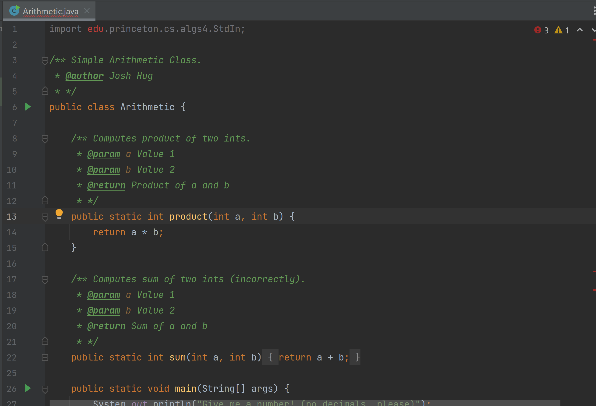

### Student-Facing Setup FAQ Doc

Please take a look at the [setup FAQ doc](https://docs.google.com/document/d/105i_qCGOzgTUQl8plNzXFcKI2Sby3jMo4nHpIvUmt3k/edit?usp=sharing) for additional setup assistance!

### Mac: Homebrew installs Java 18 instead of the recommended Java 17

Java 18 will work perfectly fine for our purposes! Don't worry about this for now.

### I can't find the plugins for IntelliJ!

You likely installed the ultimate edition instead of the community edition. Make sure you have the community edition installed!

### When I try to push, I get the error "failed to push some refs"

If you see a hint that says "Updates were rejected because the tip of your
current branch was behind its remote counterpart", then read
[this section of the Git
WTFS](../../../resources/guides/git/wtfs/#error-failed-to-push-some-refs).

### I set up SSH for GitHub, but I get the error "Connection timed out"

SSH only works on secure (password-protected) networks. If you're connected to
CalVisitor or another an insecure network, git commands that try to talk to
GitHub will fail.

To fix this, connect to eduroam or a secure WiFi network.

### On Gradescope, I'm missing required files

First, make sure that you've pushed your code! You can check this by viewing
your repository on GitHub.

Secondly, the expected file structure is

```text
{{ site.semester }}-***
└── lab01
    ├── magic_word.txt
    ├── src
    │   └── Arithmetic.java
    └── tests
        └── ArithmeticTest.java
```

Note that the files are inside the `lab01` directory. If the files aren't
inside `lab01`, then the autograder won't be able to find them.

If you’re sure you’ve done the above correctly, you may have two copies of your `{{ site.semester }}-s*` folder (with differing locations on your computer). Be sure that the one in your terminal and the one in IntelliJ match, otherwise your changes won’t be recorded! You can see the current working directory of your terminal by running `pwd`.

### I didn't complete the git checkoff during my lab section

Please use the asynchonrous checkoff form linked on Beacon to obtain a magic word!

### I'm using Mac, and after I install Java, it's not showing up in IntelliJ or in `JavaVirtualMachines`

See common mistakes doc linked on Ed, and/or come to lab and office hours!

### I'm using Mac, and I get "Unable to load Java Runtime Environment"

Run `brew reinstall java`, and look for the command that starts `sudo ln`,
right under "For the system wrappers to find this JDK...". Copy-paste and
run that command.

After this, your newly installed Java should appear in IntelliJ.

### When I try to push to GitHub, it says "Support for password authentication was removed on August 13, 2021"

Make sure that you've set up and are using the Personal Access Token as your
password, as described in the [spec](index.md#clone-your-sp23-s-git-repository).

### In IntelliJ, I get "release version 18 not supported"

Go into File > Project Structure > Project Settings > Project, and make sure
that your Language level is set to 17.

### In IntelliJ, when I open up `Arithmetic.java`, my import is grayed out at the top. 

In some cases, you might get something like this:

{: style="max-height: 200;" }

IntelliJ can be very weird - if you've already ensured that your `library-{{ site.semester }}` is there (navigate to File --> Project Structure --> Libraries) 
to check everything seems okay), then try deleting the library, reimporting it and clicking "Apply". Make sure to hit "OK" before 
exiting the window.


