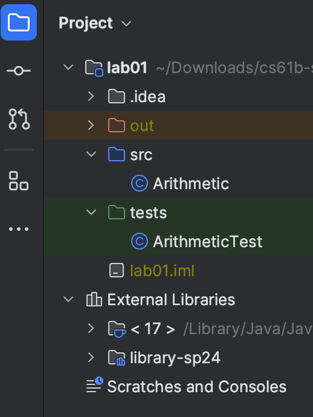

<!-- markdownlint-capture -->

## FAQ

Each assignment will have an FAQ linked at the top. The FAQ for Lab 1 is located
[here](faq.md).

## Welcome to CS 61B!

We're very excited to work with you this term! Before we can get started, you'll
need to have a computer that you can work on assignments on. In this class,
you'll be using real-world tools, which means that you'll likely run into
real-world problems. These are hard problems, and software engineers run into
them every day! **Don't be discouraged**, and make sure to ask
for help if you're stuck!

We highly recommend attending a lab section, and asking for help during lab
section. If you're working outside of a lab section, you can ask on Ed or
attend office hours.

{: .danger}
> If something isn't working, **do not** keep trying random things! Instead, ask for help. 
> Your lab TA will tell you how to join the queue. They may choose to use a whiteboard queue 
or the [online OH queue](https://oh.datastructur.es).
> 
> In general, while you are waiting, you should **move on to the next step of the
assignment**, whenever possible.

### Partners

Labs in CS 61B are **solo**. This means that you will need to write and submit
your own code. For Lab 1 in particular, you will need to set up your own
computer.

However, we strongly encourage working together
with other students! In-person lab sections are an excellent place to find
groups.

### Goals and Workflow

In this lab, we will work on setting up the software that will be used throughout this course. 
This includes an introduction to the terminal, git, Java, and IntelliJ. We'll also work through a 
small Java program to get situated with the Java language!

{: .info}
> This lab will be long! To help guide you through this lab, here's a brief overview of what your workflow 
should look like: 
> - Installing Software (Java, Git, Gh)
> - Terminal Tasks  
> - Setting Up Github and Beacon Accounts 
> - Git Basics and Exercises
> - Setting Up Your Git Repository and Libraries (IMPORTANT!)
> - Submitting to Gradescope
> - IntelliJ Setup and Java Deliverable 
> - Final Deliverables (`magic_word.txt` and `Arithmetic.java`)
> 
> **Do not skip steps!** 

## Personal Computer Setup

### Task: Installing Software

Installation will vary, depending on your operating system.

<!-- TODO: Rework these. Mac brew is *nasty*, just switch to the websites. -->
<!-- Hmm, Mac needs brew for git though. Blegh.  -->

- [Windows instructions](windows.md)
- [macOS instructions](mac.md)
- [Linux instructions](linux.md)

{: .task}
Follow the guide for your operating system to install the software.

## The Terminal

### Terminal Guide

In CS61B, we will be using the terminal extensively to work with git. The terminal also has some other commands 
that allow you to work with folders or files. We've compiled them in this brief guide, so please make sure to read
through it here: [How to Use the Terminal](terminal.md). 

{: .task}
Read through the terminal guide!                

### Task: Terminal Test Run

Let's ensure that everything is working.

1.  First open up your terminal.
    Check that git is a recognized command by typing the following command:

    ```shell
    git --version
    ```

    The version number for git should be printed. If you see "git: command not
    found", or similar, try opening a new terminal window, restarting your
    computer, or installing git again.

2.  Second, let's check that `javac` and `java` are working.
    `javac` and `java` allow _Command Line Compilation_, or in other words,
    the ability to run Java programs directly from the command line.
    In practice, most developers run Java programs through an IDE like IntelliJ,
    so we won't be using command line compilation this semester other than
    testing your setup.

    Start by running the following commands at your terminal.

    ```shell
    mkdir ~/temp
    cd ~/temp
    ```

    1.  Then, open your operating system's file explorer in this directory.
        You can do this from the command line:

        - Mac: `open .`
        - Windows: `explorer .`
        - Ubuntu: `gnome-open .`

    2.  In this newly opened directory, create a file `HelloWorld.java` with
        these contents:

        ```java
        public class HelloWorld {
            public static void main(String[] args) {
                System.out.println("Hello world!");
            }
        }
        ```

        Note that in addition to the file finder or explorer, you are able to
        create a file using the `touch` in the terminal; try creating the file
        using `touch HelloWorld.java` from the terminal! Then, open the file
        using your favorite text editor and copy-paste the code.

    3.  In your terminal, enter `ls` (list the files/folders in this directory).
        You should see `HelloWorld.java` listed.

    4.  Run `javac HelloWorld.java`. If this produces any output, then something
        may be wrong with your setup. Try opening a new terminal window or
        restarting your computer. If that still doesn't work, see the
        Troubleshooting section under the directions for your operating system.

    5.  Type `ls`, you should see both `HelloWorld.java`
        and a freshly created `HelloWorld.class` (the `javac` command created
        this file).

    6.  Run `java HelloWorld`. It should print out "Hello world!" for you.
        If it didn't, something is wrong with your setup!

    7.  You're done! You can also delete the "temp" folder and its contents as
        you please.

The screenshot below shows what we're hoping for when we do the above steps.
If you see something similar to this, your terminal setup is complete.

<script
    id="asciicast-i4kqX0gnASof89lIdE6JzMCyC"
    src="https://asciinema.org/a/i4kqX0gnASof89lIdE6JzMCyC.js"
    async
></script>

{: .task}
Familiarize yourself with the terminal and complete the steps mentioned above. 

## GitHub and Beacon Accounts

### Overview

Instead of bCourses, CS 61B uses an in-house system for centralizing your
grades and student information called Beacon.

In this section, we'll set up your Beacon account as well as your CS 61B GitHub
repository ("repo"), which you will need to submit all coding assignments.

### Task: Setting Up Accounts

1.  Create an account on [GitHub](https://github.com/). If you already have
    an account, you do not need to create a new one.
2.  Go to [Beacon]({{ site.links.beacon }}) and follow the steps to complete your GitHub repository
    registration. You must be logged in to your Berkeley account to complete
    the Google Form syllabus quiz.
3.  After completing all of the steps, you should receive an email inviting you
    to collaborate on your course GitHub repository. Accept the email
    invitation to receive access to your course repository. This email will be
    sent to the **email that you used to create your GitHub account, which may
    not necessarily be your Berkeley email**.

{: .warning}
> Don't follow the instructions that GitHub says you might want to do.
> We have our own set of instructions later in this lab.

{: .task}
Follow the steps above to create your GitHub and Beacon accounts, and
connect them.

### Your Repository

Your repository will have a name containing a number that is unique to you.
For instance, if your repo is called "`{{ site.semester }}-s1`", you'll be able to visit your
private repository at <https://github.com/Berkeley-CS61B-Student/{{ site.semester }}-s1>
(when logged into GitHub). **Your student number is not "1", so this
link will not work for you. Replace "1" with your own number to see your repo on
GitHub.**

Additionally, **course staff will be able to view your repository.** This means you can 
(and should!) link to your code when asking private debugging questions in Ed or Gitbugs. 
No other students will be able to view your repository.

{: .danger}
As a reminder, you may not post code from this course publicly, even after
completing the course. Doing so is a violation of our course policies and you
might be subject to disciplinary action.


## Git

### Git Basics

In this course, you'll be required to use the Git version control system, which
is nearly universal out in the real world. Since the abstractions behind
it are fairly tricky to understand, don't be worried if you encounter
significant frustration as you learn to use it.

{: .task}
Before you proceed, **read up to the Remote Repositories
section of the [Using Git Guide](../../resources/guides/git/index.md)**. You do not need
to read past that.

### Task: Setting Up Git

Before we use git, we have some short commands to configure it appropriately.

First, set the name and email that git will use with these two commands:

```shell
git config --global user.name "<your name>"
git config --global user.email "<your email>"
```

Set git's default branch name:

```shell
git config --global init.defaultBranch main
```

Set the "merge strategy":

```shell
git config --global pull.rebase false
```

We'll also change the text editor associated with git. Sometimes, git needs
your help when inputting things like commit messages, so it will open a text
editor for you. The default editor is `vim`, which is notoriously difficult to use.
We recommend `nano` for this course, but you're free to use whatever you'd like.

**Follow the instructions
[here](https://git-scm.com/book/en/v2/Appendix-C%3A-Git-Commands-Setup-and-Config)**.
This will configure Git's default editor (make sure that you follow the correct
instructions for your operating system).

{: .task}
Configure git by following the above instructions, and set your preferred
editor.

### Task: Git Exercise

Now you're ready to start using git! Your next task is to work through a small
git workflow by setting up a repository and making a couple commits. At the end,
you will need to be checked off by filling out the form linked on Beacon.

{: .info}
> If you need help with creating directories, creating files, changing
directories, etc., refer back to [_How to Use the Terminal_](terminal.md). Another
resource that might be helpful is [Section C of the Using Git Guide](../../resources/guides/git#staging--committing). 
> 
> **As a quick recap, you may find the following git commands useful**: `git init`, `git add`, 
`git commit`, `git status`, `git log`, `git restore`.

1.  Create a directory called `lab01-checkoff`. You can put this directory
    anywhere on your computer (unless you have already cloned your `{{ site.semester }}-s***`
    repository, in which case, you **should not put this directory inside
    your `{{ site.semester }}-s***` repo)**.
2.  Move into the `lab01-checkoff` directory, and initialize a git repository.
3.  Create a file called `61b.txt` in any way you'd like. In this text file,
    add the text "Created 61b.txt".
4.  Create another file called `61boba.txt` in any way you'd like. In this text file, 
    add the text "Created 61boba.txt".
5.  Begin tracking **only** `61b.txt`, and create a new commit containing just
    this file, with the following commit message: `Add 61b.txt`.
6.  Make a modification in `61b.txt` by changing the text in the file to: "61b.txt
    changed to version 2".
7.  Make another commit, this time containing both `61b.txt` and `61boba.txt`.
    The commit message should be: `Updated 61b.txt and added 61boba.txt`.
8.  Make one more modification to `61b.txt` by changing the text in
    the file to: "61b.txt changed to final version". **Don’t commit this version.**

    At this point, if you were to type in `git status` and `git log`, you'd see
    something similar to the following: 

    {: style="max-height: 200;" }   

9.  **Using git only**, restore `61b.txt` to the version in the most recent
    commit.
    <!-- markdownlint-disable MD030 -->
10. **Using git only**, restore `61b.txt` to the version in the first commit.

<!-- markdownlint-restore -->

Be sure to save this repository and directory until you complete the
asynchronous checkoff form on [Beacon]({{ site.links.beacon }}) and
obtain a **magic word**.

{: .task}
Do the steps above, then get checked off by filling out the Beacon
form.

### Git and Remote Repos

First, read the **Remote Repositories** section of the
**[Using Git Guide](../../resources/guides/git/index.md#d-remote-repositories)**.

In this course, you'll be required to submit your code using git to your course
GitHub repository that you created in [Account Setup](#task-setting-up-accounts).
This is for several reasons:

- To spare you the incredible agony of losing your files.
- To submit your work for grading and to get results back from the autograder.
- To save you from the tremendous anguish of making unknown changes to your
  files that break everything.
- To ensure that we have easy access to your code so that we can help if
  you're stuck.
- **To dissuade you from posting your solutions on the web in a public GitHub
  repository**. This is a major violation of course policy!
- To expose you to a realistic workflow that is common on every major project
  you'll ever work on in the future.

## Task: Git Repository and Java Libraries

### Java Libraries                                                                     
                                                                                                  
Like in Python, we sometimes want to use libraries that others wrote. Java dependency management 
is a bit of a mess, so we instead provide a git repo that contains all the dependencies that we 
will use in this course.

Navigate to the folder where you would like to store your libraries. For this lab, we'll 
assume that you placed all your stuff in a folder named __cs61b__. You can pick a different name
if you would like to.

To go into that folder, `cd` into it: 

```shell
cd cs61b
```

Once inside the folder, run:                                                                                        
                                                                                                  
```shell                                                                                          
git clone https://github.com/Berkeley-CS61B/library-{{ site.semester }}
```                                                                                               
                                                                                                  
Below is the directory structure of `library-{{ site.semester }}`. Look inside the folder using 
`ls library-{{ site.semester }}` and make sure you see the `.jar` files listed below. There are many more, 
but we only list the first few. If you're using your operating system's file explorer, 
the `jar` part might not show up in the filenames, and that's OK.                                                                  
                                                                                                  
```console                                                                                        
library-{{ site.semester }}
├── algs4.jar
├── animated-gif-lib-1.4.jar
├── antlr4-runtime-4.11.1.jar
├── apiguardian-api-1.1.2.jar
└── ...
```          
                                                                                                  
{: .task}
Follow the instructions above to get the course libraries.                                                                                                                                                                                

### Configure Personal Repository

Now, it's time to clone your personal repository. As you did with the libraries, navigate to the 
folder where you would like to keep your repository. We recommend that it's the same folder as where
you stored your Java libraries (for example, `cs61b`).

Before we do clone your repo though, we need to login to Github. Verify that you have the Github package: 
```sh
gh --version
```

You should see a version number displayed. If you instead see a command not found error, please install Github cli 
again by following the steps outlined for you [operating system](#task-installing-software).

Next login with your account with the following command: 

```sh
gh auth login
```

You'll be asked a few questions with some options to select from. You don't have to worry
about them, simply select the first options for all of them and proceed. You'll be provided
with a one time code, and prompted to open the browser.

Enter the code in the browser window and select authorize Github. You should now be logged in!

{: .info}
For Windows Users: if you run into an error that says 
\"could not prompt: Incorrect Function\", run `winpty gh auth login` instead.

The entire process should look like the below: 

<script async id="asciicast-rzokme4d9MDHMkmzIRxdnFfyG" src="https://asciinema.org/a/rzokme4d9MDHMkmzIRxdnFfyG.js"></script>

**Once you've logged in, run the following command to clone your personal repository.** Make sure to replace the `***` with your 
class repository number (you can find this repo number on Beacon). 

{: .danger}
Do not place your repository inside the `library-{{ site.semester }}` folder. This will cause headaches
in the future.

```shell
git clone https://github.com/Berkeley-CS61B-Student/{{ site.semester }}-s***.git
```

{: .info}
After cloning your terminal will report `warning: You appear to have cloned
an empty repository.` This is not an issue, it is just git letting you know
that there are no files in the repo.

Move into your newly created repo!

```shell
cd {{ site.semester }}-s***
```

Make sure that we're working with the branch name we expect, `main`:

```shell
git branch -M main
```

**Now, we'll add the `skeleton` remote repository.** We add starter code for the assignments
to `skeleton`, and you will pull from it (please make sure you're in your newly created repository 
before running this command!). 

```shell
git remote add skeleton https://github.com/Berkeley-CS61B/skeleton-{{ site.semester }}.git
```

Listing the remotes should now show both the `origin` and `skeleton` remotes.

```shell
git remote -v
```

{: .info}
If you see an error like `fatal: not a git repository` make sure you have
properly moved into the `{{ site.semester }}-s***` directory using `cd`.

{: .task}
Follow the steps above to clone and configure your repository.

<details markdown="block">
<summary markdown="block">

**At this point, your work space might look like this:** 

</summary>


- Note that this also assuming that you did your `lab01-checkoff` inside the same folder where you cloned 
  your `{{ site.semester }}-s***` repository and `library-{{ site.semester }}`. 
- Your personal repository and libraries should be "separate", such that you didn't clone your `library-{{ site.semester }}`
  inside your personal repository or vise versa. 
- Your workspace doesn't have to look like this exactly. This is mainly for an idea of what it can look like. 

</details>

### Getting the Skeleton

{: .task}
Follow the instructions in the
[Getting the Skeleton section of the Assignment Workflow guide](../../resources/guides/assignment-workflow/index.md#getting-the-skeleton)
to get the skeleton code for Lab 1.

{: .warning}
At this point, you should have a `lab01` folder, with the contents
`src/Arithmetic.java` and `tests/ArithmeticTests.java`. If you **do not have
these contents**, don't make it manually! Instead, pull from the skeleton or
ask a staff member.

### Pushing to GitHub

{: .warning}
You will need the magic word (obtained from checkoff) to complete this
step.

Open the file `lab01/magic_word.txt` in a text editor, and edit it to contain
the **magic word** obtained during the [git exercise][{{ site.links.beacon }}].

[git exercise]: #task-git-exercise

Now stage and commit `magic_word.txt` **(make sure you're in your `{{ site.semester }}-s***` repo!)**.

```shell
git add lab01/magic_word.txt
git commit -m "Added Magic Word"
```

Right now, the modified `magic_word.txt` is only on your computer. We want to
push these changes to the GitHub repository so that your changes can be seen by
us and Gradescope. Push these changes to the `main` branch on the `origin`
remote repo.

```shell
git push origin main
```

You can verify that this was successful by checking your repository online on
GitHub's website. It should contain the updated `magic_word.txt` file. If it
doesn't, make sure that your `add` and `commit` were successful. In particular,
make sure that you are in your repo, `{{ site.semester }}-***`.

{: .task}
Follow the instructions above to push your magic word to GitHub, and
check that it appears.

Our work is now on GitHub, and ready to submit!

## Task: Submitting to Gradescope

Although we use GitHub to store our programming work, we use **Gradescope** to
actually grade it. The last step is to submit your work with [Gradescope][{{ site.gradescope_url }}],
which we use to autograde programming assignments.

{: .info}
> We added everyone's CalCentral email to Gradescope on the first day of labs.
Make sure to login using the email address listed on CalCentral.
> 
> If you're having trouble accessing the course on Gradescope or would like to use
a different email address, ask your TA!

{: .warning}
As above, **we strongly encourage you to make frequent commits!** Lack of
proper version control will not be considered an excuse for lost work,
particularly after the first week.

{: .task}
Follow the instructions in the
[Submitting to Gradescope section of the Assignment Workflow guide](../../resources/guides/assignment-workflow/index.md#submitting-to-gradescope)
to submit to Gradescope.

<details markdown="block">
<summary markdown="block">

**Once you submit, open this dropdown. No, you're not done with the lab yet.**

</summary>

At this point, Gradescope should show you something similar to the following:

{: style="max-height: 400;" }


In CS 61B, we use automated tests to check that your code is written correctly.
In your first submission, you:

- Should be **passing** "Magic Word", if you received the magic word
- Should be **passing** "Test product correctness"
- Should **not be passing** "Test sum correctness"

We'll now show you how you can work on and check your code locally, which is
much easier than checking on Gradescope every time.

</details>

## Task: IntelliJ Setup

IntelliJ is an Integrated Development Environment or IDE. An IDE is a single
program which combines typically a source code editor, tools to compile and run
code, and a debugger. Some IDEs like IntelliJ contain even more features such
as an integrated terminal and a graphical interface for git commands. Finally,
IDEs also have tools like code completion which will help you write Java faster.

We _highly_ recommend using IntelliJ. Our tests are written to run
in IntelliJ, and we will explicitly use its debugger in later labs.
Additionally, IntelliJ is an industry-standard tool that you will almost
certainly encounter if you work with Java again in the future.

We will assume that you are using IntelliJ, and will not offer support for
other editors, including VSCode.

{: .warning}
IntelliJ is a real world, industrial software development application. There are
many features that we will not use, and you will sometimes encounter situations
that do not make sense. **Ask for help if you are stuck or something seems
broken!** It can be very hard to guess the right thing to do in IntelliJ. Check
out the [IntelliJ WTFS Guide](../../resources/guides/intellij/wtfs.md) for solutions
to some common problems.

**Before continuing, make sure that you have completed all above tasks besides
the git exercise:**

1.  You have installed Java 17 or higher.
1.  You have successfully created your local repo for the class on your own
    machine. This is the `{{ site.semester }}-s***` repository you earlier.
1.  You have pulled from the skeleton, and you have a `lab01` directory.

### Installing IntelliJ

1.  Download the Community Edition of IntelliJ from the
    [JetBrains](https://www.jetbrains.com/idea/download/) website.
    As a student you can actually get a student license for the Ultimate
    version, but there are not any additional features that we will use for this
    class. **It is recommended and assumed that you proceed with the Community
    Edition. The Ultimate Version will be the first one you see when you click on the link - 
    make sure to scroll down for the Community Version.**

    {: .info}
    If you have an M1 or M2 Mac,
    select ".dmg (Apple Silicon)". Otherwise, select ".dmg (Intel)."'

{:start="2"}

1.  After selecting the appropriate version for your OS, click download and wait
    a few minutes for the file to finish downloading.

1.  Run the installer. If you have an older version of IntelliJ, you should
    uninstall it at this time and replace it with this newer version.

{: .info}
While IntelliJ downloads, you can read / skim our
[Using IntelliJ Guide](../../resources/guides/intellij/index.md).
You don't need to read or internalize all of this to complete the lab.
IntelliJ is complicated, but the core features should feel somewhat familiar
to text editors you have used in the past.

### Installing Plugins

Open IntelliJ. Then follow the steps below.

**Make sure you're running IntelliJ Version 2021.2 or later before
continuing.** This is because we will use Java 17 or later.
We are using **IntelliJ Version 2023.2** (in the images), which has an updated user interface. Note 
that there might be older screenshots of IntelliJ in this lab - that is fine since the general layout is still 
relatively consistent. 

1.  In the _Welcome_ window, click the **"Plugins"** button in the menu on the
    left.

    {: style="max-height: 325;" }

1.  On the window that appears, click "Marketplace" and enter "CS 61B" in the
    search bar at the top.
    The CS 61B plugin entry should appear.
    If you click the autocomplete suggestion, a slightly different window
    from what is shown below may appear -- this is okay.

1.  Click the green **Install** button, and wait for the plugin to download and
    install.

    {: style="max-height: 250;" }

    If you have the plugin installed from a prior term, make sure to update it.

1.  Now, search for "Java Visualizer", and click the green **Install** button to
    install the plugin.

    {: style="max-height: 250;" }

1.  Restart (close and reopen) IntelliJ.

For more information on using the plugins, read
[the plugin guide](../../resources/guides/intellij/plugins.md).
You don't have to read this right now.

### Creating Projects

{: .task}
Follow the instructions in the
[Opening in IntelliJ section of the Assignment Workflow guide](../../resources/guides/assignment-workflow/index.md#opening-in-intellij)
to open `lab01`.

Once you've done this, you should see at least these three files in the left
pane:

- `magic_word.txt`, which should contain the magic word you added.
- `src/Arithmetic`, a Java file which contains your first programming
  exercise.
- `tests/ArithmeticTest`, another Java file which will check that
  `Arithmetic` is implemented correctly.

{: style="max-height: 250;" }

When you open `Arithmetic` and `ArithmeticTest`, you should not see any red
text or red squiggles.

### IntelliJ Test

To test if everything is working correctly, run the `Arithmetic` class by
opening the file, clicking on the green triangle next to
`public class Arithmetic`, then clicking "Run 'Arithmetic.main()'".

{: style="max-height: 250;" }

<details markdown="block">
<summary markdown="block">

**There are other ways to run the main method.** 

</summary>

{: style="max-height: 250;"}

Assuming that the file has a `main` method, you can right click on the file in the project view 
and navigate to `[filname].main()`. You can also run it through the green arrow in the top right (outlined 
in red). 

</details>


You should see a console pop up, prompting you to enter a number:

{: style="max-height: 250;" }

If you follow the prompts, you will (probably) see something wrong! **Don't fix
it yet.**

### Testing Your Code

While we could run the `Arithmetic` file again and again to check that our
code works correctly, it would take a lot of time to type into the program each
time, and manually check that the output is correct. Instead, we use **tests**.

Open `ArithmeticTest`, and click the green triangle(s) next to the
`public class ArithmeticTest`. This will run the tests that we have provided
in this assignment. At this point, you will see the following:

{: style="max-height: 200;" }


The green checkmark ({: .inline }) indicates
tests that you have passed, while the yellow X
({: .inline }) indicates tests that you have
failed. Don't worry about the doubled output; this is a strange quirk of
IntelliJ.

{: .info}
This should look familiar. The test that failed on Gradescope is the same test
that we see here! We can run these tests locally, very easily!

{: .task}
Fix the bug in `Arithmetic.java` so that the tests pass.

## Task: Saving Your Work using Git and GitHub

As you are making changes to your code, it is good practice to save your work
often. We have briefly discussed the commands, but now we will explain how they
should be used in practice. In the case that you ever want to go back to
another version of your code, it is better to have more options to roll back
to. The next set of instructions will talk you through git's version of saving
work through snapshots of your file system called commits.

1.  After you have made some changes to the code within our local repository,
    git will take notice of these changes. To see the current state
    of your local repository, use the command `git status`. Run this and try to
    interpret the results. Do they make sense to you or do they match your
    intuition? It is a good habit to run this before running other git commands
    to know what the state of things are.

2.  To save work that we have completed on a file, we first stage the file, and
    then we can commit it. We stage a file with the command `git add`. This
    does not save the file, but it marks it to be saved the next time you
    commit. The two below commands show what saving work looks like in a git
    repository. For `git add` depending on what directory you are in, the path
    to the file you are adding might differ (use `git status` to see the path).

    The `-m "Completed Arithmetic.java"` part of the commit command specifies a
    message to be attached to this snapshot. You should always have a commit
    message to identify what exactly happened in this commit. As an example
    workflow:

    ```shell
    git add lab01/src/Arithmetic.java
    git commit -m "lab01: Completed Arithmetic.java"
    ```

    If you run `git status`, you will see that
    `Your branch is ahead of 'origin/main'`. You will also see that the
    staged changes are no longer staged, and are instead committed. If you
    haven't edited since staging, you shouldn't have any changes not staged
    for commit.

3.  We want to push these changes to the GitHub repository so that
    your changes can be seen by us and Gradescope. Your changes will also be
    available to `pull`ed if you had your repo initialized in other places or
    other computers.

    ```shell
    git push origin main
    ```

    `git status` will now show that
    `Your branch is up to date with 'origin/main'.`

{: .warning}
Get into the habit of saving your files and doing the `git commit` step *often*
(i.e. every 15 minutes). It will be incredibly helpful when you mess things up,
since it allows you to back out of changes and to see what you have changed
recently.

Basically, right when you sit down to work in your repository, first `git pull`
to make sure you are starting with the most recent code. While you are working,
frequently commit. When you are finished, `git push` so all your changes are
uploaded and ready for you to pull again next time.

{: .task}
Follow the instructions (again!) in the
[Submitting to Gradescope section of the Assignment Workflow guide](../../resources/guides/assignment-workflow/index.md#submitting-to-gradescope)
to submit to Gradescope. This time, you should receive a full score on the lab.

## Deliverables

As a reminder, this assignment has an [FAQ page](faq.md).
There are two required files, all inside the `lab01` directory:

`magic_word.txt`
: You should have received the correct magic word from completing the git
checkoff.

`Arithmetic.java`
: You should have fixed the bug so that the tests pass. We check this file
with an autograder! For this lab, the autograder tests are the same as the
ones you have on your computer.

Be sure to submit **again** according to the
[submission section](#task-submitting-to-gradescope), so that you submit your
completed lab. Congratulations on finishing your first CS 61B lab!

## Optional: Josh Hug's Color Schemes

Per Josh Hug:

> I'm not a big fan of the default IntelliJ colors.
>
> **Sunburst**: If you want the color scheme that is used in most of the lecture videos,
> this is a custom color scheme I made which is a very close imitation of the great Sunburst theme
> for Sublime. To use Sunburst, download [hug_sunburst](hug_sunburst.jar), and
> import it using the "File &rarr; Manage IDE Settings &rarr; Import Settings"
> option in IntelliJ. You might end up with large text, which I use for
> recording videos. To adjust the size of the font in Intellij to your liking,
> see
> [this link](https://www.jetbrains.com/help/idea/configuring-colors-and-fonts.html).
> 
> **Mariana Pro**: In 2022, I switched over to Mariana Pro. It doesn't feel as much like
> being in a forest as Sunburst, but it has more color depth. To get Mariana Pro, go to the
> same plug-in shop that you used to install the CS 61B plugin, and search for "Mariana Pro".
> This plugin was made by Thibault Soulabaille. Note that I prefer a pure black background,
> whereas Mariana Pro is a dark grey. You can change the background color using 
> [these directions](https://stackoverflow.com/questions/19411510/how-do-you-change-background-color-in-the-settings-of-jetbrains-ide).
