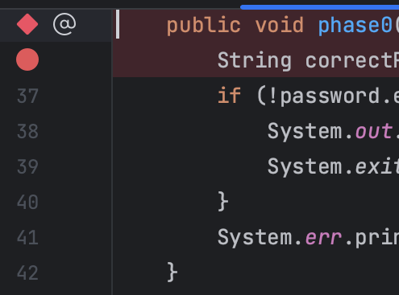
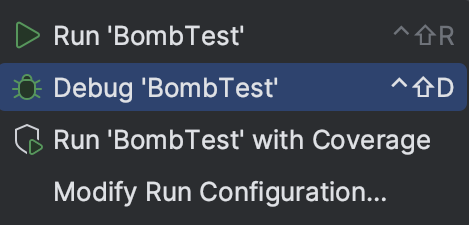
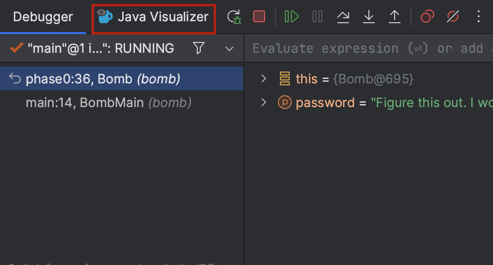
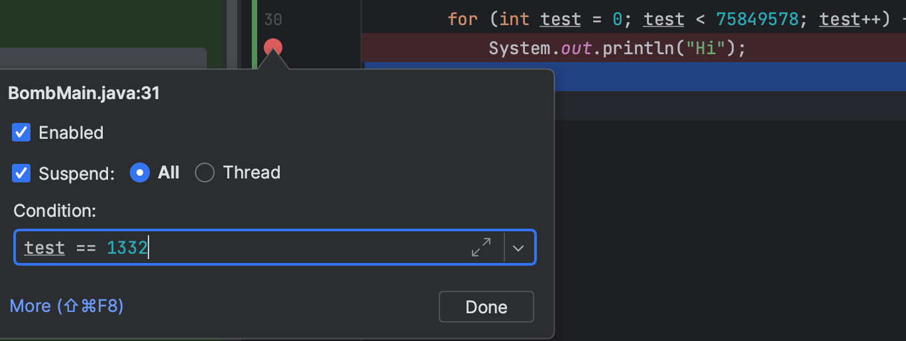

## FAQ

Each assignment will have an FAQ linked at the top. You can also access it by
adding "/faq" to the end of the URL. The FAQ for Lab 02 is located
[here](faq).

## Introduction

To debug a program, you must first know what's wrong. In this lab, you'll get
some experience with using the debugger to see the program state. When you run into
a bug, the error is accompanied with a "stack trace" that details the method
calls that caused the error in the first place. We won't cover going through the stack trace 
in this lab, but we'll talk more about it in a later lab. 

### Setup

Follow the
[assignment workflow](../../resources/guides/assignment-workflow/index.md#opening-in-intellij)
to get the assignment and open it in IntelliJ.

### Goals and Outcomes

In this lab, you will enhance your code debugging abilities by defusing a
(programmatic) bomb. We’ll guide you through this process, but the intention 
is to make this a realistic debugging experience.

By the end of this lab, you will…

- Be able to use the debugger and visualizer to inspect program state.
- Be able to interpret test failure messages.
- Be better able to approach debugging code.

{: .info}
For this lab and course in general, we highly encourage that you try things out on your own first,
including looking things up if you're unsure what something is. In this lab, this might be about what a certain
error means or the exception that is thrown - google it!

## `Bomb`

The `BombMain` class calls the various `phase` methods of the `Bomb` class.
For this lab, we'll be running the lab through the tests in `BombTest.java`. 
If you were to run `BombTest` (in the testing folder), you'll notice that there are some errors - 
this is because the current inputs to the phase methods in `BombMain` aren't the 
correct passwords! Your job is to figure out what the passwords to each of these phases 
is by _using the IntelliJ debugger_.

{: .danger}
**WARNING**: The code is written so that you can't find the password just by reading it. For
this lab, you are **forbidden** from editing the `Bomb` and `BombTest` code, whether to add
print statements or otherwise modify it. The point of this exercise is to get comfortable 
using tools that will help you a lot down the road. Please take it seriously! **If you modify those
files, you will not pass the tests on the autograder!**

As mentioned, you'll be running your code from `BombTest.java` in the testing folder 
and you can use those tests to help you debug, as on other assignments, you will
end up writing your own tests to help you fix bugs! The **only** file you
need to modify is `BombMain.java`

**`BombTest.java` is where you will be running the program. `Bomb.java` and `BombMain.java`
will not have the green run button since it does not contain a `static void main(String[] args)` 
so please make sure to run the program through `BombTest.java`!**

### Interactive Debugging

So far, you might have practiced debugging by using print statements to
see the values of certain variables as a program runs. When placed
strategically, the output from printing might help make the bugs obvious or
narrow down their cause. This method is called **print debugging**. While print
debugging can be very useful, it has a few disadvantages:

- It requires you to modify your code, and clean it up after.
- It's tedious to decide and write out exactly what you want to print.
- Printing isn't always formatted nicely.

In this lab, we'll show you a new technique, **interactive debugging** --
debugging by using an interactive tool, or a debugger. We'll focus on IntelliJ's
built-in debugger.

### Debugger Overview

#### Breakpoints

Before starting the IntelliJ debugger, you should set a few **breakpoints**.
Breakpoints mark places in your code where you can _suspend_ the program while
debugging and examine its state. This:

- Doesn't require you to modify your code or clean it up after, since
  breakpoints are ignored in normal execution.
- Lets you see _all_ the variables without needing to write print statements.
- Lets IntelliJ display everything in a structured manner

Go ahead and open up `Bomb.java` and place a breakpoint. To set a breakpoint, 
click the area just to the right of the line number.

{: style="max-height: 325px;" }

A red circle or diamond should appear where you clicked. If nothing appears,
make sure that you click next to a line with code. When the debugger reaches
this point in the program, it will pause **before** the execution of the line or
method. Clicking the breakpoint again will remove it.  

#### Running the Debugger

Now, let's set a few breakpoints - you can do this either in `Bomb.java` or `BombMain.java`. 
With these set, we can start a debugging session! Click on the green triangle next to the 
class or test you want to debug (in test files there may be two green triangles). 
Instead of clicking the green triangle to run, click the
{: .inline } debug option:

{: style="max-height: 325px;" }

The selected program should run until it hits its first breakpoint. A debugger
window should also appear on the bottom of the interface, where the console was.

{: style="max-height: 325px;" }

On the left, you will be able to see all current method calls and on the right,
you will be able to see the values of instantiated variables at this point in
the program (they will also be shown in gray text in the editor). For instances
of classes, you can click the dropdown to expand them and look at their fields.

In the debugger, you have a few options:

- Learn something from the displayed values, identify what's wrong, and fix
  your bug! Click {: .inline } to stop the debug session.
- Click {: .inline } to resume the program (until it
  hits another breakpoint or terminates).
- Click {: .inline } to advance the program by
  one line of code.
  - {: .inline } does something similar, but
    it will step into any method called in the current line, while
    {: .inline } will step over it.
  - {: .inline } will advance the program until
    after it returns from the current method.
- If you accidentally step too far and want to start the session over, click
  {: .inline } (at least right now, there isn't a good way to directly 
  step back).

### `Bomb` Introduction (Phase 0)

{: .info}
For this lab, we will be providing method breakdowns if you want an 
overview of the method/phase that you're debugging.

{: .task}
Set a breakpoint at `phase0` and use the debugger to find the password
for `phase0` and replace the `phase0` argument accordingly in
`bomb/BombMain.java`. You can start the program from `testBombPhase0` in 
`tests/bomb/BombTest.java`.

Once you've found the correct password, running the code (not in debug mode)
should output `You passed phase 0 with the password \<password\>!` instead of
`Phase 0 went BOOM!`

<details markdown="block">
<summary markdown="block">

**`phase0` Method Breakdown**

</summary>

The `phase0` method first generates a secret String `correctPassword` (you don't
need to understand how `shufflePassword` works). The `password` passed in from
`BombMain` is then compared against `correctPassword`. The goal of this phase is
to use the debugger to find the value of `correctPassword` and pass in a
`password` that matches that value!

</details>

### Visualizer (Phase 1)

For this portion of the lab, we'll be working with `IntList`. If you need a quick recap, 
refer to the relevant lecture slides from this week. 

Adding to our implementation of `IntList` are two methods that may not have been 
mentioned: `print` and `of`. The `of` method makes it more convenient to create `IntList`s. 
Here's a brief demonstration of how it works. Consider the following code: 

```shell
IntList lst = new IntList(1, new IntList(2, new IntList(3, null)));
```

That's a lot of typing for just a list of 1, 2, and 3 (quite confusing too)! 
The `IntList.of` method addresses this problem. To create an IntList containing 
the elements 1, 2, and 3, you can simply type:

```shell
IntList lst = IntList.of(1, 2, 3);
```

The other method `print` returns a `String` representation of an IntList.

```shell
IntList lst = IntList.of(1, 2, 3);
System.out.println(lst.print())
// Output: 1 -> 2 -> 3
```

Back to debugging - while being able to see variable values is great, sometimes we have data that's
not the easiest to inspect. For example, to look at long `IntList`s, we need to
click a lot of dropdowns. The Java Visualizer shows a box-and-pointer diagram of
the variables in your program, which is much better suited for `IntList`s. To
use the visualizer, run the debugger until you stop at a breakpoint, then click
the "Java Visualizer" tab. The tab is outlined in red below. 



**The password for phase 1 is an `IntList`, not a `String`. You may find the
`IntList.of` method helpful.**

{: .task}
Set a breakpoint at `phase1` and use the Java Visualizer
to find the password for `phase1` and replace the `phase1` argument accordingly
in `bomb/BombMain.java`. You can start the program from `testBombPhase1` in
`tests/bomb/BombTest.java`.

<details markdown="block">
<summary markdown="block">

**`phase1` Method Breakdown**

</summary>

The `phase1` method generates a secret `IntList` called `correctIntListPassword`
(similar to the previous phase, you don't need to understand how
`shufflePasswordIntList` works). The `password` (in the form of an `IntList`)
passed in from `BombMain` is then compared against the `correctIntListPassword`
for equality. The goal of this phase is to use the debugger's Java Visualizer to
find the structure and value of the `correctIntListPassword`'s IntList and pass
in a `password` that matches it!

</details>

### Conditional Breakpoints (Phase 2)

Consider a program that loops 5000 times - trying to step 
through each time to find the error wouldn't be too efficient. Instead, you would want 
your program to pause on a specific iteration, such as the last one. In other words, you 
would want your program to pause on certain conditions. To do so, create a breakpoint at the 
line of interest and open the "Edit breakpoint" menu by right-clicking the breakpoint icon itself. 
There, you can enter a boolean condition such that the program will only pause at this
breakpoint if the condition is true. It will look something like this:



Another thing you can do is to set breakpoints for exceptions in Java. If your
program is crashing, you can have the debugger pause where the exception is
thrown and display the state of your program. To do so, click
{: .inline }
in the debugger window and press the plus icon to create a "Java Exception
Breakpoint". In the window that should appear, enter the name of the exception
that your program is throwing.

{: .task} 
Set a breakpoint at `phase2` and use the debugger to find the password
for `phase2` and replace the `phase2` argument accordingly in
`bomb/BombMain.java`. Remember, don't edit `Bomb.java`! You can start the program 
from `testBombPhase2` in `tests/bomb/BombTest.java`.

{: .info}
**NOTE**: The password isn't given explicitly like in the previous phases.
Rather, your task is to "try to find it" using a conditional breakpoint.

<details markdown="block">
<summary markdown="block">

**`phase2` Method Breakdown**

</summary>

The `phase2` method takes in your `password` from `BombMain`. 

The method adds 100,000 random integers to a `Set` called `numbers`. It
then loops through them using a for-each loop, incrementing a variable `i` as it
goes along. On the 1338th iteration (because Java is zero-indexed, `i == 1337`
on iteration 1338), we check whether your password is equal to the current
`number`.

</details>

---

At this point, you should be able to run the tests in `tests/bomb/BombTest.java`
and have all of them pass with a green checkmark.

## Deliverables and Scoring

{: .warning} 
**Make sure you did not edit `Bomb.java` or `BombTest.java`.** There are tests 
on the autograder that check if you edited those files and you will not pass 
if there are changes in the file (this includes adding comments). **The 
local tests prevent you from editing `Bomb.java`, but not `BombTest.java`
(this is only on the autgrader), so do not touch those files!** 

The lab is out of 5 points. 

- Find all the passwords in `BombMain.java` and ensure that you pass all tests locally 
  before submitting to Gradescope. 

## Submission

Just as you did in Lab 1, add, commit, then push your Lab 2 code to GitHub.
Then, submit to Gradescope to test your code. If you need a refresher, check
out the instructions in the
[Lab 1 spec](../lab01/index.md#submitting-to-gradescope) and the
[Assignment Workflow Guide][workflow].

[workflow]: ../../resources/guides/assignment-workflow/index.md#opening-in-intellij

## Acknowledgements

This assignment is adapted from Adam Blank.**
