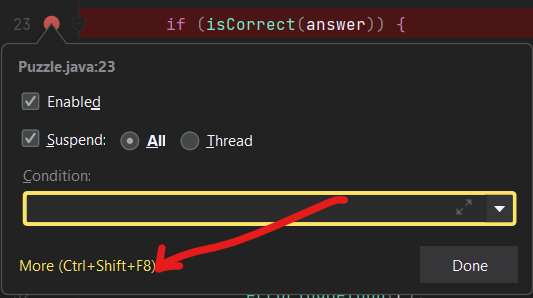
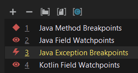
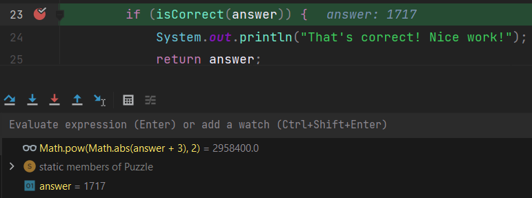

## FAQ

The FAQ for Lab 03 is [here](faq.md).

## Introduction 
This is a continuation of debugging from last week. In this week's lab, we will 
be utilizing the debugging tools we used last week and gaining more practice 
with debugging. The goal for today's lab is to learn more about the following: 
- Reading the stack trace and knowing how to isolate the bug from it.
- Understanding the different types of exceptions we might run into.
- Getting more comfortable using the IntelliJ debugger.
- Exception breakpoints, expressions and watches (optional).

As usual, don't hesitate to look things up if you're unsure what something means, particularly, 
what a specific exception or error means if it comes up in the stack trace (which we'll be
covering in today's lab). The hints are meant to guide your thinking, but we encourage you 
to try going through the lab on your own first before opening the hints.

## `Adventure`

### Running the Game and Tests

The very first thing you should do is run the `main` method in `AdventureGame`
to run through the game. Follow the instructions that are given once you run 
through the game. This will give you a sense of what the program you are
debugging is supposed to do (if you run into an error, that's normal). 

Then, after you’ve run the game, run the tests in `tests/adventure/AdventureGameTests`. 
They should fail on `BeeCountingStage` which will lead you into debugging the first error
below (note that all the tests will be failing at this point). To pass the entirety of 
`AdventureGameTests`, you'll need to fix all the individual stage tests (fixing one stage will 
show that you passed that individual stage). **The stages are meant to be completed in order
of the spec.**

We encourage you to run through the game for each stage you complete to see how they’re all 
related to the game. Don’t forget to commit frequently to save your progress!

### Reading Stack Traces

When a _runtime error_ occurs in Java, a stack trace is printed to the console
to provide information on where the error occurred and what steps the program
took to get there. When running `Adventure` for the first time, your stack
trace will look something like this:

{: style="max-height: 325;" }

The first thing to note is what kind of error occurred; this is shown at the
first line of the stack trace. In this case, our code threw a
`NullPointerException`.

For some exceptions, including `NullPointerException`s, Java will give you an
explanation. Here, `this.input` is `null`, so we can't invoke (call) a method on
it.

The lines beneath it represent the sequence of methods the program took to
arrive at the error: the first line in the list is where the error occurred
and the line beneath it represents the line of code that called the method
which threw the error, and so on.

You can click on **`blue text`**{: .blue} to navigate to that file and line.

{: .info}
To get a sense of how you would interpret stack traces in, you would usually start from
the top. As mentioned, the first line in the stack trace is where the error occurred -
in other words, it is the last method call that took place before the error,
so you can use that to isolate where the bug is. Depending on how the program is written, how 
it's designed and what code you've written/contributed, you would navigate to the appropriate
line in the stack trace and click on the **`blue text`**{: .blue} to go that line and start 
debugging.

---

{: .warning}
For each of the following stages, **only change what is necessary**! You should
not be rewriting entire blocks of code unless otherwise specified. We've
included how many lines we changed as a guideline.

{: .info}
You can run through the adventure game each time if you'd like to
validate correctness, but you don't need to - feel free to debug through the
tests directly. For each file you'll be working in, it contains a `playStage` method,
and you can set a breakpoint in that method. From there, you can start debugging 
in `AdventureGameTests`.

### Debug `BeeCountingStage`

{: .task}
Fix the `NullPointerException` that occurs in `BeeCountingStage` by
analyzing the stack trace. You can ignore the lines with `<XX internal lines>`;
these are from test framework or library code and usually won't help you find
errors.    Expected lines modified: 1

**Hint 1**

Just because the error occurs on a certain line doesn't necessarily mean that
piece of code is incorrect - something not shown in the stack trace may
be the elusive culprit!

**Hint 2**

Take a close look at the constructor. Look at the variables that are declared and what 
is instantiated. 

---

It turns out that this isn’t the only error in `BeeCountingStage`!

{: .task}
Fix the `IndexOutOfBoundsError` that occurs in `BeeCountingStage`.

{: .info}
Ignore the grey links to `Objects.java` and `ArrayList.java` at the
top of the stack trace. The error may have _occurred_ in code that was not
yours, but the root cause was probably something _your code_ tried to do. 
   Expected lines modified: 1

---

**Hint 1**

Don't forget, Java is 0-indexed!

### Debug `SpeciesListStage`

{: .task}
Fix the error(s) in `SpeciesListStage`. If you don't see what the
issue is inside the method where the exception occurred (the top line of the
stack trace), it's often a good idea to look at the second line to see where the
method is being called from, and with what arguments. 
   Expected lines modified: 3-4

---

**Hint 1**

Consider the possibilities for lists. Does the code account for all of
them? Are there any edge cases the code fails to handle?

It might also help to read the javadoc comments above the method to gain more 
context on what the method does. 

### Debug `PalindromeStage`

{: .task}
Sometimes, IntelliJ will tell you something that it thinks is wrong.
Hover over the yellow / orange highlights in the method with the bug (in the
`digitsToIntList` method in `PalindromeStage` - you can navigate to it 
through the stack trace). Does that give you any useful information?
   Use this feature to address the error in `PalindromeStage`.

{: .info}
If the debugger feels unresponsive, it is usually due to an infinite
loop somewhere in your code. If you set a breakpoint and it is never reached,
then you know an infinite loop occurs before the breakpoint! Use this in
combination with stepping to isolate the problem.

{: .warning}
**There are two bugs in this part that you'll need to fix. Fix the most obvious one 
first and then try to isolate and solve the second one. The hint for this part of the 
lab applies to the second bug that needs to be resolved.** 
   Expected lines modified: 3

**Hint 1 (Only applies to second bug)**

If you haven't already, read through the note above. Look at the method where `digitsToIntList`
is called on. If you set a breakpoint in the method and run through the debugger, do we ever exit 
out the `while` loop? What is the condition we need to meet to break out of the `while` loop? Is it 
being met? Try using the Java Visualizer in conjunction so you can inspect the bug more closely 
with the visualizer. 

### Debug `MachineStage`

The `sumOfElementwiseMax` method in `MachineStage` is supposed to take two
arrays, compute the element-wise max of those two arrays, and then sum the
resulting maxes. For example, for two arrays `{2, 0, 10, 14}` and
`{-5, 5, 20, 30}`, the element-wise max is `{2, 5, 20, 30}`. In the second
position, the larger of `0` and `5` is `5`. The sum of this element-wise max is
$2 + 5 + 20 + 30 = 57$.

There are two different bugs that make the method return an incorrect result.
You can assume the input parsing code in `playStage` works correctly.

To find the bugs, you should not step into the `mysteryMax` or `mysteryAdd`
functions, or even try to understand what they are doing. That is, you should
use {: .inline } to _only see the result_. These
are **_mysterious_** functions that are deliberately obfuscated. If you find
yourself having accidentally stepped into one of these two functions, use the
{: .inline } button to escape.

Even without stepping INTO these functions, you should be able to tell whether
they have a bug or not. That’s the glory of abstraction! Even if I don’t know
how a fish works at a molecular level, there are some cases where I can clearly
tell that a fish is dead.

{: .task}
Fix the two bugs so that `sumOfElementwiseMax` returns a correct
result. If you find a bug in `mysteryMax` or `mysteryAdd`, rewrite the method entirely
instead of trying to fix it. Don't rewrite code unnecessarily, though -- be
sure that it's broken first!    Expected lines modified: 2-5

---

**Hints**

- Understand what the `sumOfElementwiseMax` function is supposed to do. When
  you give inputs to the game, try computing the answer by hand or with a
  calculator. Verify your computation against the output, and you'll see that
  the output is incorrect.
- Set a breakpoint on the line that calls `sumOfElementwiseMax`. When you run
  the debugger, step into `sumOfElementwiseMax`, then use
  {: .inline } to see the result of the call
  to `arrayMax`. Is the output of `arrayMax` what you expect it to be?
- You should step into `arrayMax` if you think that there's a bug there. Don't
  step into `mysteryMax`, though -- if and only if you think it has a bug,
  rewrite it completely.
- Repeat for `arraySum` and `mysteryAdd`.

## Another Debugging Puzzle?! [OPTIONAL]

The rest of the lab is **optional**. We'll cover some additional 
tools that you can use in the IntelliJ debugger that you may find useful - 
exception breakpoints and expressions and watches.

{: .danger}
Do not modify `Puzzle.java`!

{: .warning} 
These exercises will involve working
with code that may seem quite cryptic and unfamiliar. Enforce the abstraction
barriers and try to find the answers without having to understand exactly what
is going on!

### Exception Breakpoints

When debugging, you may sometimes run into an unexpected error, making it
difficult to figure out what is wrong with your code. To help with this,
IntelliJ allows you to set breakpoints on exceptions. These ensure that when
your code throws an exception, the debugger will pause execution and allow you
to inspect the state of your program.

Go ahead and run the `Puzzle` class. You should see the following output:

For many common exceptions, IntelliJ will indicate a "Create breakpoint" button
in the console output (just to the right of `java.lang.RuntimeException` in the
above screenshot), which will allow you to access the advanced breakpoint
window. To access it without this button, create a breakpoint on any line (in
the following screenshot, we've created a breakpoint on line 23), right-click
it, and select "More".

The advanced breakpoint window should look something like this:

There's a lot going on here, but you don't need to understand most of it. Click
the plus symbol in the top-left corner, and you should see a popup like this:

Select "Java Exception Breakpoints", and another window will appear where you
can specify the type of exception for which we want to pause execution. The
console told us that we were getting a `java.lang.RuntimeException`, so go ahead
and select that.

You should now see the original advanced breakpoint window, with a newly created
exception breakpoint aptly named 'java.lang.RuntimeException' (if you used the
console's "Create breakpoint" button to access the window, you may see two
copies of this, and that's okay).

You will have the option to break on caught or uncaught exceptions, or both.
This can be useful because a lot of library code intentionally throws and
catches a lot of exceptions, so this allows us to focus on the unhandled ones if
necessary. For now, go ahead and leave both options checked.

If you debug the program at this point, your code should pause on line 53, with
a little lightning bolt symbol in place of the usual red circle. This indicates
that the breakpoint was triggered by an exception, rather than a normal
breakpoint.

From this, we can see that IntelliJ is hinting that the problem may be in
`src/puzzle/answer.txt`. By inspecting that file, poking around `Puzzle.java`,
and using other debugging techniques you learned in Lab 02 and this lab, can 
you figure out what's going on?

{: .task}
Fix `answer.txt` so that `Puzzle` no longer throws a `RuntimeException`. 
Feel free to look at the hint if you're stuck!

**Hint**

The issue is that `Puzzle.java` parses `answer.txt` for an integer guess, and
doesn't find any, so it throws an exception. To fix this, replace the TODO line
of `answer.txt` with any integer.

After fixing the bug, run `Puzzle` again. You should now see the following
output:

Read the error message and see if you can find the answer! If you've got it
correct, `Puzzle.java` will no longer error and you should pass `testPuzzle`
inside of `tests/puzzle/PuzzleTest`.

{: .task}
Replace the value in `answer.txt` so that `Puzzle` no longer errors.

### Expressions and Watches

When debugging, you may not always have the value that you want to inspect
stored in a variable. Luckily, IntelliJ has a solution for us! Once paused on a
certain line, you can use the "Evaluate Expression" tool (shaped like a
calculator). You can click on the calculator icon to open up a whole new window,
but you can also just type the expression into the debugger directly:

You can use variables and method calls with this tool too! Even though we've
only used `Math` library methods in the following example, you can call anything
you want. Here, we are using the tool in `Puzzle.java` with an initial `answer`
guess of `973`:

After you resume the program, `result` will be lost. If you don't want to lose
it, you can use Ctrl+Shift+Enter (Windows) or Cmd+Shift+Enter (Mac) to add it as
a _watch_. This will keep it around even after you continue execution. Moreover,
watches will change value accordingly with the program, just like normal
variables would!

Watches will persist even after you stop and rerun your program, so they can be
very useful for debugging over multiple executions. As an example, I've changed
my guess from before to be `1717` and reran the program entirely, but didn't
have to re-evaluate the expression for the debugger to tell me what it was!

There won't be an associated exercise with this part, but we think it would be a 
useful thing to know about!

---

Congratulations, you've made it to the end of Lab03!

## Deliverables and Scoring

The lab is out of 5 points. There are no hidden tests on Gradescope. If you
pass all the local tests for `Adventure`, you will receive full credit on the 
lab (unless you modified things you weren't supposed to modify). To reiterate, 
"Another Debugging Puzzle?!" is optional for this lab. The final deliverables are: 

- `BeeCountingStage` (1.25 pts)
- `SpeciesListStage` (1.25 pts)
- `PalindromeStage` (1.25 pts)
- `MachineStage` (1.25 pts)

## Submission

Just as you did for the previous assignments, add, commit, then push your Lab 03
code to GitHub. Then, submit to Gradescope to test your code. If you need a
refresher, check out the instructions in the
[Lab 1 spec](../lab01/index.md) 
and the
[Assignment Workflow Guide][workflow].

[workflow]: ../../resources/guides/assignment-workflow/index.md#opening-in-intellij

