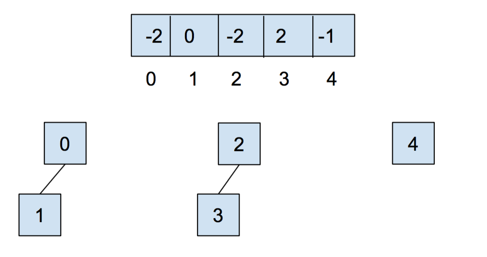
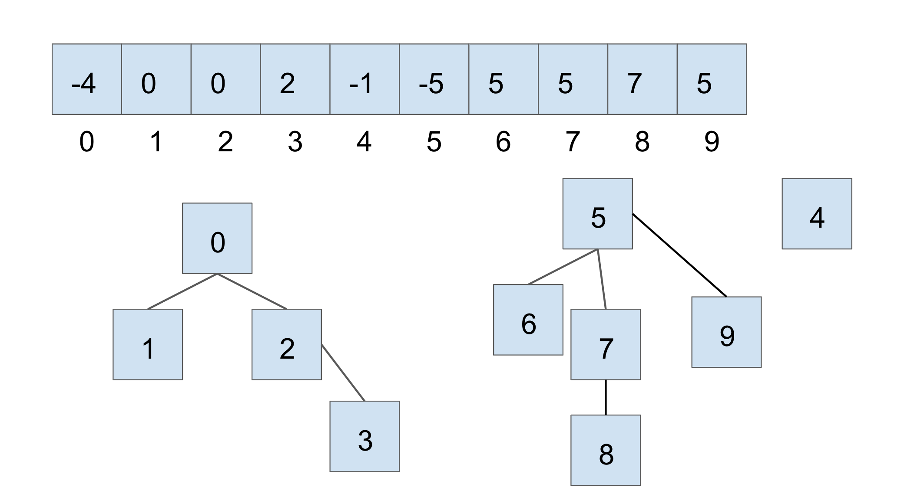
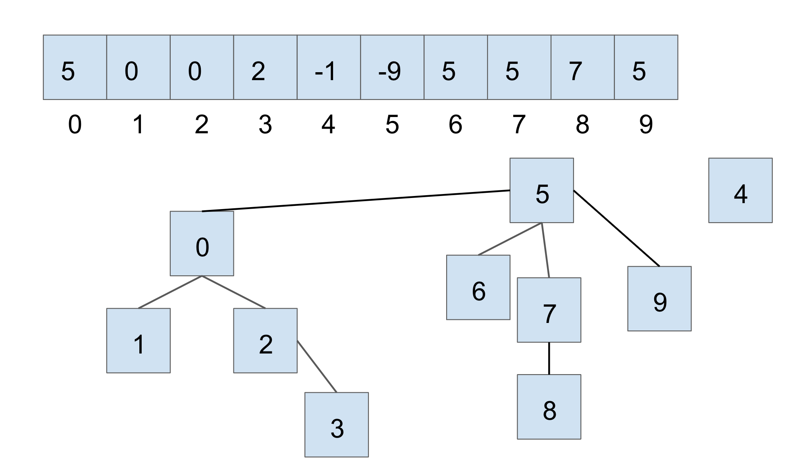
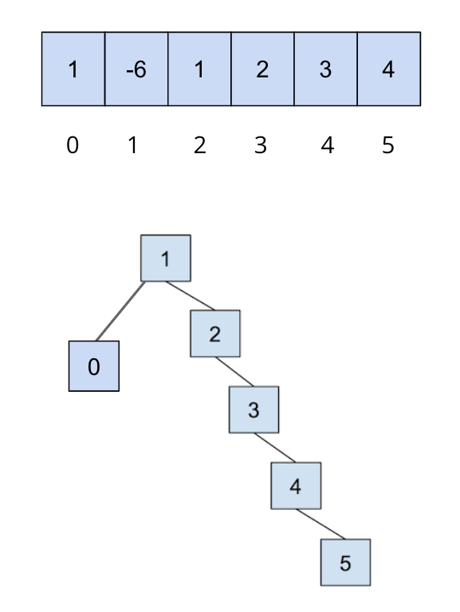
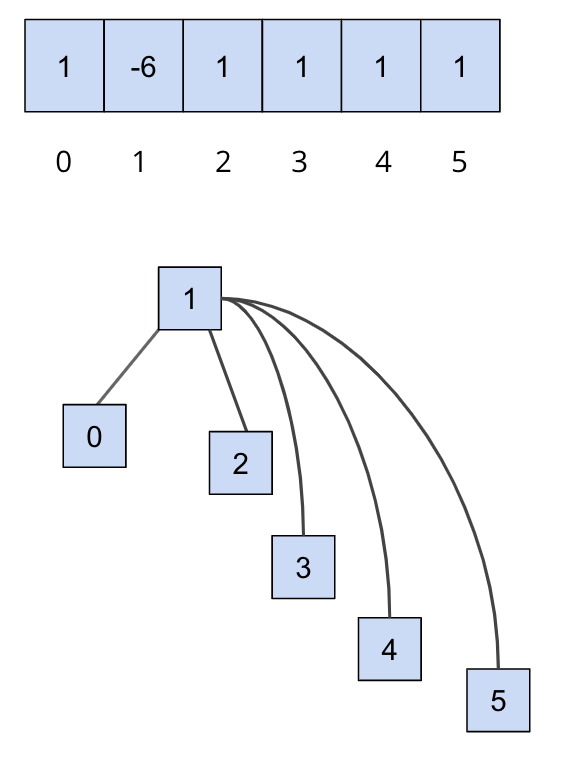

## FAQ Page

Please use our **[common issues and frequently asked questions page](./faq.md)**
as a resource. We'll be updating this FAQ page on the website throughout the
week!

## Introduction

Today, we will delve a little deeper into disjoint sets. We **strongly recommend** that you watch the 
lecture on disjoint sets before starting on this lab, as it will cover material that you will 
need to know to get started. 

For this week's lab, we will be implementing our own disjoint sets, `UnionFind`. More specifically, we 
will be implementing Weighted Quick Union + Path Compression. 

While we will briefly cover the concepts needed, please reference lecture for more information. 

As usual, pull the files from the skeleton: 

    git pull skeleton main

## Disjoint Sets

As a recap, let's cover what disjoint sets are. The **disjoint sets data structure** represents a collection 
of sets that are disjoint, meaning that any item in this data structure is found in no more than one set. 

For disjoint sets, we generally limit ourselves to two main operations: `union` and `find`. The `union` operation 
will combine two sets into one set. The `find` operation will take in an item, and tell us which set that 
item belongs to. With these operations, we're able to easily check if two items are connected to each other.

### Quick Union

As introduced in lecture, we talked about quick union. With this representation, we can think of our disjoint sets 
data structure as a tree. Specifically, the tree would have the following qualities:

- the nodes will be the items in our set,
- each node only needs a reference to its parent rather than a direct reference
  to the face of the set, and
- the top of each tree (we refer to this top as the "root" of the tree) will be
  the face of the set it represents.

However, one of the problems with this approach is that the worst case runtime of `union` would be 
linear, depending on how items are connected. In other words, the trees can get really tall, leading 
to poor performance for `union`. For example, take a look at the example below - why would this lead 
to the worst case runtime?

Now, let's combat the shortcomings of this data structure with the following
optimizations.

### Weighted Quick Union 

The first optimization that we will do for our quick union data structure is
called "union by size". This will be done in order to keep the trees as shallow
as possible and avoid the spindly trees that result in the worst-case runtimes.
When we `union` two trees, we will make the smaller tree (the tree with less
nodes) a subtree of the larger
one, breaking ties arbitrarily. We call this **weighted quick union**.

Because we are now using "union by size", the maximum depth of any item will be
in $$O(\log N)$$, where $$N$$ is the number of items stored in the data
structure. This is a great improvement over the linear time runtime of the
unoptimized quick union. Some brief intuition for this depth is because the
depth of any element $$x$$ only increases when the tree $$T_1$$ that contains
$$x$$ is placed below another tree $$T_2$$. When that happens, the size of the
resulting tree will be at least double the size of $$T_1$$ because $$size(T_2)
\ge size(T_1)$$. The tree that contains only $$x$$ can double its size at most
$$\log N$$ times until we have reached a total of $$N$$ items.

See the following visual for some intuition on how this works:

### Example

Let's go over a example of what this all looks like for weighted quick union. When we initially 
create our disjoint set, each item is in its own set, so we will initialize all of the elements in the array to `-1`.
For this representation, we want to track our size in the array, so we 
**store the weight of a set at its root as -weight** (to also distinguish 
between a parent and the weight of the set).

After we call `union(0,1)` and `union(2,3)`, our array and our abstract representation will end up as below

{: .warning} 
**The tie-breaking scheme in this example is that the smallest element becomes the root - note that this isn't 
always the case depending on the implementation.**

Notice that for above, the values stored at 0 and 2 are -2, as the roots of the respective 
set are storing their (negated) size. Now let's call `union(0,2)`. It'll look like this: 

For the sake of an example, let's say we have another disjoint set, in the current 
state shown below (we are using the same tie-breaking scheme above):

If we were to connect the two larger sets, through `union(7, 2)`, we would get the following:

In this case, we connect the roots of the sets that 7 and 2 belong to respectively, with the smaller 
set's root becoming the child of the larger set's root. With weighted quick union, we update two values
in the array: 
- the smaller root's parent becomes the root of the larger set 
- the larger root's value is updated accordingly with a new size

### Path Compression

Even though we have made a speedup by using a weighted quick union data
structure, there is still yet another optimization that we can do! What would
happen if we had a tall tree and called `find` repeatedly on the deepest leaf?
Each time, we would have to traverse the tree from the leaf to the root.

A clever optimization is to move the leaf up the tree so it becomes a direct
child of the root. That way, the next time you call `find` on that leaf, it
will run much more quickly. An even more clever idea is that we could do the
same thing to *every* node that is on the path from the leaf to the root. 
Specifically, when we call `find` on an item, all of the nodes that were 
traversed upon going up the tree (to the root) are updated so that they are 
now connected directly to the root. This optimization is called **path compression**. 
Once you find an item, path compression will make finding it (and all the nodes 
on the path to the root) in the future faster.

The runtime for any combination of $$f$$ `find` and $$u$$ `union` operations
takes $$\Theta(u + f \alpha(f+u,u))$$ time, where $$\alpha$$ is an *extremely*
slowly-growing function called the [*inverse Ackermann function*](https://en.wikipedia.org/wiki/Ackermann_function#Inverse). And by
"extremely slowly-growing", we mean it grows so slowly that for any practical
input that you will ever use, the inverse Ackermann function will never be
larger than 4. That means for any practical purpose, a weighted quick union data
structure with path compression has `find` operations that take constant time on
average!

> It is important to note that even though this operation can be considered
> constant time for all practically sized inputs, we should not describe
> this whole data structure as constant time. We could say something like,
> it will be constant for all inputs smaller than some incredibly large size.
> Without that qualification we should still describe it by using the inverse
> Ackermann function.

An example of this is shown below, where we start out with the following

{: .warning} 
This is only an example to demonstrate what path compression does. 
**Note that you can't get this structure with a weighted quick union.**

After we call on `find(5)`, all of the nodes we traversed to get to the root 
are updated so that they now connect directly to the root: 

You can visit this link
[here](http://www.cs.usfca.edu/~galles/visualization/DisjointSets.html) to play
around with disjoint sets.

## Exercise: `UnionFind`

We will now implement our own disjoint sets data structure, `UnionFind`. At this point, if you haven't already, 
take a look at `UnionFind.java` file. In this file, you'll see that some skeleton code has been provided for
you - you'll have to fill in the implementation for the following methods:
- `UnionFind(int N)`: This is the constructor. It creates a `UnionFind` data structure that holds N items.
- `int sizeOf(int v)`: Returns the size of the set that `v` belongs to.
- `int parent(int v)`: Returns the parent of v.
- `boolean connected(int v1, int v2)`: Returns `true` if the two vertices are connected.
- `int find(int v)`: Returns the root of the set that `v` belongs to.
- `void union(int v1, int v2)`: Connects `v1` and `v2` together.

We recommend that you start with implementing the constructor and taking a look at `find`
before the rest of the other methods.  

{: .task} 
Complete the methods in `UnionFind`.

## Lab Notes

**Please note, for this lab, we will work with non-negative integers as the items 
in our disjoint sets.**

Comments have been provided for each method and will go into a little more detail 
than the summary above, so make sure to read those carefully to understand what 
you'll want to implement. Remember to implement both optimizations discussed
above, and take note of the **tie-breaking scheme** that is described in the comments 
of some of the methods.

{: .warning} 
For this lab, you'll want to implement the following tie-breaking scheme: if the sizes 
of the sets are equal, **tie break by connecting `v1'`'s root to `v2`'s root.**

You should also correctly handle faulty inputs, e.g if invalid vertices are passed 
into the functions, throw an `IllegalArgumentException`. You can throw an 
`IllegalArgumentException` with the following line: 

    throw new IllegalArgumentException("Some comment to describe the reason for throwing.");

## Testing
For this lab, we've provided some tests for you to check your implementation, 
but they are **not comprehensive.** 4 out of 6 tests on the autograder are 
provided locally. Passing the tests locally do not mean you will pass the tests on 
Gradescope and you will need to write your own tests to verify correctness. 

If you find yourself failing the last two tests, ensure that you've 
implemented path compression correctly and that you've tested the 
correctness for all the methods you've implemented. 

## Submission

Just as you did for the previous assignments, add, commit, then push your Lab 05 code to GitHub. Then, 
submit to Gradescope.

- Complete the implementation of `UnionFind.java`. This lab is worth 5 points in total. 
