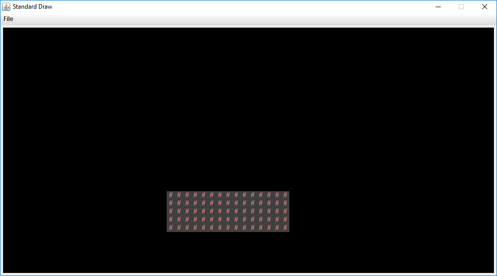
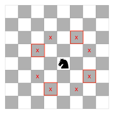
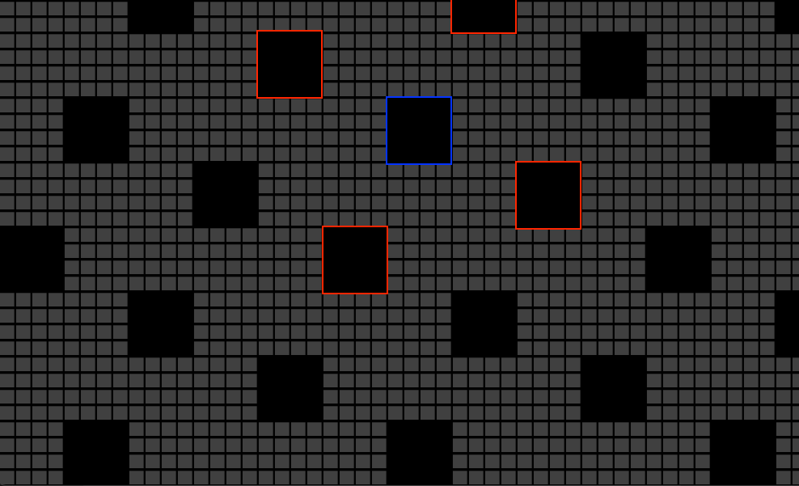
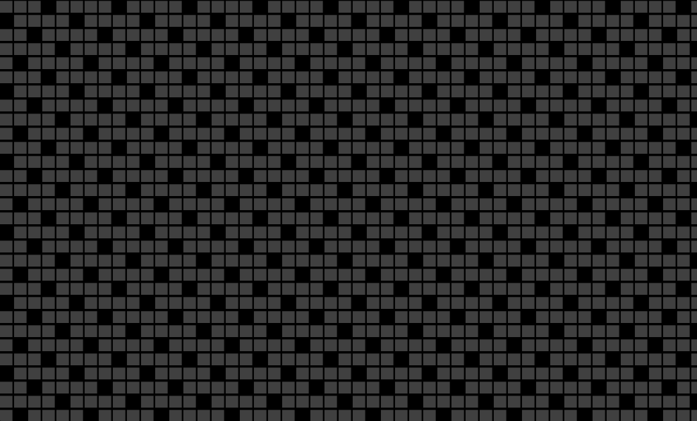
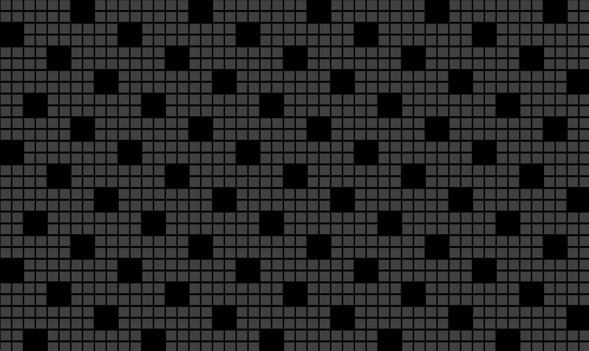
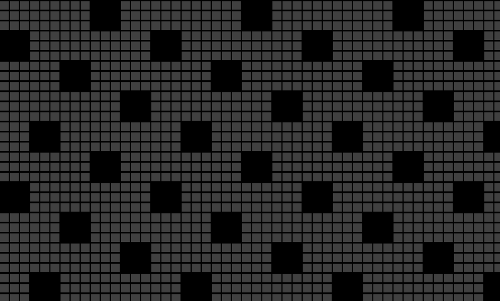

## [FAQ](faq.md)

Each assignment will have an FAQ linked at the top. You can also access it by
adding "/faq" to the end of the URL. The FAQ for Lab 11 is located
[here](faq.md).

## Introduction

This lab will help you with Project 3: Build Your Own World (BYOW). The first
part will teach you how to use a set of "tiles" to generate shapes on your
screen. This will apply to building the rooms, hallways, and other features of
your world in Project 3. Next week's lab will go more into implementing interactivity, 
which is relevant towards building a part of Project 3 (but more on this in the 
next lab).

We've also included an optional, but highly recommended
[part](#persistence-ungraded) of this lab that 
touches on how to read and write into a file, which will come in 
handy for a later portion of Project 3 (saving and loading).

## Pre-Lab

Some steps to complete before getting started on this lab:

- As usual, use `git pull skeleton main`

- Watch a previous semester's project 3 getting started video [at this link](https://youtu.be/zgdNWICEb_M).
- Note the name and API have changed slightly, but the bigger picture still
  applies.

- Understand that project 3 will be a marathon and not a sprint. Don't wait
  until the last minute. You and your partner should start thinking about your
  design NOW.

- Read over Phase 1 of the [project 3 spec](../../proj/proj3/index.md).

In the first half of this lab, you and your partner will learn some basic
techniques and tools that will be helpful for project 3.

## Part I: Meet the Tile Rendering Engine

### Boring World

Open up the skeleton and check out the `BoringWorldDemo` file. Try running
it and you should see a window appear that looks like the following:



This world consists of empty space, except for the rectangular block near the
bottom middle. The code to generate this world consists of three main parts:

- Initializing the tile rendering engine.
- Generating a two dimensional `TETile[][]` array.
- Using the tile rendering engine to display the `TETile[][]` array.

The API for the tile rendering engine is simple. After creating a `TERenderer`
object, you need to call the `initialize` method, specifying the width
and height of your world, where the width and height are given in terms of the
number of tiles. Each tile is 16 pixels by 16 pixels, so for example, if we
called `ter.initialize(10, 20)`, we'd end up with a world that is 10 tiles wide
and 20 tiles tall, or equivalently 160 pixels wide and 320 pixels tall. For this
lab, you don't need to think about pixels, though you'll eventually need to when
you start building the user interface for Project 3.

`TETile` objects are also quite simple. You can either build them from scratch
using the `TETile` constructor (see `TETile.java`), or you can choose from a
palette of pregenerated tiles in the file `Tileset.java`. For example, the code
from `BoringWorldDemo.java` below generates a 2D array of tiles and fills them
with the pregenerated tile given by `Tileset.NOTHING`.

```java
TETile[][] world = new TETile[WIDTH][HEIGHT];
for (int x = 0; x < WIDTH; x++) {
    for (int y = 0; y < HEIGHT; y++) {
        world[x][y] = Tileset.NOTHING;
    }
}
```

Of course, we can overwrite existing tiles. For example, the code below from
`BoringWorld.java` creates a 14 x 4 tile region made up of the pregenerated tile
`Tileset.WALL` and writes it over some of the `NOTHING` tiles created by the
loop code shown immediately above.

```java
for (int x = 20; x < 35; x++) {
    for (int y = 5; y < 10; y++) {
        world[x][y] = Tileset.WALL;
    }
}
```



The last step in rendering is to call `ter.renderFrame(world)`, where
`ter` is a `TERenderer` object. Changes made to the tiles array will not appear
on the screen until you call the `renderFrame` method.

Try changing the tile specified to something else in the `Tileset` class other
than `WALL` and see what happens. Also experiment with changing the constants in
the loop and see how the world changes.





### Random World

Now open up `RandomWorldDemo.java`. Try running it and you should see something like this:


This world is sheer chaos -- walls and flowers everywhere! If you look at the `RandomWorldDemo.java` file, you'll
see that we're doing a few new things:

- We create and use an object of type `Random` that is a "[pseudorandom number generator](https://en.wikipedia.org/wiki/Pseudorandom_number_generator)".
- We use a new type of conditional called a `switch` statement.
- We have delegated work to functions instead of doing everything in `main`.

A random number generator does exactly what its name suggests, it produces an
infinite stream of numbers that appear to be randomly ordered. The `Random`
class provides the ability to produce _pseudorandom_ numbers for us in Java.
For example, the following code generates and prints 3 random integers:

```java
Random r = new Random(1000);
System.out.println(r.nextInt());
System.out.println(r.nextInt());
System.out.println(r.nextInt());
```

We call `Random` a _pseudorandom_ number generator because it isn't truly
random. Underneath the hood, it uses cool math to take the previously generated
number and calculate the next number. We won't go into the details of this math,
but see [Wikipedia](https://en.wikipedia.org/wiki/Pseudorandom_number_generator)
if you're curious. More importantly, the sequence generated is deterministic, and the
way we get different sequences is by choosing what is called a "seed". 

In the above code snippet, the seed is the input to the `Random` constructor, so
`1000` in this case. Having control over the seed is pretty useful since it
allows us to indirectly control the output of the random number generator. **If we
provide the same seed to the constructor, we will get the same sequence values.**
For example, the code below prints 4 random numbers, then prints the SAME 4
random numbers again. Since the seed is different than the previous code
snippet, the 4 numbers will likely be different than the 3 numbers printed
above. This is super helpful in Project 3, as it will give us deterministic
randomness: your worlds look totally random, but you can recreate them
consistently for debugging (and grading) purposes.

```java
Random r = new Random(82731);
System.out.println(r.nextInt());
System.out.println(r.nextInt());
System.out.println(r.nextInt());
System.out.println(r.nextInt());
r = new Random(82731);
System.out.println(r.nextInt());
System.out.println(r.nextInt());
System.out.println(r.nextInt());
System.out.println(r.nextInt());
```

In the case a seed is not provided by the user/programmer, i.e.
`Random r = new Random()`, random number generators select a seed using some
value that changes frequently and produces a lot of unique values, such as the
current time and date. Seeds can be generated in all sorts of other stranger
ways, such as
[using a wall full of lava lamps](https://www.popularmechanics.com/technology/security/news/a28921/lava-lamp-security-cloudflare/).

For now, `RandomWorldDemo` uses a hard coded seed, namely `2873123`, so it will
always generate the exact same random world. You can change the seed if you want
to see other random worlds, though given how chaotic the world is, it probably
won't be very interesting.

The final and most important thing is that rather than doing everything in
`main`, **our code delegates work to functions with clearly defined behavior**.
This is critically important for your project 3 experience! You're going to want
to constantly identify small subtasks that can be solved with clearly defined
methods. Furthermore, your methods should form a hierarchy of abstractions!
We'll see how this can be useful in the final part of this lab.

## Part II: Use the Tile Rendering Engine

### Knight World Intro

If you're unfamiliar with the knight from chess, it moves in an "L"-shape, two
squares in one direction and one square in a perpendicular direction. For
example, the knight can move from the center square to any of the squares marked
with an "X" in the diagram below.



We've seen how we can draw a world and generate randomness. Your task for this
lab is to use the tile generator we've seen to draw a world like the one below,
where each hole is a knight's move away from the closest neighboring holes. Note that 
we've only included every other square instead of all eight to create a pleasing 
repeating pattern. This has been annotated on the above image, specifically 
with the red squares and has also been annotated on the image below (the blue 
square is where the knight would be, with the red squares as the corresponding moves
from that position).

For the example below, we've used `Tileset.NOTHING` to
represent holes and a grey version of `Tileset.LOCKED_DOOR` to represent floor
tiles, but you can use any tilesets you'd like. 

The location of the specific holes is flexible, as long as the hole pattern is
correct (e.g. translating each of the holes in the image below one square to the
left is also valid).



You should be able to draw differently-sized knight worlds. The picture above
contains size-4 holes; below are worlds consisting of size-1, size-2, and size-3
holes, respectively.







In the actual Project 3, you'll be generating random worlds with rooms and
hallways. While this lab task does not directly apply to the project, it will
familiarize you with the tile rendering engine and also help you think about how
you can take complex drawing tasks and break them into simpler pieces.

### Drawing a Knight World

There are many possible ways to accomplish this task. We've provided an
extremely basic skeleton with an unimplemented constructor and `main` method for
you to fill in. You can find this skeleton in `KnightWorld.java`. You should be
able to run this file and see a blank world.

If you run this file without any changes, you'll run into a
`NullPointerException` (refer [here](#boring-world) to see why).

We've included the `tiles` instance variable and a `getTiles` method to render
your world. Feel free to modify the skeleton as you deem fit.

### Managing Complexity

- You should **absolutely not** do everything in a nested for loop with no
  helper methods. While it is technically possible to do this, you will melt
  your brain. Without hierarchical abstraction, your mind will
  **transform into a pile of goo** under the weight of all the complexity.

- The DRY (Don't-Repeat-Yourself) and encapsulation principles are ubiquitous in
  software engineering. If you find yourself repeating something over and over
  again, you should probably treat it as its own thing.

- **Don't hardcode!** Wherever possible, you should use variables, methods,
  and/or classes to represent a larger concept whenever things get unwieldy or
  there is some arbitrary choice being made. Look for patterns in the given
  example images above to help you identify what you should be abstracting.

- If you find yourself repeatedly trying an approach that isn't working, don't
  be afraid to completely scrap your code and try something else (but commit
  your work first!). You can always restore back to a previous commit.

If you're stuck, here are some hints. As usual, please try to solve it on your own first.

<details markdown="block">
<summary markdown="block">

**Hint 1**

</summary>

What depends on the `holeSize` given? What doesn't?

</details>

<details markdown="block">
<summary markdown="block">

**Hint 2**

</summary>

Are holes really that different from floors? Is there a way to draw them both
without introducing too much complexity?

</details>

<details markdown="block">
<summary markdown="block">

**Hint 3**

</summary>

It will probably be helpful to have something that allows you to draw a square
of a specified size somewhere in the world. How can you use this to draw a hole
or floor tile?

</details>

<details markdown="block">
<summary markdown="block">

**Hint 4**

</summary>

Holes repeat every five squares (relative to the hole size). Can you extrapolate
this pattern to the entire world?

</details>

<details markdown="block">
<summary markdown="block">

**Hint 5**

</summary>

This hint gives away a lot and promotes a certain approach, so only read it if
you're legitimately stuck. You've been warned!

To decipher the hint, translate the following hexadecimal numbers to ASCII,
twice. (You should probably Google a hex-to-ASCII converter.)

```text
34 43 20 36 46 20 36 46 20 36 42 20 32 30 20 36 31 20 37 34 20 32 30 20 36 31
20 36 45 20 37 39 20 32 30 20 36 37 20 36 39 20 37 36 20 36 35 20 36 45 20 32
30 20 33 35 20 37 38 20 33 35 20 32 30 20 36 32 20 36 43 20 36 46 20 36 33 20
36 42 20 32 30 20 36 46 20 36 36 20 32 30 20 37 33 20 37 31 20 37 35 20 36 31
20 37 32 20 36 35 20 37 33 20 32 30 20 32 38 20 37 32 20 36 35 20 36 43 20 36
31 20 37 34 20 36 39 20 37 36 20 36 35 20 32 30 20 37 34 20 36 46 20 32 30 20
37 34 20 36 38 20 36 35 20 32 30 20 36 38 20 36 46 20 36 43 20 36 35 20 32 30
20 37 33 20 36 39 20 37 41 20 36 35 20 32 39 20 32 30 20 36 39 20 36 45 20 32
30 20 37 34 20 36 38 20 36 35 20 32 30 20 36 35 20 37 38 20 36 31 20 36 44 20
37 30 20 36 43 20 36 35 20 32 30 20 36 39 20 36 44 20 36 31 20 36 37 20 36 35
20 37 33 20 32 45 20 32 30 20 34 34 20 36 46 20 32 30 20 37 39 20 36 46 20 37
35 20 32 30 20 36 45 20 36 46 20 37 34 20 36 39 20 36 33 20 36 35 20 32 30 20
36 31 20 36 45 20 37 39 20 37 34 20 36 38 20 36 39 20 36 45 20 36 37 20 32 30
20 36 39 20 36 45 20 37 34 20 36 35 20 37 32 20 36 35 20 37 33 20 37 34 20 36
39 20 36 45 20 36 37 20 33 46
```

</details>

## Moving on to Project 3

In theory, this lab has taught you everything you need to know for Project 3!
The process of generating your world will be similar in many ways to drawing a
knight world, though Project 3 world generation will be considerably more
complex. Read over Phase 1 of the [project 3 spec](../../proj/proj3/index.md).

Take a look at the questions in `project3prep.md`. Feel free to discuss with
your partner or a TA before jotting down your answers.

### Checkoff

Once you have finished `KnightWorld` and have answered the questions in
`project3prep.md`, you can check off with a staff member in lab. You will be
asked to show your world, change the world dimensions, change the hole size, and
answer some questions about your code and `project3prep.md` file. If your work
is satisfactory, they'll give you a magic word to put into `magic_word.txt` and
you'll be done!

If you're not able to make it to lab this week for a checkoff, please attend an
OH block or make a private post on Ed and fill out the checkoff template. While 
we'll try to get back to you as soon as we can, please do not expect us to respond 
immediately as we'll process the checkoffs in order, so make sure not to do this last
minute!

### Persistence (Ungraded)

In Project 3, you'll have to implement the ability to save and load your game state, as 
mentioned in this part of the project [spec](../../proj/proj3/index.md/#saving-and-loading). 
While this part of the lab is not graded or required, we highly recommend that you do 
start thinking early about you might want to do implement this feature. Note that we haven't 
talked too much about interactivity in this lab, so the goal of this portion is for you
to get familiar with the idea of persistence and see how that might apply once you get 
to the later part of the project. 

Whenever a Java program is run, we use variables to keep track of our values. But once that 
program ends, those values "no longer exist" or they are no longer accessible. For us to continue 
accessing those values, we want to ensure that the state of our program persists. This is called 
persistence. 

We've provided a class to help you save and load information into a file, called `FileUtils`.
For this exercise, we want to keep track of the number of times the file is written to (excluding
the first time, more details in the file). Go ahead and open up `SaveLoad` and refer to the 
comments in the file and play around with the given `FileUtils` class.

## Submission

You'll be submitting your completed `project3prep.md` file and `magic_word.txt`
to Gradescope. You will get full credit as long as these are filled out and
submitted! The lab is worth 5 points.