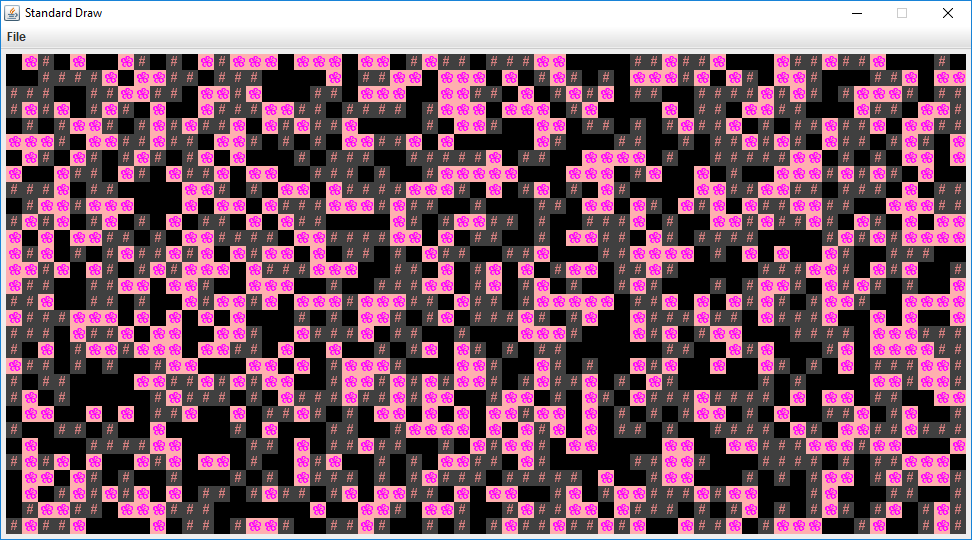

{: .warning} 
This lab is a work in progress and unfinished. Proceed at your own risk.

## [FAQ](faq.md)

Each assignment will have an FAQ linked at the top. You can also access it by
adding "/faq" to the end of the URL. The FAQ for Lab 09 is located
[here](faq.md).

## Introduction

This lab will help you with Project 3: Build Your Own World (BYOW). The first
part will teach you how to use a set of "tiles" to generate shapes on your
screen. This will apply to building the rooms, hallways, and other features of
your world in Project 3. Next week's lab will go more into implementing interactivity, 
which is relevant towards building a part of Project 3 (but more on this in the 
next lab).

## Pre-Lab

Some steps to complete before getting started on this lab:

- As usual, run `git pull skeleton main`
- Watch a previous semester's project 3 getting started video [at this link](https://youtu.be/zgdNWICEb_M).
- Note the name and API have changed slightly, but the bigger picture still
  applies. 
- Understand that project 3 will be a marathon and not a sprint. Don't wait
  until the last minute. You and your partner should start thinking about your
  design NOW.
- Read over Phase 1 of the [project 3 spec](../../proj/proj3/index.md).

In the first half of this lab, you will learn some basic
techniques and tools that will be helpful for project 3.

## Part I: Meet the Tile Rendering Engine

### Boring World

Open up the skeleton and check out the `BoringWorldDemo` file. Try running
it and you should see a window appear that looks like the following:


This world consists of empty space, except for the rectangular block near the
bottom middle. The code to generate this world consists of three main parts:

- Initializing the tile rendering engine.
- Generating a two dimensional `TETile[][]` array.
- Using the tile rendering engine to display the `TETile[][]` array.

The API for the tile rendering engine is simple. After creating a `TERenderer`
object, you need to call the `initialize` method, specifying the width
and height of your world, where the width and height are given in terms of the
number of tiles. Each tile is 16 pixels by 16 pixels, so for example, if we
called `ter.initialize(10, 20)`, we'd end up with a world that is 10 tiles wide
and 20 tiles tall, or equivalently 160 pixels wide and 320 pixels tall. 

`TETile` objects are also quite simple. You can either build them from scratch
using the `TETile` constructor (see `TETile.java`), or you can choose from a
palette of pregenerated tiles in the file `Tileset.java`. For example, the code
from `BoringWorldDemo.java` below generates a 2D array of tiles and fills them
with the pregenerated tile given by `Tileset.NOTHING`.

```java
TETile[][] world = new TETile[WIDTH][HEIGHT];
for (int x = 0; x < WIDTH; x++) {
    for (int y = 0; y < HEIGHT; y++) {
        world[x][y] = Tileset.NOTHING;
    }
}
```

Of course, we can overwrite existing tiles. For example, the code below from
`BoringWorld.java` creates a 14 x 4 tile region made up of the pregenerated tile
`Tileset.WALL` and writes it over some of the `NOTHING` tiles created by the
loop code shown immediately above.

```java
for (int x = 20; x < 35; x++) {
    for (int y = 5; y < 10; y++) {
        world[x][y] = Tileset.WALL;
    }
}
```

{: .info}
$(0, 0)$ is the bottom-left corner of the world (not the top-left
as you may be used to). We will work with this orientation in the lab.

The last step in rendering is to call `ter.renderFrame(world)`, where
`ter` is a `TERenderer` object. Changes made to the tiles array will not appear
on the screen until you call the `renderFrame` method.

Try changing the tile specified to something else in the `Tileset` class other
than `WALL` and see what happens. Also experiment with changing the constants in
the loop and see how the world changes.

{: .warning} 
Tiles themselves are immutable! You cannot do something like
`world[x][y].character = 'X'`.

{: .info}
Why do we initialize the world to `Tileset.NOTHING`, rather than just leaving it
untouched? The reason is that the `renderFrame` method will not draw any tiles
that are `null`. If you don't initialize the world to `Tileset.NOTHING`, you'll
get a `NullPointerException` when you try to call `renderFrame`.

### Random World

Now open up `RandomWorldDemo.java`. Try running it and you should see something like this:



This world is sheer chaos -- walls and flowers everywhere! If you look at the `RandomWorldDemo.java` file, you'll
see that we're doing a few new things:

- We create and use an object of type `Random` that is a "[pseudorandom number generator](https://en.wikipedia.org/wiki/Pseudorandom_number_generator)".
- We use a new type of conditional called a `switch` statement.
- We have delegated work to functions instead of doing everything in `main`.

A random number generator does exactly what its name suggests, it produces an
infinite stream of numbers that appear to be randomly ordered. The `Random`
class provides the ability to produce _pseudorandom_ numbers for us in Java.
For example, the following code generates and prints 3 random integers:

```java
Random r = new Random(1000);
System.out.println(r.nextInt());
System.out.println(r.nextInt());
System.out.println(r.nextInt());
```

We call `Random` a _pseudorandom_ number generator because it isn't truly
random. Underneath the hood, it uses cool math to take the previously generated
number and calculate the next number. We won't go into the details of this math,
but see [Wikipedia](https://en.wikipedia.org/wiki/Pseudorandom_number_generator)
if you're curious. More importantly, the sequence generated is deterministic, and the
way we get different sequences is by choosing what is called a "seed". 

In the above code snippet, the seed is the input to the `Random` constructor, so
`1000` in this case. Having control over the seed is pretty useful since it
allows us to indirectly control the output of the random number generator. **If we
provide the same seed to the constructor, we will get the same sequence values.**
For example, the code below prints 4 random numbers, then prints the SAME 4
random numbers again. Since the seed is different than the previous code
snippet, the 4 numbers will likely be different than the 3 numbers printed
above. This is super helpful in Project 3, as it will give us deterministic
randomness: your worlds look totally random, but you can recreate them
consistently for debugging (and grading) purposes.

```java
Random r = new Random(82731);
System.out.println(r.nextInt());
System.out.println(r.nextInt());
System.out.println(r.nextInt());
System.out.println(r.nextInt());
r = new Random(82731);
System.out.println(r.nextInt());
System.out.println(r.nextInt());
System.out.println(r.nextInt());
System.out.println(r.nextInt());
```

In the case a seed is not provided by the user/programmer, i.e.
`Random r = new Random()`, random number generators select a seed using some
value that changes frequently and produces a lot of unique values, such as the
current time and date. Seeds can be generated in all sorts of other stranger
ways, such as
[using a wall full of lava lamps](https://www.popularmechanics.com/technology/security/news/a28921/lava-lamp-security-cloudflare/).

For now, `RandomWorldDemo` uses a hard coded seed, namely `2873123`, so it will
always generate the exact same random world. You can change the seed if you want
to see other random worlds, though given how chaotic the world is, it probably
won't be very interesting.

The final and most important thing is that rather than doing everything in
`main`, **our code delegates work to functions with clearly defined behavior**.
This is critically important for your project 3 experience! You're going to want
to constantly identify small subtasks that can be solved with clearly defined
methods. Furthermore, your methods should form a hierarchy of abstractions!

## Part II: Conway's Game of Life

### Introduction

Conway's Game of Life (or just Life) is a cellular automaton created by mathematician 
John Horton Conway. Cellular automaton is a model of computation related to automata 
theory (i.e. study of abstract machines and automata/self-operating machines). We don't 
really need to know automata theory or what cellular automaton is exactly, but the Game
of Life is meant to be an example of how cells change over time. It is a zero-player game, 
with the world existing as an infinite, two-dimensional grid of cells. Each cell can either 
be alive or dead, with the status of each cell changing at each timestep, dependent on 
the status of its 8 neighbors (we'll go more into the rules later). An example of what 
the game looks like is shown below: 

{: style="height: 250px;" }

The evolutions are based on the initial state. The initial state will effectively 
act as a "seed" for what future states will look like. For this lab, the initial
state can be generated with a random seed, or it can be provided in the form 
of a file.

## Implementation 

Before we get started, please take this time to go through the `GameOfLife` file. It's
important to familiarize yourself with the current code before you start working with it.

Here are also a couple of reminders and tips before you begin:
- You can assume that each tile on the board will always be `Tileset.NOTHING` or `Tileset.CELL`.
- (0, 0) is the bottom left of the board.
- Comments have been provided for you above each method, as well as in the form of TODO comments 
  for the methods you'll be implementing. Make sure to read them!

{: .warning} 
Make sure you've read through the tips and reminders above! We'll assume you understand them 
in the next sections.

### `nextEvolution`

As we mentioned earlier, the world of Conway's Game of Life is a two-dimensional grid of 
cells, with each cell existing as dead or alive. The status of those cells will change 
based on the status of their 8 neighbors (vertical, horizontal, diagonal). An example 
of this is shown below, where the green cell is our current cell and the purple cells 
are its neighbors: 

{: style="height: 250px;" }

{: .info} 
When you are checking how the status of a cell will be changed, you only need to be 
concerned with its direct 8 neighbors as shown above.

** At each timestep, the status of a cell will change based on the following rules:**
1. Any live cell with fewer than two live neighbors dies, as if by underpopulation.
2. Any live cell with two or three neighbors lives on to the next generation.
3. Any live cell with more than three neighbors dies, as if by overpopulation. 
4. Any dead cell with exactly three live neighbors becomes a live cell, as if by reproduction.

In `nextEvolution`, we want to "update" the state of our board according to the rules 
that are provided above. The current state of the board is represented by
`TETiles[][] tiles`. The provided `TETile[][] newEvo` represents the next state and 
is **initially filled with Tileset.NOTHING**. We want to take the current state 
of the board and store the next evolution/state in `newEvo` and return it. 

{: .task} 
Implement the method `nextEvolution` according to the rules above. 

## Persistence 
Before we get into the other two methods you'll need to implement, let's talk a little about Project 3. 
In Project 3, you’ll have to implement the ability to save and load your game state. The goal 
of this portion of the lab is to help you gain familiarity with the idea of persistence. What is 
persistence?

Whenever a Java program is run, we use variables to keep track of our values. But once that
program ends, those values “no longer exist” or they are no longer accessible. For us to continue 
accessing those values, we want to ensure that the state of our program persists. 
This is called persistence.

{: .info} 
For this part of the lab, we've provided a class, `FileUtils` to help you save and load 
information into a file. Please use the provided class in your implementation and read 
through the class before moving on.

### `saveBoard`

If you navigate to `src/patterns`, you'll see several text files that contain 
different patterns. These specific patterns represent several initial states
that we can pass in, but more importantly, they are saved in a specific format 
that we want to replicate in `saveBoard`. Let's walk through one of them
(`glidergun.txt`) as an example: 

```shell
50 50
00000000000000000000000000000000000000000000000000
00000000000000000000000000000000000000000000000000
00000000000000000000000000000000000000000000000000
00000000000000000000000000000000000000000000000000
00000000000000000000000000000000000000000001100000
// The rest is hidden away
```

The first two numbers you see are the width and height of the board respectively and **are separated by 
a single space.** The next lines in the text file represent our board (in the example above,
we've hidden away most of it since it gets quite long). In code, each position of the
board is either `Tileset.NOTHING` or `Tileset.CELL`. When we save it into a text file,
we will save it so that **0 represents `NOTHING` and 1 represents a `CELL`.** 

There are three additional requirements: 
- Make sure the orientation in the text file represents the same orientation as the board. The top 
  right corner of the board should match the top right corner of what is saved in the text file. 
  Think about why this is important - if (0, 0) represents the bottom left of our board, but we 
  write from the top, what might end up happening? 
- For each row you write in to the text file make sure to append `\n`. This applies to the dimensions
  although the code has already been provided to you in the skeleton). This is to ensure that the board 
  representation in the text file is accurate; it will also be useful in the next method, `loadBoard`.
- **The name of your text file that you save to must be called `save.txt`. We've provided it already, so 
  do not delete it.**

In the skeleton, we've provided `TODO` comments. You can access the current state of
the board through the instance variable `currentState`.

{: .task}
Implement the method `saveBoard`. 

### `loadBoard`

Now, instead of saving, we want to load from a given file. When loading, you can assume 
the format is the same as what's mentioned in the previous part in `saveBoard`. That is, 
the first line are the dimensions, and the rest of the lines are the board. We want to load 
this information into a `TETile[][]` and return it. 

Based on the requirements mentioned in `saveBoard`, you can assume that each line is separated 
by "\n" and that the orientation of the board is correct (keep in mind that if your `saveBoard` 
doesn't follow the exact format mentioned, it might affect your `loadBoard`). For this part, 
you might find the `split` and `charAt` function from the `String` class useful. 

{: .task}
Implement the method `loadBoard`. Since we're loading in the game, make sure to initialize 
the instance variables `width` and `height`. 

## Testing and Running the Game

We've provided some local tests to help check your implementation. Passing all of them 
**does not guarantee full score on the autograder.**

{: .danger}
We've provided some files for you in `patterns`, that represent some initial states you can 
pass in. **DO NOT MODIFY THEM.** They should not be modified as they are used in the local 
tests and it is expecting them to be untouched - the local tests will check if they are modified 
and the tests will not run if the files are edited. 

If you want to run the game with one of the initial states (or potentially create your own!), 
navigate to Run --> Edit Configurations. Go to Applications --> GameOfLife. For your program 
arguments, you want to specify the file path as well as add in the `-l` flag. For example, 
if you wanted to use the `hammerhead.txt` as an initial state, you would pass in the following 
for your program arguments: 

```shell
-l src/patterns/hammerhead.txt
```

## Project 3 Saving and Loading

## Submission

To summarize, there are three methods for you to implement: 
- `nextEvolution`
- `saveBoard`
- `loadBoard`

Before submitting, make sure that you've passed all the provided local tests. 
The autograder will be testing the functionality of your loading and saving. 

The score you receive on Gradescope if your final score. 
