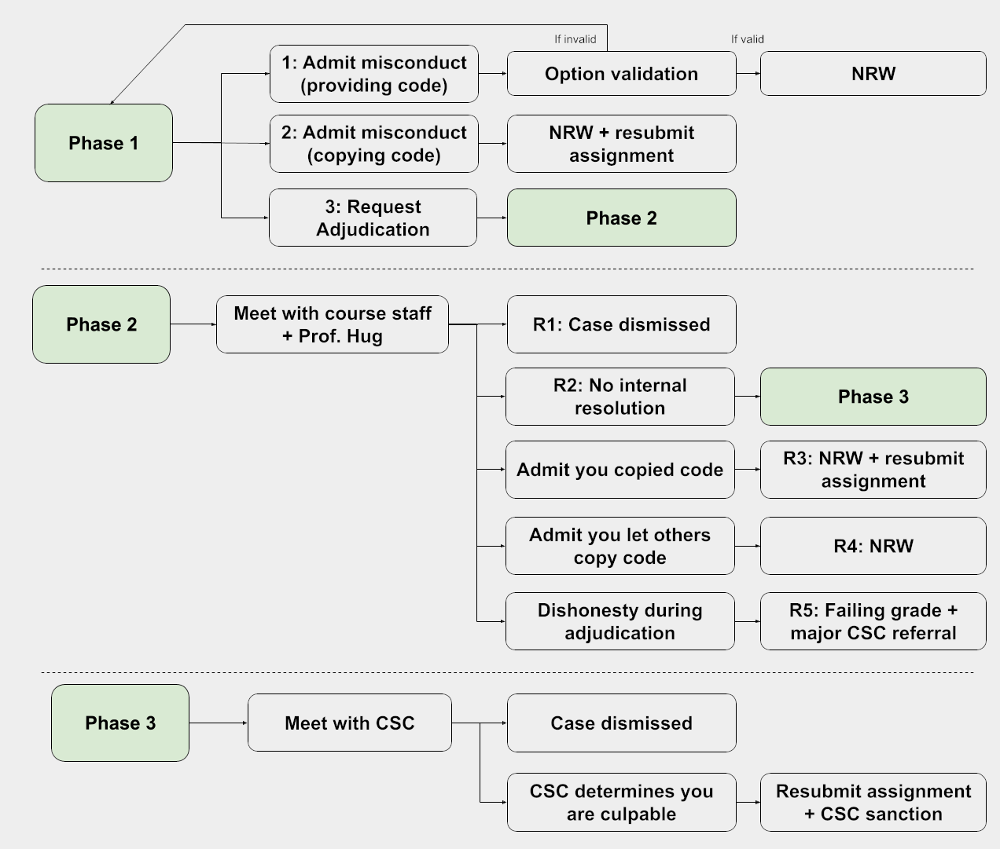

## Brief Overview of the Academic Misconduct Process

At a high level, the overall process is simple. If you violated course
policies, you admit responsibility and we reach a swift resolution. However, if
you did not violate course policy, or you are not sure if you violated
course policies, you can request adjudication where you get a chance to
hear our case and explain your situation.

If you did commit an act of academic misconduct, please do not waste our time
or yours by trying to get out of negative consequences. It probably won't work
and it's unethical.

For those of you want more details on the process, read further. However,
you shouldn't need these details to decide what to do.

**Dropping the course is not a way to avoid penalties.** If you drop after being
informed of potential academic misconduct and do not respond to us, we will
forward the details of your case directly to the Center for Student Conduct,
and you will be re-enrolled in the course by your college if found responsible.

## About Academic Misconduct

Given how very hard so many people in 61B work for what they achieve, we must
pursue academic misconduct cases very seriously, and without much mercy.

However, we also don't want to derail your undergraduate plans for a single,
albeit serious, mistake. This is particularly true today in the era of the
3.3 GPA cutoff and pandemic.

For those of you who did do something dishonest: we understand that the pressure
is very high at Berkeley, and that under this pressure, you may have done
something you wouldn't usually do. This is not a reflection on who you are as
a person, but nonetheless, we must administer sanctions to maintain the
integrity of the department. We hope you will learn from this experience
and that it does not cause you too much grief.

In 61B, there are four possible actions in response to academic misconduct,
divided into two categories: Academic Penalties and Center for Student Conduct
Referrals. We may take multiple actions, and will always refer verified
misconduct to the CSC.

### Academic Penalties

1. Failing grade.
2. Resubmitting the assignment.

### Center for Student Conduct Referrals

1. Non-Reportable Warning (NRW) from the Center for Student Conduct (CSC).
2. Reportable warning from the CSC.

The following section describes what each of these mean. The section after that
describes the process by which sanctions are assigned.

## Description of Sanctions

### Failing Grade (Grade Penalty Type 1)

This grade penalty is typically assessed if you cheat on an exam or have two or
more violations on projects, hws, or labs. However, it can be assessed in other
circumstances as described in "Process" portion of this document.

Failing the course will impact your GPA. However, if you retake 61B, your
original grade will be replaced with your new grade. However, even if you retake
the course, the failing grade will be factored into your 61A/61B/70 GPA for
purposes of declaring the major, effectively rendering it impossible to enter
the major.

If you are already on academic probation or are in danger of losing some sort of
scholarship or financial aid, then unfortunately this may significantly impact
your life. However, dismissal is not permanent. If this is your
situation, please contact the staff immediately so we can advise you on how to
proceed.

### Resubmitting the Assignment (Grade Penalty Type 2)

This grade penalty is given for plagiarism on a HW, lab, or project. You will
resubmit the assignment, and your new submission will be closely scrutinized
for academic misconduct. Plagiarism on the resubmission will be treated as a
new instance of plagiarism, resulting in a failing grade in the course.

### Non-Reportable Warning (NRW) (Warning Type 1)

The Office of Student Conduct will issue a formal warning to you that "violation
of specified University policies or campus regulations has occurred and that
continued or repeated violations of University policies or campus regulations
may be cause for further disciplinary action."

Such warnings are completely private, and will not be observable to anybody
outside the CSC, or as they put it "records of non-reportable warnings are
maintained only for in-house reference in case of subsequent violations." This
warning will not affect your ability to declare yourself as a CS major, and will
not appear on any documents (including transcripts, financial aid, a letter to
your parents) whatsoever.

Such warnings are called Non-Reportable Warnings (NRW). A second NRW in 61B or
another course will likely result in temporary or even permanent dismissal from
the university.

See the [code of conduct](http://sa.berkeley.edu/student-code-of-conduct) for
more.

However, all the Colleges have policies that affect your ability to drop
the course if you admit academic misconduct or the CSC finds you responsible.

[Letters and Sciences](https://lsadvising.berkeley.edu/policies/student-responsibilities)
: "If the Center for Student Conduct(link is external) finds you responsible
for academic misconduct in a course, **you will not be allowed to drop that
course**, change the grade option, or request an Incomplete
(or freeze an Incomplete). If an L&S Dean grants a drop or approves a change,
or you withdraw, and you are later found responsible, **the course will be
reinstated to your record**."

[Engineering](https://engineering.berkeley.edu/students/undergraduate-guide/policies-procedures/grades/)
: "Courses for which academic dishonesty has been verified by established
campus procedures **cannot be dropped from the record**, nor can the grading
option be changed. If a student drops a course in which academic dishonesty
has been verified, **the course will be reinstated** and the grade will be posted
to the student’s record. If a student changes the grading option in a course
in which academic dishonesty has been verified, the the grading option will
be reverted to the grading option on record at the time of the incident of
misconduct and the grade will be posted to the student’s record."

Other colleges have similar policies not linked here.

### Reportable Warning (Warning Type 2)

A reportable warning is similar to a non-reportable warning, except that it is
"maintained as part of the student’s conduct record." We are not sure of any
further distinctions. Please contact the Office of Student Conduct for more
information.

## The Process

In order to resolve each case, we must establish two things: The facts of your
case, and the appropriate sanction (if any). The 61B academic misconduct process
follows up to three phases, described below.

### Phase 1: Option Selection

In order to streamline the process, we provide a low-friction way for you to
admit responsibility, with clear sanctions. We provide a form that you can fill
out to provide your input on the case:

1. You accept that you allowed another student to have a copy of your work
   (either directly or inadvertently) and sign the faculty disposition form. You
   are given no grade penalty in the course and will not have to resubmit the
   assignment, but you are referred to the Center
   for Student Conduct for an NRW, with a special note from the instructors that this was a
   very minor violation. Optionally, you may meet with one of the
   instructors and/or TAs, though this will not prevent a CSC warning. This penalty applies even
   if you simply posted your code somewhere publicly, e.g. a public Github
   repository.
2. You accept that you submitted work for a grade that was not your own, and
   sign the faculty disposition form. You will resubmit the assignment with
   your own work, and we will verify that your resubmission is your own work
   more carefully. You are also referred to the Center for Student Conduct for
   an NRW. Optionally, you may meet with one of the
   instructors and/or TAs, though this
   will not prevent a CSC warning.
3. You are unsure if your case consitutes academic misconduct, and express a
   desire to enter the adjudication phase (see next section). You must schedule
   a meeting with the TAs to determine the facts of your case. **You should NOT
   select this option if you are sure that you violated course policies.**

To determine what option to enter, please review the
[course collaboration policies](/policies#academic-misconduct). Feel free to
contact the head TAs at `cs61b [at] berkeley.edu`{: .blue} for advice on
options.

For any case involving a group of students with matching code, the pleas of all
participants will be rejected if there is no student who accepts responsibility
for plagiarism (Option 2). In other words, if everybody claims Option 1, we will
invalidate all of these choices (and thus re-enter Phase 1).

If one student in a plagiarism case requests adjudication, then all members
involved might need to meet at once with the TAs to establish the facts of the
case.

If you are truly believe that you did not engage in academic misconduc, please
submit Option 3.
**We are very serious about ensuring that nobody is wrongly penalized!**

**If you aren't sure which option to enter, please email
`cs61b [at] berkeley.edu`{: .blue} for additional information.**

### Phase 2: Internal Adjudication

If you request adjudication (Option 3), we will hold a meeting between you
and ALL involved parties at the same time. During this meeting, we will attempt
to establish the facts of your case, as well as an appropriate sanction.

We ask that if you come to adjudication, that you conduct yourself honestly.
Attempts to be deceptive will be met very harshly as described below.

From here, there are five potential results for **each** person, determined
independently.

- R1: We determine that you are innocent. The process ends.
- R2: You think that you have not engaged in academic misconduct, but we still
  think you did. We then move to Phase 3 (External Adjudication).
- R3: We determine that you have overcollaborated or copied code, thus
  submitting work that is not your own. You will be required to resubmit the
  assignment and you will receive an NRW from the CSC.
- R4: We determine that you have given someone else your code. You will receive
  an NRW from the CSC.
- R5: You conduct yourself dishonestly during adjudication, wasting everybody's
  time. In this case, regardless of the circumstances of your specific case or
  the minimal nature of your dishonesty, we will give you a failing grade and
  refer you to CSC for additional sanctions.

### Phase 3: External Adjudication

If we are unable to come to an agreement in Phase 2, we will refer your case to
the Center for Student Conduct. They will conduct their own investigation, and
resolve your case through their own process.

Note that censures are likely to be more severe if the CSC determines you
engaged in academic misconduct, possibly including a Reportable Warning, which
will become a part of your official student record.

## Summary

The process is described in the flowcharts below. A NRW is a non-reportable
warning from the CSC. "Option validation" refers to the process of ensuring that
not everyone in the group has claimed "Option 1", which is impossible.

We hope this process is fair and encourages you to establish a more solid
foundation as you move forwards with your future in CS. If you are indeed
responsible, do not feel that you are somehow a tainted person! Painful though it may
be now, we hope that you will instead someday reflect on this process as
ultimately enriching, as it helps build you into being more resistant to taking
the easy low road in future times of great duress.

This policy is subject to minor revisions and should not be considered set in
stone.
