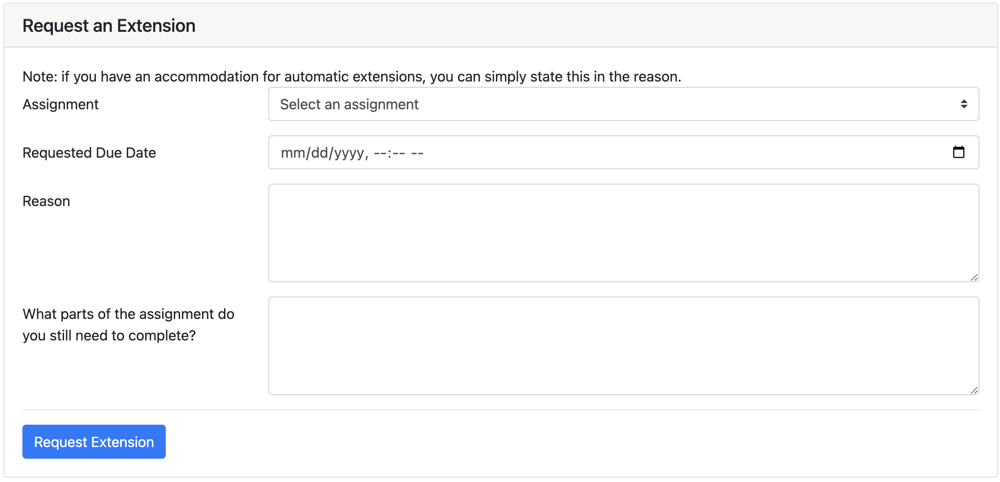

## Extensions

This guide walks through how to submit an extension request through Beacon. Before requesting an extension, please make sure to read through [our lateness policy](/policies#lateness).

## Requesting an Extension

1. Navigate to the extensions page on [Beacon]({{ site.beacon_url }}/extensions).
2. In the "Requesting an Extension" form, fill out each field and click "Submit".

   

3. If your extension requires a manual approval, we'll do our best to respond within 48 hours.
4. To request longer extensions or request information about campus resources, please fill out the [Extenuating Circumstances Form](https://forms.gle/ttnxv8qjGmfYr3Hg9)!
5. If you would like to meet with a member of course staff to discuss academic, mental health, or other campus resources, you can schedule a meeting through [this form](https://forms.gle/Lf6KfY8tw16cmriW9)!
