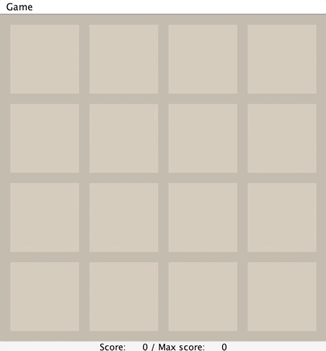
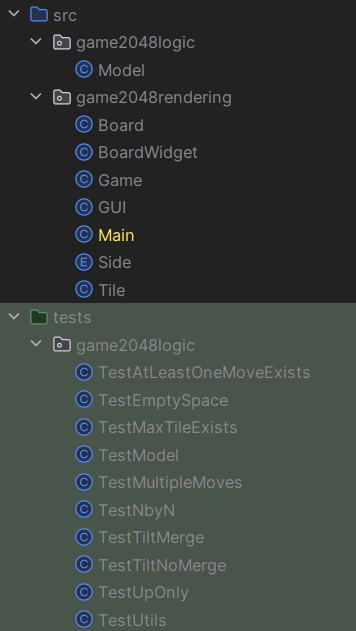
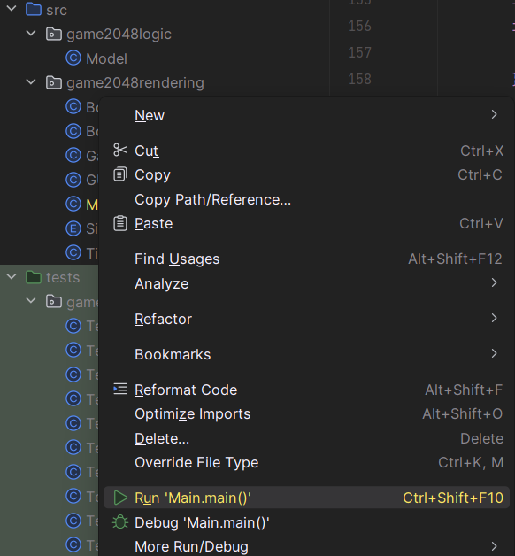

Due: <b>Tuesday, January 24, 11:59 PM PT</b>.

## FAQ

Each assignment will have an FAQ linked at the top. The
FAQ for Project 0 is located
[here](faq.md).

---

## Introduction

A high level overview of this project can be found at [https://youtu.be/Xzihuj_JZBI](https://youtu.be/Xzihuj_JZBI). This
video is from the Spring 2021 version of the project so there are some slight differences.

The intent of this project is to give you a chance to get familiar with Java and the various tools used in the course
like the IntelliJ IDE and JUnit for writing and running unit tests. Though you'll find many files and lots of code in
the `proj0` folder, your task only resides in `Model.java` and is constrained to just four methods.

We will be grading _solely_ on whether you manage to get your program to work
(according to our tests) and to hand in the assigned pieces. **There are no hidden tests**. In future assignments we
will also be grading you on style, but that isn't the case with this project. We still recommend following our
[style61b guide](../../resources/guides/style/index.md) as you'll find that it helps create clean code, but you won't be graded on
it.

The spec for this assignment is quite long, and there is a lot of starter code. We recommend that you read the entire
spec before you start doing any programming. It will probably feel overwhelming at first. You'll probably need to reread
sections of the spec several times to fully digest it, and some of the later parts might not make total sense until
you've finished earlier parts of the project. Ultimately, we hope you leave this experience with a sense of empowerment
that you were able to navigate such a large task.

For those of you who have taken CS10, you may remember implementing 2048, though you'll see that this assignment has a
rather different feeling to it.

## The Game

You've probably seen and perhaps played the game "2048," a single-player computer game written by Gabriele Cirulli, and
based on an earlier game "1024"
by Veewo Studio (see his
[on-line version of 2048](http://gabrielecirulli.github.io/2048)).

In this project, you'll be building the core logic of this game. That is, we've already put together all the GUI code,
handle key-presses, and a ton of other scaffolding. Your job will be to do the most important and interesting part.

Specifically, you will fill out 4 methods in the `Model.java` file which governs what happens after certain key-presses
from the user.

The game itself is quite simple. It's played on a $4\times4$ grid of squares, each of which can either be empty or
contain a tile bearing an integer--a power of 2 greater than or equal to 2. Before the first move, the application adds
a tile containing either 2 or 4 to a random square on the initially empty board. The choice of 2 or 4 is random, with a
75% chance of choosing 2 and a 25% chance of choosing 4.

The player then chooses a direction via their arrow keys to _tilt_ the board:
north, south, east, or west. All tiles slide in that direction until there is no empty space left in the direction of
motion (there might not be any to start with). A tile can possibly _merge_ with another tile which earns the player
points.

The below GIF is an example to see what the result of a few moves looks like.

{:style="display:block; margin-left:auto; margin-right:auto"}

Here are the full rules for when merges occur that are shown in the image above.

1. Two tiles of the same value _merge_ into one tile containing double the initial number.

2. A tile that is the result of a merge will not merge again on that tilt. For example, if we have [X, 2, 2, 4], where X
   represents an empty space, and we move the tiles to the left, we should end up with [4, 4, X, X], not [8, X, X, X].
   This is because the leftmost 4 was already part of a merge so should not merge again.

3. When three adjacent tiles in the direction of motion have the same number, then the leading two tiles in the
   direction of motion merge, and the trailing tile does not. For example, if we have [X, 2, 2, 2] and move tiles left,
   we should end up with [4, 2, X, X] not [2, 4, X, X].

As a corollary of these rules, if there are four adjacent tiles with the same number in the direction of motion, they
form two merged tiles. For example, if we have [4, 4, 4, 4], then if we move to the left, we end up with [8, 8, X, X].
This is because the leading two tiles will be merged as a result of rule 3, then the trailing two tiles will be merged,
but because of rule 2 these merged tiles (8 in our example) will not merge themselves on that tilt. You'll find
applications of each of the 3 rules listed above in the animated GIF above, so watch through it a few times to get a
good understanding of these rules.

To test your understanding, you should complete this [Google Form quiz](https://forms.gle/xW74vQnK7dZAjS6eA). This quiz
is not part of your 61B course grade.

If the tilt did not change the board state, then no new tiles will be randomly generated. Otherwise, a single randomly
generated tile will be added to the board on an empty square. Note: Your code will not be adding any new tiles! We've
already done that part for you.

You might also notice that there is a field "Score" at the bottom of the screen that is being updated with each move.
The score will not always change every move, but only when two tiles merge. Your code will need to update the score.

Each time two tiles merge to form a larger tile, the player earns the number of points on the new tile. The game ends
when the current player has no available moves (no tilt can change the board), or a move forms a square containing 2048.
Your code will be responsible for detecting when the game is over.

The "Max Score" is the maximum score the user has achieved in that game session. It isn't updated until the game is
over, so that is why it remains 0 throughout the animated GIF example.

## Assignment Philosophy and Program Design

A video overview of this section of the spec can be found
at [https://youtu.be/3YbIOga6ZdQ](https://youtu.be/3YbIOga6ZdQ).

In this project, we're giving you a TON of starter code that uses many pieces of Java syntax that we have not covered
yet, and even some syntax that we'll never cover in our class.

While it may seem daunting to have a ton of code dumped on you that you can't possibly understand, it'll be OK! The
reason we're doing this is that in the real world, you'll often work with codebases that you don't fully understand (or
maybe don't understand at all, like in this project!) and will have to do some tinkering and experimentation to get the
results you want. Don't worry, when we get to project 1 next week, you'll have a chance to start from scratch.

We'll now go over the different classes that you will interact with.

### Tile

This class represents the numbered tiles on the board. If a variable of type `Tile`
is `null`, it's treated as an empty tile on the board. You will not need to instantiate any `Tile` objects, though you
will need have an understanding of them since you will be using them in the `Model` class. The only method of this class
you'll need to use is `.value()` which returns the value of the given tile. For example if `Tile t` corresponds to a
tile with the value 8, then `t.value()` will return `8`.

### Side

The `Side` class is a special type of class called an `Enum`.
Enums may take on only one of a finite set of values. In this case, we have a value for each of the 4
sides: `NORTH`,
`SOUTH`, `EAST`, and `WEST`. You will not need to use any of the methods of this class nor manipulate the instance
variables.

Enums can be assigned with syntax like `Side s = Side.NORTH`. Note that rather than using the `new` keyword, we simply
set the `Side` value equal to one of the four values. Similarly if we have a function
like `public static void printSide(Side s)`, we can call this function as follows: `printSide(Side.NORTH)`, which will
pass the value `NORTH` to the function.

If you're curous to learn more about Java enums,
see [https://docs.oracle.com/javase/tutorial/java/javaOO/enum.html](https://docs.oracle.com/javase/tutorial/java/javaOO/enum.html)
.

### Model

This class represents the entire state of the game. A `Model` object represents a game of 2048. It has instance
variables for the state of the board (i.e. where all the `Tile` objects are, what the score is, etc) as well as a
variety of methods. One of the challenges when you get to the fourth final task of this project (writing the `tilt`
method) will be to figure out which of these methods and instance variables are useful.

### Board

This class represents the board of tiles itself. It has three methods that you'll use: `setViewingPerspective`, `tile`
, `move`.

**You will only edit the `Model.java` file in this assignment.** Gradescope will only take your `Model.java` file and
use the skeleton versions of the other files, so if you make an edit to `Tile.java` for example, it will not be
recognized by Gradescope.

## Getting Started

**Firstly, ensure you've completed [lab 1](../../lab/lab01/index.md)**. You will not be able to work on the project if
haven't completed all the necessary set up that you're required to do in lab 1.

### Getting the skeleton files

First, make sure that everything in your repository is properly updated and checked in. Before you start, the command

    git status

when done in your `{{ site.semester }}-s***` directory should report that the directory is clean and that there are no untracked files
that should be added and committed. If there are, simply add and commit.

_Never_ start a new project without doing this.

To obtain the skeleton files, you should use the command

    git pull skeleton main

in your `{{ site.semester }}-s***` directory. You'll see a folder `proj0` containing all of the skeleton code is now in your student
repo.

In the unlikely event that we must update the skeleton, you can use the same command to update your project with the
same changes.

### Getting restarted: Skeleton

Rather than trying to get your current code to work, you might find yourself wanting to just restart completely. That is
possible with Git! Simply run this command in your `{{ site.semester }}-s***` directory:

    git restore --source=skeleton/main proj0

**Beware: this command will get rid of all changes to anything in the `proj0`**
directory that you haven't committed. So if you think you _might_ want the code you currently have, simply make a commit
before running this command, and then you can use a similar command to revert your `proj0` directory to the state it was
in the commit you just made. For example, suppose you want to save a copy of your work and then start back over. To do
this you could do the following:

    git add proj0
    git commit -m "save work because I want to start back over"
    git push
    git restore --source=skeleton/main proj0

Then later, if you wanted to restore your work that you saved, you could use `git restore` with that commit as the source. If you have trouble with this, post to Ed or ask a TA.

For more information, refer to [this section of the git guide](../../resources/guides/git/#getting-previous-versions-of-files)

### IntelliJ Setup

Let's now open the files in IntelliJ. Firstly, launch IntelliJ. It will show you a list of your recent projects, but
since you haven't started this assignment yet, it won't be there. To open the project, click the "Open" button at the
top right of the application window which should bring up your operating system's file browser. Navigate to the `proj0`
folder in your student repo, and then hit open:

{:style="display:block; margin-left:auto; margin-right:auto"}

{:style="display:block; margin-left:auto; margin-right:auto"}

On the top left of the screen, you'll see a list of the files/folders inside the `proj0` directory. If you don't, click
the down arrow on the `proj0` folder which will expand the folder below. It should look like this:

{:style="display:block; margin-left:auto; margin-right:auto"}

The `.idea` folder is something that IntelliJ generates to store miscellaneous settings. You can ignore this folder.

The `src` folder contains all the Java source files for the game. The `tests` folder contains all the testing files. Everything you need to do lies in these folders.

IntelliJ is usually smart enough to set up the rest of the things for you, but in case your IntelliJ application is
having a hard time we'll walk through the setup procedures.

We need to tell IntelliJ that we want to use those `.jar` files in the `library-{{ site.semester }}`
folder. Still in the Project Structure, on the left-hand side click the section of the Project Settings called "Library"
. If you see that `library-{{ site.semester }}` is already added, there is nothing to do. Else, we will click on the "+" button and
then "Java" which will launch our operating system's file browser, and we'll click on the `library-{{ site.semester }}` folder. Then,
in the bottom right of the screen, hit "Apply" and then the blue "OK" button.

In all, the setup would look like this (this is from fa22, {{ site.semester }} might have different files so don't worry if the files exactly match, also sorry for the blurryness):

{:style="display:block; margin-left:auto; margin-right:auto"}

To make sure the setup is all fine, open the `game2048` folder and right click on the `Main` Java file: you'll see a few
options, but the one we care about is the green "Run Main.main()" button. It should look like the following image:

{:style="display:block; margin-left:auto; margin-right:auto"}

Click that to launch the 2048 game. This will launch a new window with a blank board. Just close the window for now by pressing the red square at the top right of IntelliJ and we’ll come back to it later when we get to the section of this spec called "Main Task: Building the Game Logic".

If nothing pops up, it means your setup is incorrect. You should redo the above steps to make sure you didn't miss
anything, but don't spend more than 10 minutes on this. It's best to get setup problems fixed with a TAs help, meaning
you should post on Ed or go to Office Hours. If you post on Ed, you need to tell us **everything** you've done/tried so
we can get a clear picture of what the error is.

One weird quirk you might run into is that the code compiles and runs correctly, but you still get red underlines in
IntelliJ. Go to the `Model`
class, and find the `addTile` method. This is a method we provided, but you might see that the `tile` variable is
underlined in red with the following error message:

{:style="display:block; margin-left:auto; margin-right:auto"}

But we know that clearly it's correct because 1). the code ran and 2). it's the starter code! While IntelliJ is
incredibly powerful, it does get things wrong sometimes like this. To fix this, you should go to File >
Invalidate / Restart, then in the following window hit "Invalidate and Restart"

{:style="display:block; margin-left:auto; margin-right:auto"}

This will take a minute or two as IntelliJ is re-indexing your JDK and setting up your project from scratch. After it
finishes, you should see no red underlines in the source files.

You won't be able to work on the project unless the above setup is fine, so make it your priority to get setup as soon
as you can.

## Your Assignment

Your job for this project is to modify and complete the `Model` class, specifically the `emptySpaceExists`
, `maxTileExists`, `atLeastOneMoveExists` and
`tilt` methods. Everything else has been implemented for you. We recommend completing them in this order. The first two
are relatively straightforward. The third (`atLeastOneMoveExists`) is harder, and the final method `tilt` will probably
be quite difficult. We anticipate that `tilt` will take you 3 to 10 hours to complete. The first three methods will
handle the game over conditions, and the final method `tilt` will modify the board after key-presses from the user. You
can read the very short body of the `checkGameOver` method to get an idea of how your methods will be used to check if
the game is over.

Let's start by looking at the first three methods:

### public static boolean emptySpaceExists(Board b)

This method should return true if any of the tiles in the given board are null.
**You should NOT modify the Board.java file in any way for this project**. For this method, you'll want to use the
`tile(int col, int row)` and `size()` methods of the `Board` class. No other methods are necessary.

Note: We've designed the `Board` class using a special keyword `private` that disallows you from using the instance
variables of `Board` directly. For example, if you try to access `b.values[0][0]`, this will not work. This is a good
thing! It forces you to learn to use the `tile` method, which you'll use throughout the rest of the project.

Try opening the `TestEmptySpace.java` folder. Run the tests. You should see that 6 of the tests fail and 2 of them pass.
After you've correctly written the `emptySpaceExists` method, all 8 tests in `TestEmptySpace` should pass.

{: .warning}
A quick overview of how to get started writing this method is provided in [this video](https://youtu.be/13rdFndFNXc).

### public static boolean maxTileExists(Board b)

This method should return true if any of the tiles in the board are equal to the winning tile value 2048. Note that
rather than hard coding the constant 2048 into your code, you should use MAX_PIECE, which is a constant that is part of
the `Model` class. In other words, you shouldn't do `if (x == 2048)` but rather `if (x == MAX_PIECE)`.

Leaving in hard coded numbers like `2048` is a bad programming practice sometimes referred to as a "magic number". The
danger of such magic numbers is that if you change them in one part of your code but not another, you might get
unexpected results. By using a variable like `MAX_PIECE` you can ensure they all get changed together.

After you've written the method, the tests in `TestMaxTileExists.java` should pass.

### public static boolean atLeastOneMoveExists(Board b)

This method is more challenging. It should return true if there are any valid moves. By a
"valid move", we mean that if there is a button (UP, DOWN, LEFT, or RIGHT) that a user can press while playing 2048 that
causes at least one tile to move, then such a keypress is considered a valid move.

There are two ways that there can be valid moves:

1. There is at least one empty space on the board.
2. There are two adjacent tiles with the same value.

For example, for the board below, we should return true because there is at least one empty space.

```
|   2|    |   2|    |
|   4|   4|   2|   2|
|    |   4|    |    |
|   2|   4|   4|   8|
```

For the board below, we should return false. No matter what button you press in 2048, nothing will happen, i.e. there
are no two adjacent tiles with equal values.

```
|   2|   4|   2|   4|
|  16|   2|   4|   2|
|   2|   4|   2|   4|
|   4|   2|   4|   2|
```

For the board below, we would return true since a move to the right or left would merge the two 64 tiles, and also a
move up or down would merge the 32 tiles. Or in other words, there exist at least two adjacent tiles with equal values.

```
|   2|   4|  64|  64|
|  16|   2|   4|   8|
|   2|   4|   2|  32|
|   4|   2|   4|  32|
```

After you've written the method, the tests in `TestAtLeastOneMoveExists.java` should pass.

## Main Task: Building the Game Logic

The fourth and final part of the assignment is to implement `tilt`. You should only start this method once you're
passing all the tests in `TestEmptySpace`, `TestMaxTileExists` and `TestAtLeastOneMoveExists`.

Computer science is essentially about one thing: Managing complexity. Writing the
`tilt` method is a rich experience that will give you a chance to try just that. I must warn you, this is probably going
to be a frustrating experience. It is likely that you will attempt several approaches that will ultimately fail before
you have to start back over.

Before we start talking about how `tilt` should work, let's try running the game.

Open the `Main` class and click the run button. You should see the game pop up. Try pressing the arrow keys. You should
see that nothing is happening. This is because you have not implemented the `tilt` method yet. When you're done
writing `tilt`, you'll be able to play the game.

### public void tilt(Side side)

The tilt method does the work of actually moving all the tiles around. For example, if we have the board given by:

```
|   2|    |   2|    |
|   4|   4|   2|   2|
|    |   4|    |    |
|   2|   4|   4|   8|
```

And press up, `tilt` will modify the `board` instance variable so that the state of the game is now:

```
|   2|   8|   4|   2|
|   4|   4|   4|   8|
|   2|    |    |    |
|    |    |    |    |
```

In addition to modifying the board, the score instance variable must be updated to reflect the total value of all tile
merges (if any). For the example above, we merged two 4s into an 8, and two 2s into a 4, so the score should be
incremented by 8 + 4 = 12.

All movements of tiles on the board must be completed using the `move` method provided by the `Board` class. All tiles
of the board must be accessed using the `tile` method provided by the `Board` class. **Due to some details in the GUI
implementation, you should only call `move` on a given tile once per call to `tilt`**. We'll discuss this constraint
further in the Tips section of this document.

{: .warning}
A quick overview of how to get started writing this method is provided in [this video](https://youtu.be/abFbbK1QY2k).

## Tips

We strongly recommend starting by thinking only about the up direction, i.e. when the provided `side` parameter is equal
to `Side.NORTH`. To support you in this, we provide a `TestUpOnly` class that has four tests: `testUpNoMerge`
, `testUpBasicMerge`, `testUpTripleMerge`, and `testUpTrickyMerge`. You'll note that these tests involve only a single
move up.

When considering how to implement the up direction, consider the following:

In a given column, the piece on the top row (row 3) stays put. The piece on row 2 can move up if the space above it is
empty, or it can move up one if the space above it has the same value as itself. In other words, when iterating over
rows, it is safe to iterate starting from row 3 down, since there's no way a tile will have to move again after moving
once.

While this sounds like it's not going to be very hard, many students are surprised how challenging this method is to
write. Be ready to bust out a notepad and work out a bunch of examples. Strive for elegant code, though elegance is hard
to achieve with this problem. We strongly recommend the creation of one or more helper methods to keep your code clean.
For example, you might have a helper function that processes a single column of the board, since each column is handled
independently. Or you might have a helper function that can return a desired row value.

Reminder: You should only call `move` on a given tile once. In other words, suppose you have the board below and press
up.

```
|    |    |    |    |
|    |    |    |    |
|    |    |    |    |
|    |    |    |   2|
```

One way we could accomplish this would be as follows:

```
Tile t = board.tile(3, 0)
board.move(3, 1, t);
board.move(3, 2, t);
board.move(3, 3, t);
return true;
```

However, the GUI will get confused because the same tile is not supposed to move multiple times. Instead, you'll need to
complete the entire move with one call to `move`, e.g.

```
Tile t = board.tile(3, 0)
board.move(3, 3, t);
```

In a sense, the hard part is figuring out which row each tile should end up on.

To test your understanding, you should complete this [Google Form quiz](https://forms.gle/pubhRx4fxYnPTGNX8). This quiz (and the following quizzes) are completely optional (i.e. no graded)
but **highly suggested** as it'll find any conceptual misunderstandings you might have about the game mechanics. You may
attempt this quiz as many times as you'd like.

To know when you should update the score, note that the `board.move(c, r, t)` method returns `true` if moving the
tile `t` to column `c` and row `r` would replace an existing tile (i.e. you have a merge operation).

To make matters seemingly much worse, even after you get tilt working for the up direction, you'll have to do the same
thing for the other three directions. If you do so naively, you'll get a _lot_ of repeated, slightly modified code, with
ample opportunity to introduce obscure errors.

For this problem, we've given away a clean solution. This will allow you to handle the other three directions with only
two additional lines of code!
Specifically, the `Board` class has a `setViewingPerspective(Side s)` function that will change the behavior of
the `tile` and `move` classes so that they _behave as if the given side was NORTH_.

For example, consider the board below:

```
|    |    |    |    |
|  16|    |  16|    |
|    |    |    |    |
|    |    |    |   2|
```

If we call `board.tile(0, 2)`, we'll get `16`, since 16 is in column 0, row 2. If we call
`board.setViewingPerspective(s)` where `s` is `WEST`, then the board will behave as if WEST was NORTH, i.e. you had your
head turned 90 degrees to the left, as shown below:

```
|    |    |  16|    |
|    |    |    |    |
|    |    |  16|    |
|   2|    |    |    |
```

In other words, the `16` we had before would be at `board.tile(2, 3)`. If we were to call
`board.tilt(Side.NORTH)` with a properly implemented `tilt`, the board would become:

```
|   2|    |  32|    |
|    |    |    |    |
|    |    |    |    |
|    |    |    |    |
```

To get the board to go back to the original viewing perspective, we simply call
`board.setViewingPerspective(Side.NORTH)`, which will make the board behave as if
`NORTH` was `NORTH`. If we do this, the board will now behave as if it were:

```
|    |    |    |    |
|  32|    |    |    |
|    |    |    |    |
|   2|    |    |    |
```

Observe that this is the same thing as if you'd slid the tiles of the original board to the `WEST`.

Important: Make sure to use `board.setViewingPerpsective` to set the perspective back to `Side.NORTH`
before you finish your call to `tilt`, otherwise weird stuff will happen.

To test your understanding, try this third and final [Google Form quiz](https://forms.gle/AGrhEFbwfMJ7qwaB6)
. <!--(QA notes: Let me know if this quiz is too weird / if it is actually helpful).-->You may attempt this quiz as many
times as you'd like.

## Testing

While in the future we expect you to be able to test your own programs, for this project we've given you the full test
suite.

The tests are split over 9 files: `TestEmptySpace`, `TestMaxTileExists`,
`TestAtLeastOneMoveExists`, `TestModel`, `TestUpOnly`, `TestTiltNoMerge`, `TestTiltMerge`, `TestMultipleMoves`, and `TestNbyN`. Each file tests a specific portion of the code with the
exception of `TestMultipleMoves` which tests all the things you write in coordination with each other. Such a test is called an
_integration test_ and are incredibly important in testing. While unit tests run things in isolation, integration tests
run things all together and are designed to catch obscure bugs that occur as a result of the interaction between
different functions you've written.

So do not attempt to debug `TestMultipleMoves` until you're passing the rest of the tests! In fact, the order in which we
discuss the tests is the order you should attempt them in.

We recommend using the given tests to debug your code, though you're also welcome to debug by running `Main.java`. You can also start the game from a specific state by changing the `CUSTOM_START` and `USE_CUSTOM_START` variables in `Main.java`, which may be helpful for debugging specific tests.

To run all the tests at once, you can right-click the tests folder in Intellij, then click "Run All Tests"

We'll now take a look at each of these tests and show you how to read the error messages.

### TestEmptySpace

These tests will check the correctness of your `emptySpaceExists` method. Here is what the error message would look like
if you failed one of the tests:

{:style="display:block; margin-left:auto; margin-right:auto"}

On the left-hand side, you'll see the list of all tests that were run. The yellow X means we failed a test while the
green check means we passed it. On the right, you'll see some useful error messages. To look at a single test and its
error message in isolation, click the test on the left-hand side. For example, let's say we want to look at
the `testCompletelyEmpty` test.

{:style="display:block; margin-left:auto; margin-right:auto"}

The right-hand side is now the isolated error message for this test. The top line has a useful
message: `"Board is full of empty space"` followed by a String representation of the board. You'll see that it's clearly
empty, yet our `emptySpaceExists` method is returning `false` and causing this test to fail. The javadoc comment at the
top of the code for the test also has some useful information in case you're failing a test.

### TestMaxTileExists

These tests will check the correctness of your `maxTileExists` method. The error messages will be similar to those
for `TestEmptySpace`, and you can still click on each individual test to look at them in isolation. Remember that your
`maxTileExists` method should **only** look for the max tile and not anything else (i.e. shouldn't look for empty space)
. If yours does, you will not pass all of these tests.

### TestAtLeastOneMoveExists

These tests will check the correctness of your `atLeastOneMoveExists` method. The error messages are similar to the
above two. Since the
`atLeastOneMoveExists` method depends on the `emptySpaceExists` method, you shouldn't expect to pass these tests until
you are passing all of the tests in `TestEmptySpace`.

### TestModel

These tests create a `Model` at a specific state, then check correctness of the `gameOver` method. Since `gameOver` is a combination of `maxTileExists` and `atLeastOneMoveExists`, you should expect to pass these tests if both of those methods are implemented correctly.

### TestUpOnly

These tests will check the correctness of your `tilt` method, but only in the up (`Side.NORTH`) direction. The error
messages for these are different, so let's look at one. Say we run all the tests, notice we're failing the
`testUpTrickyMerge` test. After clicking that test, we'll see this:

{:style="display:block; margin-left:auto; margin-right:auto"}

The first line tells us the direction that was tilted (for these tests it'll always be North), then what your board
looked like before the tilt, then what we expected the board to look like, and finally what your board actually looked
like.

You'll see that we're merging a tile twice on a single call to tilt which results in a single tile with value 8 instead
of two tiles both with value 4. As a result, our `score` is also incorrect as you can see in the bottom of the
representation of the board.

For other tests it might be difficult to notice the difference between the expected and actual boards right away; for
those, you can click the blue
"Click to see difference" text at the very bottom of the error message to get a side-by-side comparison of the
expected (on the left) and actual (on the right) boards in a separate window. Here is what it looks like for this test:

{:style="display:block; margin-left:auto; margin-right:auto"}

Debugging these can be a bit tricky because it's hard to tell what you're doing wrong. First, you should identify which
of the 3 rules listed above you're violating. In this case, we can see that it's rule 2 since a tile is merging more
than once. The javadoc comments on these methods are good resources for this as they specifically lay out what
rule/configuration they're testing. You might also be able to figure out what rule you're violating by just looking at
the before and after boards. Then, comes the tricky party: refactoring your existing code to properly account for that
rule. We suggest writing out on pen and paper the steps your code takes so you can first understand why your board looks
the way it does, then coming up with a fix. These tests only call `tilt`
once, so you don't need to worry about debugging multiple calls to tilt.

### TestTiltNoMerge

This is similar to `TestUpOnly`, but specifically tests situations with no merges. Unlike `TestUpOnly`, it tests in all 4 directions.

### TestTiltMerge

This is similar to `TestUpOnly`, but specifically tests situations with merges. Unlike `TestUpOnly`, it tests in all 4 directions.

### TestMultipleMoves

These integration tests simulate parts of a game. They run multiple tilts in a row and add random tiles to the board.

### TestNbyN

2048 is normally played on a 4x4 board, but it is generalizable to any size board. These tests make sure the game works on non-4x4 boards.

## Grading

A full scoring project will pass all of the unit tests that we provide. Remember that **there are no hidden tests**, so
if you're passing all of these tests then you have a full scoring project!

Tests are "all or nothing" in their own fields. If you fail one of the subtests in the test category, you will not receive credit for that category although you might have passed different test cases. For example, you'll see in Gradescope `TestModel` category 5 subtests.

Here is a breakdown of what percent you'd earn on this project with varying levels of completing:

1. `TestEmptySpace`: 10%
2. `TestMaxTileExists`: 10%
3. `TestAtLeastOneMoveExists`: 15%
4. `TestUpOnly`: 10%
5. `TestModel`: 5%
6. `TestTiltMerge`: 10%
7. `TestTiltNoMerge`: 10%
8. `TestMultipleMoves`: 15%
9. `TestNbyN`: 15%

## Submission and Version Control

It is important that you commit work to your repository _at frequent intervals_. Version control is a powerful tool for
saving yourself when you mess something up or your dog eats your project, but you must use it regularly if it is to be
of any use. Feel free to commit every 15 minutes; Git only saves what has changed, even though it acts as if it takes a
snapshot of your entire project.

The command `git status` will tell you what files you have modified, removed, or possibly added since the last commit.
It will also tell you how much you have not yet sent to your GitHub repository.

The typical commands would look something like this:

    git status                          # To see what needs to be added or committed.
    git add <filepath>                  # To add, or stage, any modified files.
    git commit -m "Commit message"      # To commit changes.
    git push

Then you can carry on working on the project until you're ready to commit and push again, in which case you'll repeat
the above. It is in your best interest to get into the habit of comitting frequently with informative commit messages so
that in the case that you need to revert back to an old version of code, it is not only possible but easy. We suggest
you commit every time you add a significant portion of code or reach some milestone (passing a new test, for example).

Once you've pushed your code to GitHub (i.e. ran `git push`), then you may go to Gradescope, find the `proj0`
assignment, and submit the code there. Keep in mind that the version of code that Gradescope uses is the most recent
commit you've pushed, so if you do not run `git push` before you submit on Gradescope, old code will be tested instead
of the most recent code you have on your computer.

Something to note, for this project we will be limiting the number of times you can submit your code within an hour to
three times. you will get 4 submission "tokens" that each regenerate after 24 hours.

## Getting Help

While a little struggle and debugging is normal and even healthy, if you find yourself stuck for hours with no progress
after doing all of the suggestions above, please get help from staff!

The two ways of getting help in CS 61B are coming to Office Hours or posting on Ed so that a TA or another student can
help you become unstuck.

Remember that TAs will spend a maximum of 10 minutes per student in Office Hours. To speed things up, we ask that you
bring a clear problem that you can voice to a TA rather than just telling us a test isn't passing. For example, if a
test isn't passing, figure out which part isn't passing and why there is a discrepancy. Maybe the `score` isn't updating
properly, or perhaps things don't merge the way they should be. This helps speed things up and might even lead you to
find your own bug.

If you're posting on Ed, please read our [Ed policies](../../resources/guides/ed/) to make sure you're not
accidentally posting part of your solution and hence violating our academic integrity policies. Otherwise, we welcome
constructive discussion on our megathreads. Remember to search for your issue before posting a follow-up as many
students have very similar bugs!
