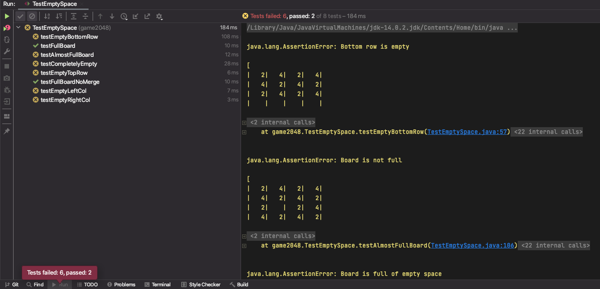

**Deadline: Monday, January 26, 11:59 PM PT.**

TODO: FAQ could be reintegrated into this spec.

## Overview

Prerequisites:

- Lab 1 (required for setup)
- HW0 (recommended, for Java syntax)
- Lectures 1-2
- [61B Style Guide](../../resources/guides/style/index.md)

[See here for a video overview of the project.](https://www.youtube.com/playlist?list=PL8FaHk7qbOD7WwTongMI3rfNbnkCE9NPb) This video is from an earlier version of the project, so there are some slight differences.

<!-- Any future resources (e.g. project party or intro section recording) can also be linked at the top here for ease of access. -->

In this project, you'll get some practice with Java by creating a playable game of 2048. We've already implemented the graphics and user interaction code for you, so your job is to implement the logic of the game.

If you're not familiar with 2048, [you can try out a demo at this link](http://gabrielecirulli.github.io/2048).

This project can seem daunting at first! There's a lot of starter code that uses Java syntax that you might not have seen before, but it'll be OK! In the real world, you'll often work with codebases that you don't fully understand, and will have to do some tinkering and experimentation to get the results you want. Don't worry, when we get to Project 1, you'll have a chance to start from scratch.

### 2048 Rules: Basic Rules

2048 is played on a grid of squares. Each square can either be empty, or contain a numbered tile.

The player chooses a direction (using the arrow keys) to _tilt_ the board: north, south, east, or west. All tiles slide in that direction until there is no empty space left in the direction of motion.

As a tile slides, it can possibly _merge_ with another tile with the same number. Each time two tiles merge to form a larger tile, the player earns the number of points on the new tile. You'll implement this in Task 4.

One tile (with value 2 or 4) is randomly generated when the game begins. After each tilt, if the tilt did not change the board state, then no new tiles will be randomly generated. Otherwise, a single randomly generated tile will be added to the board on an empty square. Your code will not be adding any new tiles! We've already done this part for you.

The game ends when the current player has no available moves (no tilt can change the board), or a move forms a square containing 2048. You'll implement this in Tasks 1-3.

{: .warning}
> For the entirety of this project, you will only need to modify the `game2048logic/Model.java` file. Changes to other files will not be recognized by Gradescope.
>
> You will, however, need to look through and use (but not modify!) some of the methods in the other files. We will provide descriptions of these methods in the spec.

## Task 1: Empty Space Exists

[See here for a video introduction to this task.](https://www.youtube.com/watch?v=13rdFndFNXc)

In `Model.java`, fill in the `emptySpaceExists(Board b)` method. (Don't modify any other files.)

This method should return true if any of the tiles in the given board are null.

### Starter code: Board coordinates

Our implementation uses xy-coordinates with (0, 0) at the _bottom-left_ corner:
{:style="display:block; margin-left:auto; margin-right:auto"}

### Starter code: `Board` class

The Board class represents a board of tiles.

The `private` keyword means that you won't be able to directly access the instance variables of the `Board` class. You will only be able to access `public` methods and variables from `Model`. (More on this keyword, and why it's useful, later in the class.)

To interact with a `Board` object in Task 1, you will need to use the `size()` and `tile(int x, int y)` methods. These methods are documented in `Board.java`.

### Starter code: `Tile` class

The Tile class represents a numbered tile on the board.

If a variable of type `Tile` is `null`, this represents an empty tile on the board.

To interact with a Tile object, you will need to use the `value()` method, which returns the numerical value of the given tile.

Example of syntax: If `t` is a variable of type `Tile`, representing a tile with value 8, then `t.value()` will return 8.

### Testing and Debugging

To test your method, run the tests in `TestEmptySpace.java` by right-clicking the file and selecting "Run 'TestEmptySpace'":

{:style="display:block; margin-left:auto; margin-right:auto"}

(You can also run all the tests in the entire folder by right-clicking `game2048logic` > "Run 'Tests in 'game2048logic''".)

Alternatively, you may open the `TestEmptySpace.java` file and click the green arrow next to `public class TestEmptySpace` to run the tests (yours may look a little different):

{:style="display:block; margin-left:auto; margin-right:auto"}

You may also run individual tests in the same manner.

You will run all tests in the same way for the rest of the project (and course!).

If your implementation is correct, all 8 tests should pass.

Here is what the error message would look like if you failed one of the tests:

{:style="display:block; margin-left:auto; margin-right:auto"}

On the left-hand side, you'll see the list of all tests that were run. The yellow X means we failed a test while the
green check means we passed it. On the right, you'll see some useful error messages. To look at a single test and its
error message in isolation, click the test on the left-hand side. For example, let's say we want to look at
the `testCompletelyEmpty` test.

{:style="display:block; margin-left:auto; margin-right:auto"}

The right-hand side is now the isolated error message for this test. The top line has a useful
message: `"Board is full of empty space"` followed by a `String` representation of the board. You'll see that it's clearly
empty, yet our `emptySpaceExists` method is returning `false` and causing this test to fail. The javadoc comment at the
top of the code for the test also has some useful information in case you're failing a test.

## Task 2: Max Tile Exists

In `Model.java`, fill in the `maxTileExists(Board b)` method. (Don't modify any other files.)

This method should return true if any of the tiles in the given board have the winning value (default 2048).

Note: Instead of hard-coding the constant 2048 in your code, you should use the variable `MAX_PIECE` (already defined for you). For example, you should write `if (x == MAX_PIECE)` instead of `if (x == 2048)`.

Leaving in hard coded numbers like `2048` is a bad programming practice, sometimes referred to as a "magic number". The danger of such magic numbers is that if you change them in one part of your code but not another, you might get unexpected results. By using a variable like `MAX_PIECE`, you can ensure they all get changed together.

### Testing and Debugging

To test your method, run the tests in `TestMaxTileExists.java`. If your implementation is correct, all tests should pass.

## Task 3: At Least One Move Exists

In `Model.java`, fill in the `atLeastOneMoveExists(Board b)` method. (Don't modify any other files.)

This method should return true if there are any valid moves. A valid move exists if there is a button (up, down, left, right) that the player can press that would cause at least one tile to move.

There are two ways a valid move can exist:

1. There is at least one empty space on the board.
2. There are two adjacent tiles with the same value.

For example, for the board below, we should return true because there is at least one empty space.

```text
|   2|    |   2|    |
|   4|   4|   2|   2|
|    |   4|    |    |
|   2|   4|   4|   8|
```

For the board below, we should return false. No matter what button you press in 2048, nothing will happen, i.e. there
are no two adjacent tiles with equal values.

```text
|   2|   4|   2|   4|
|  16|   2|   4|   2|
|   2|   4|   2|   4|
|   4|   2|   4|   2|
```

For the board below, we would return true since a move to the right or left would merge the two 64 tiles, and also a
move up or down would merge the 32 tiles. Or in other words, there exist at least two adjacent tiles with equal values.

```text
|   2|   4|  64|  64|
|  16|   2|   4|   8|
|   2|   4|   2|  32|
|   4|   2|   4|  32|
```

### Testing and Debugging

To test your method, run the tests in `TestAtLeastOneMoveExists.java`. If your implementation is correct, all tests should pass.

Since the `atLeastOneMoveExists` method depends on the `emptySpaceExists` method, you shouldn't expect to pass these tests until you are passing all of the tests in `TestEmptySpace`.

Once you have `maxTileExists` and `atLeastOneMoveExists` working, you should also be passing all the tests in `TestModel.java`.

TODO: something about tracebacks and indexoutofboundsexceptions

## Task 4: Understanding Tilts

Now, it's time to implement the logic for tilting the board. We recommend finishing Tasks 1-3 before reading any further in the spec!

[See here for a video introduction to this task.](https://www.youtube.com/watch?v=abFbbK1QY2k)

### Rules: Tilting

{:style="display:block; margin-left:auto; margin-right:auto"}

The animation above shows a few tilt operations. Here are the full rules for when merges occur that are shown in the image above.

1. Two tiles of the same value _merge_ into one tile containing double the initial number.

2. A tile that is the result of a merge will not merge again on that tilt. For example, if we have [X, 2, 2, 4], where X represents an empty space, and we move the tiles to the left, we should end up with [4, 4, X, X], not [8, X, X, X]. This is because the leftmost 4 was already part of a merge so it should not merge again.

3. When three adjacent tiles in the direction of motion have the same number, then the leading two tiles in the direction of motion merge, and the trailing tile does not. For example, if we have [X, 2, 2, 2] and move tiles left, we should end up with [4, 2, X, X] not [2, 4, X, X].

As a corollary of these rules, if there are four adjacent tiles with the same number in the direction of motion, they
form two merged tiles. For example, if we have [4, 4, 4, 4], then if we move to the left, we end up with [8, 8, X, X]. This is because the leading two tiles will be merged as a result of rule 3, then the trailing two tiles will be merged, but because of rule 2 these merged tiles (8 in our example) will not merge themselves on that tilt.

You'll find applications of each of the 3 rules listed above in the animated GIF above, so watch through it a few times to get a
good understanding of these rules.

### Tilting Rules Quiz

Your task: complete this [Google Form quiz](https://forms.gle/xW74vQnK7dZAjS6eA) to check your understanding of the tilting rules.

This quiz is not part of your 61B course grade. <!--TODO: but you need to complete it in order to request help from staff on Ed or in office hours. (maybe?) -->

### Implementing Tilts

Implementing tilts is surprisingly challenging. We have to account for the score updating, four different possible directions, three different merging rules, etc.

Computer science is essentially about one thing: Managing complexity. In order to implement this complicated functionality, we need to break the problem into smaller pieces and tackle them one at a time.

In future assignments, it'll be your job to figure out how to break problems into smaller pieces. For this project, here's an outline of how we've decided to tackle the tilt problem:

- **Score updating:** This will be easier once we have the logic for moving all the tiles, so let's save this for later (Task 10).

- **Four directions:** Instead of worrying about tilting in all four directions at once, let's start with just the up direction. Later, in Task 9, we'll show you a clever trick to generalize your code and deal with the other three directions with just two extra lines of code.

- **Key observation:** When you tilt the board up, each of the four columns can be processed independently. The tiles in one column have no effect on the tiles in a different column. Inspired by this observation, we'll write a _helper method_ for tilting one column. Then, to tilt the entire board up (Task 8), we'll call that helper method to tilt each of the columns, one by one.

- **Another key observation:** When you tilt a column up, we need to compute the final landing squares for each tile in that column. We could do this all in a single method, but that's going to get complicated quickly. Instead, let's write another _helper method_ for moving a single tile. Then, to tilt the entire column (Task 7), we'll call that helper method to move each tile, one by one.

- **Merging rules:** Before we even deal with merging, let's try to implement tiles tilting up. Then, once the tiles are properly tilting up, we can add logic to implement merging (Task 6).

## Task 5: Move Tile Up (No Merging)

In `Model.java`, fill in the `moveTileUpAsFarAsPossible(Board b, int x, int y)` method. (Don't modify any other files.)

This method should move the tile at position `(x, y)` as far up in its column as possible.

Remember that a tile can move up through empty squares, until the tile either reaches the top row, or the tile reaches an empty square with another tile directly above it.

For this task, don't worry about merges yet. We'll add logic for merging in the next task.

### Starter code: `move` method in Board

In the `Board` class, there is a method `move(int x, int y, Tile tile)`. This method moves the given `tile` to the given `(x, y)` position on the board.

In order to make the graphics run smoothly, you should only call `move` on a given tile once per call to `tilt`. In other words, your solution to `moveTileUpAsFarAsPossible` should only call the `move` method exactly once.

As an example, suppose you have the board below and press up.

```text
|    |    |    |    |
|    |    |    |    |
|    |    |    |    |
|    |    |    |   2|
```

One way we could accomplish this would be as follows:

```java
Tile t = board.tile(3, 0)
board.move(3, 1, t);
board.move(3, 2, t);
board.move(3, 3, t);
```

However, the graphics code will get confused because the same tile is not supposed to move multiple times. Instead, you'll need to
complete the entire move with one call to `move`, e.g.

```java
Tile t = board.tile(3, 0)
board.move(3, 3, t);
```

### Moving Rules Quiz

To test your understanding, you should complete this [Google Form quiz](https://forms.gle/pubhRx4fxYnPTGNX8). This quiz (and the following quizzes) are completely optional (i.e. not graded) but **highly suggested** as it'll find any conceptual misunderstandings you might have about the game mechanics. You may attempt this quiz as many times as you'd like.

### Testing and Debugging

To test no-merge tilting, run the tests in `TestTiltNoMerge.java`.

The error messages for these are different, so let's look at one. Say we run all the tests, notice we're failing the `testUpTrickyMerge` test. After clicking that test, we'll see this:

{:style="display:block; margin-left:auto; margin-right:auto"}

The first line tells us the direction that was tilted (for these tests it'll always be North), then what your board looked like before the tilt, then what we expected the board to look like, and finally what your board actually looked like.

You'll see that we're merging a tile twice on a single call to tilt which results in a single tile with value 8 instead of two tiles both with value 4. As a result, our `score` is also incorrect as you can see in the bottom of the representation of the board.

For other tests it might be difficult to notice the difference between the expected and actual boards right away; for
those, you can click the blue "Click to see difference" text at the very bottom of the error message to get a side-by-side comparison of the expected (on the left) and actual (on the right) boards in a separate window. Here is what it looks like for this test:

{:style="display:block; margin-left:auto; margin-right:auto"}

Debugging these can be a bit tricky because it's hard to tell what you're doing wrong. First, you should identify which of the 3 rules listed above you're violating. In this case, we can see that it's rule 2 since a tile is merging more than once. The javadoc comments on these methods are good resources for this as they specifically lay out what rule/configuration they're testing. You might also be able to figure out what rule you're violating by just looking at the before and after boards. Then, comes the tricky party: refactoring your existing code to properly account for that rule. We suggest writing out on pen and paper the steps your code takes so you can first understand why your board looks the way it does, then coming up with a fix. These tests only call `tilt` once, so you don't need to worry about debugging multiple calls to tilt.

We recommend using the given tests to debug your code, though you're also welcome to debug by running `Main.java`. You can also start the game from a specific state by changing the `CUSTOM_START` and `USE_CUSTOM_START` variables in `Main.java`, which may be helpful for debugging specific tests.

## Task 6: Merging Tiles

Modify the `moveTileUpAsFarAsPossible` method so that it accounts for tiles merging.

Remember that a tile can move up through empty squares. When the tile sees a non-empty square, if that square contains another tile of the same value, and that tile has not already been merged from this tilt, then the two tiles should merge.

### Starter code: `wasMerged` method in Tile

One tricky problem with merging is Rule 2:

A tile that is the result of a merge will not merge again on that tilt. For example, if we have [X, 2, 2, 4], where X represents an empty space, and we move the tiles to the left, we should end up with [4, 4, X, X], not [8, X, X, X]. This is because the leftmost 4 was already part of a merge so it should not merge again.

What if, halfway through this tilt operation, we have [4, X, X, 4], and we want to call `moveTileUpAsFarAsPossible` to move the rightmost 4 tile toward the left? We have to know whether or not the leftmost 4 tile was previously merged on this tilt (as is the case here), or if the leftmost 4 tile is still eligible for a merge (in which case the 4s would merge into an 8).

To keep track of whether a tile has been merged on this tilt, you can use the `wasMerged` method of the Tile class.

### Testing and Debugging

TODO

## Task 7: Tilt Column

Now that we have a _helper method_ that moves a single tile into its rightful place (including merges), our method for tilting an entire column will be a lot simpler!

In `Model.java`, fill in the `tiltColumn(Board b, int x)` method. (Don't modify any other files.)

This method should tilt the given column at coordinate `x` up, moving all of the tiles in that column into their rightful place, and merging any tiles in that column that need to be merged.

Remember to use your `moveTileUpAsFarAsPossible` helper method to keep things simple! Consider: What tiles should you call this helper method on, and in what order?

### Testing and Debugging

TODO

## Task 8: Tilt Up

Again, your helper method from the previous task should make this task a lot simpler. That's the power of breaking up this big problem into smaller helper methods!

In `Model.java`, fill in the `tilt(Side side)` method. (Don't modify any other files.)

This method should tilt the entire board up, moving all tiles in all columns into their rightful place, and merging any tiles that need to be merged.

For this task, you can ignore the `side` argument. We'll use that in the next task to deal with the other three tilt directions.

### Testing and Debugging

To test up-only tilting, run the tests in `TestUpOnly.java`. If your implementation is correct, all tests should pass.

## Task 9: Tilt in Four Directions

Modify the `tilt` method so that it accounts for tiles merging.

Now that we've gotten tilt working for the up direction, we have to do the same thing for the other three directions.

One possible approach is to copy-paste our code four times, and slightly change a few lines to handle the other three directions. This leads to messy, hard-to-read code, with ample opportunity to introduce obscure bugs. What if you fix something in one copy, but not the other three copies?

For this problem, we've given away a clean solution. This will allow you to handle the other three directions with only
two additional lines of code!

### Starter code: `Side`

The `Side` class is a special type of class called an `Enum`.
Enums may take on only one of a finite set of values. In this case, we have a value for each of the 4 sides: `NORTH`, `SOUTH`, `EAST`, and `WEST`. You will not need to use any of the methods of this class nor manipulate the instance variables.

Enums can be assigned with syntax like `Side s = Side.NORTH`. Note that rather than using the `new` keyword, we simply set the `Side` value equal to one of the four values. Similarly if we have a function like `public static void printSide(Side s)`, we can call this function as follows: `printSide(Side.NORTH)`, which will pass the value `NORTH` to the function.

If you're curious to learn more about Java enums,
see [https://docs.oracle.com/javase/tutorial/java/javaOO/enum.html](https://docs.oracle.com/javase/tutorial/java/javaOO/enum.html)
.

### Starter code: `setViewingPerspective` method in Board

Specifically, the `Board` class has a `setViewingPerspective(Side s)` function that will change the behavior of the `tile` and `move` classes so that they _behave as if the given side was NORTH_.

For example, consider the board below:

```text
|    |    |    |    |
|  16|    |  16|    |
|    |    |    |    |
|    |    |    |   2|
```

If we call `board.tile(0, 2)`, we'll get `16`, since 16 is in column 0, row 2. If we call
`board.setViewingPerspective(s)` where `s` is `WEST`, then the board will behave as if WEST was NORTH, i.e. you had your
head turned 90 degrees to the left, as shown below:

```text
|    |    |  16|    |
|    |    |    |    |
|    |    |  16|    |
|   2|    |    |    |
```

In other words, the `16` we had before would be at `board.tile(2, 3)`. If we were to call
`board.tilt(Side.NORTH)` with a properly implemented `tilt`, the board would become:

```text
|   2|    |  32|    |
|    |    |    |    |
|    |    |    |    |
|    |    |    |    |
```

To get the board to go back to the original viewing perspective, we simply call
`board.setViewingPerspective(Side.NORTH)`, which will make the board behave as if
`NORTH` was `NORTH`. If we do this, the board will now behave as if it were:

```text
|    |    |    |    |
|  32|    |    |    |
|    |    |    |    |
|   2|    |    |    |
```

Observe that this is the same thing as if you'd slid the tiles of the original board to the `WEST`.

Important: Make sure to use `board.setViewingPerpsective` to set the perspective back to `Side.NORTH`
before you finish your call to `tilt`, otherwise weird stuff will happen.

To test your understanding, try this third and final [Google Form quiz](https://forms.gle/AGrhEFbwfMJ7qwaB6)
. <!--(QA notes: Let me know if this quiz is too weird / if it is actually helpful).-->You may attempt this quiz as many
times as you'd like.

### Testing and Debugging

`TestMultipleMoves` tests all the things you write in coordination with each other. Such a test is called an _integration test_ and are incredibly important in testing. While unit tests run things in isolation, integration tests run things all together and are designed to catch obscure bugs that occur as a result of the interaction between different functions you've written. Do not attempt to debug `TestMultipleMoves` until you're passing the rest of the tests!

## Task 10: Updating Score

At this point, your game should be able to tilt the board in all four directions, accounting for merges. The last thing we have to implement is the score updating.

### Rules: Score

When two tiles of value `v` merge to form a single value of tile `2v`, the player's score increases by `2v`.

For example, if we have the board given by:

```text
|   2|    |   2|    |
|   4|   4|   2|   2|
|    |   4|    |    |
|   2|   4|   4|   8|
```

And press up, the state of the game is now:

```text
|   2|   8|   4|   2|
|   4|   4|   4|   8|
|   2|    |    |    |
|    |    |    |    |
```

We merged two 4s into an 8, and two 2s into a 4, so the score should be incremented by 8 + 4 = 12.

### Starter code: `score` instance variable in Model

The `Model` class has an instance variable `score` that keeps track of the player's score. Modify this when updating the score of the game.

### Testing and Debugging

TODO

## Style

Starting with this project, **we will be enforcing style**. You must follow the [style guide](../../resources/guides/style/index.md), or you will be penalized on the autograder.

You can and should check your style locally with the CS 61B plugin. **We will not remove the velocity limit for failing to check style.**

## Submission and Grading

Your code will be graded based on whether it passes the tests we provided. There are no hidden tests; the score you see on Gradescope is your score for this project.

Gradescope will only grade your `Model.java` file. If you edit any other files, your edits will not be recognized, so don't edit any other files.

Tests are "all or nothing" in their own fields. If you fail one of the subtests in the test category, you will not receive credit for that category although you might have passed different test cases. For example, you'll see in Gradescope `TestModel` category 5 subtests.

Here is a breakdown of what percent you'd earn on this project with varying levels of completing:

1. `TestEmptySpace`: 10%
2. `TestMaxTileExists`: 10%
3. `TestAtLeastOneMoveExists`: 15%
4. `TestUpOnly`: 10%
5. `TestModel`: 5%
6. `TestTiltMerge`: 10%
7. `TestTiltNoMerge`: 10%
8. `TestMultipleMoves`: 15%
9. `TestNbyN`: 15%

It is important that you commit work to your repository _at frequent intervals_. Version control is a powerful tool for saving yourself when you mess something up or your dog eats your project, but you must use it regularly if it is to be of any use. Feel free to commit every 15 minutes; Git only saves what has changed, even though it acts as if it takes a snapshot of your entire project.

The command `git status` will tell you what files you have modified, removed, or possibly added since the last commit.
It will also tell you how much you have not yet sent to your GitHub repository.

The typical commands would look something like this:

```bash
git status                          # To see what needs to be added or committed.
git add <file or folder path>       # To add, or stage, any modified files.
git commit -m "Commit message"      # To commit changes. Use a descriptive message.
git push                            # Reflect your local changes on GitHub so Gradescope can see them.
```

Then you can carry on working on the project until you're ready to commit and push again, in which case you'll repeat the above. It is in your best interest to get into the habit of comitting frequently with informative commit messages so that in the case that you need to revert back to an old version of code, it is not only possible but easy. We suggest you commit every time you add a significant portion of code or reach some milestone (passing a new test, for example).

Once you've pushed your code to GitHub (i.e. ran `git push`), then you may go to Gradescope, find the `proj0` assignment, and submit the code there. Keep in mind that the version of code that Gradescope uses is the most recent commit you've pushed, so if you do not run `git push` before you submit on Gradescope, old code will be tested instead of the most recent code you have on your computer.

For this project we will be limiting the number of times you can submit your code to the autograder. You will get 4 submission "tokens" that each regenerate after 24 hours.

There are no hidden tests. The score you see on Gradescope is your score for this project.
