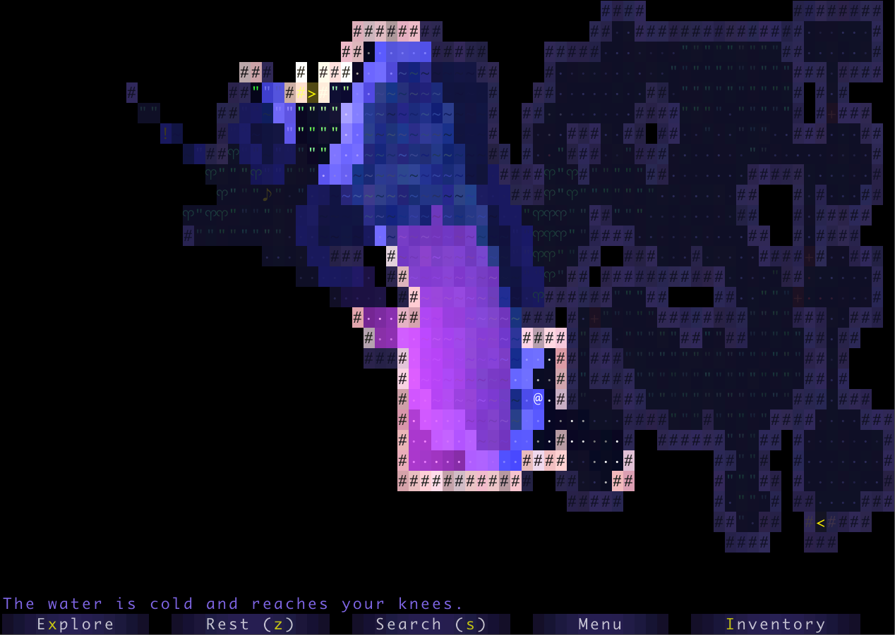
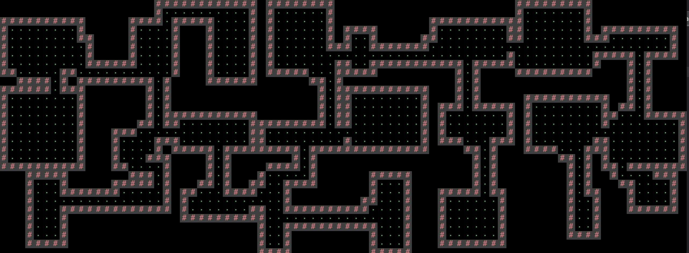
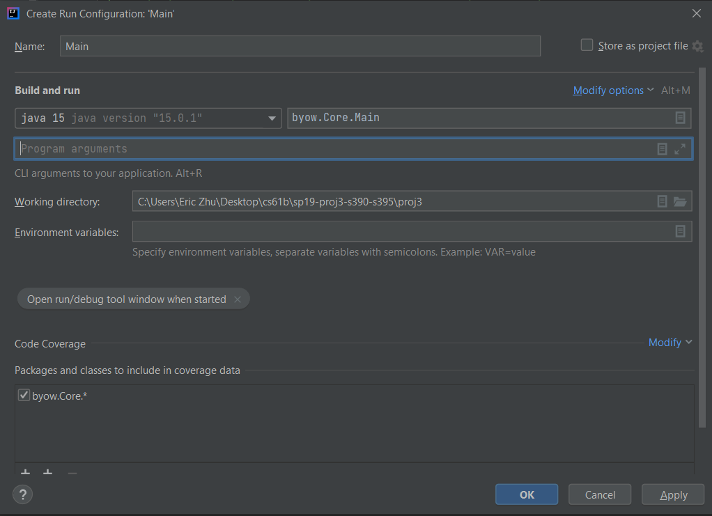
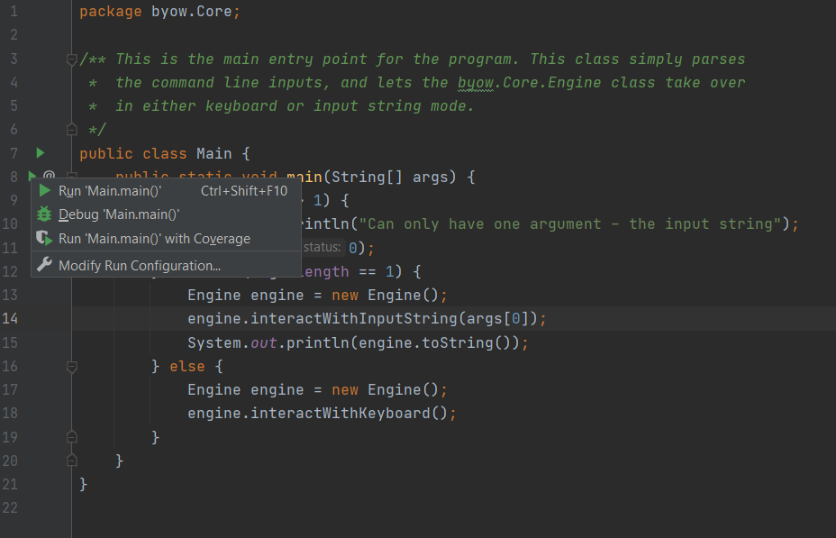
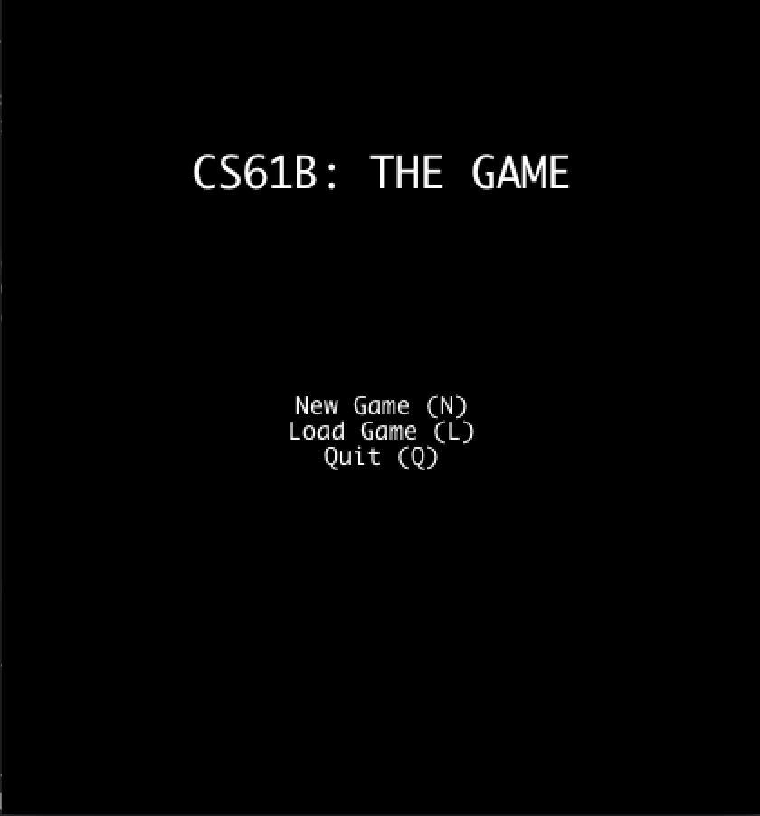
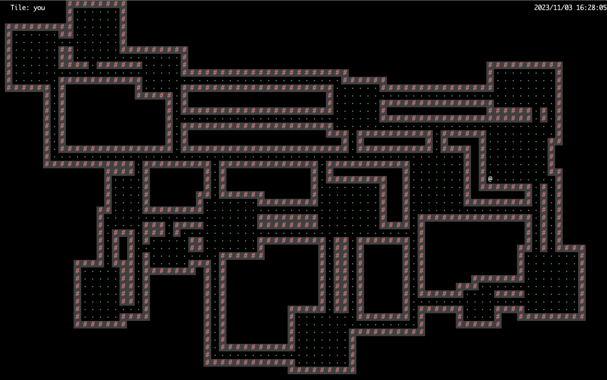
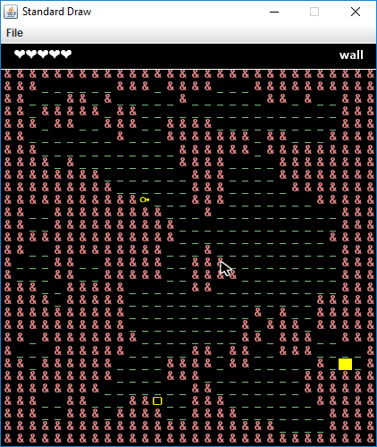
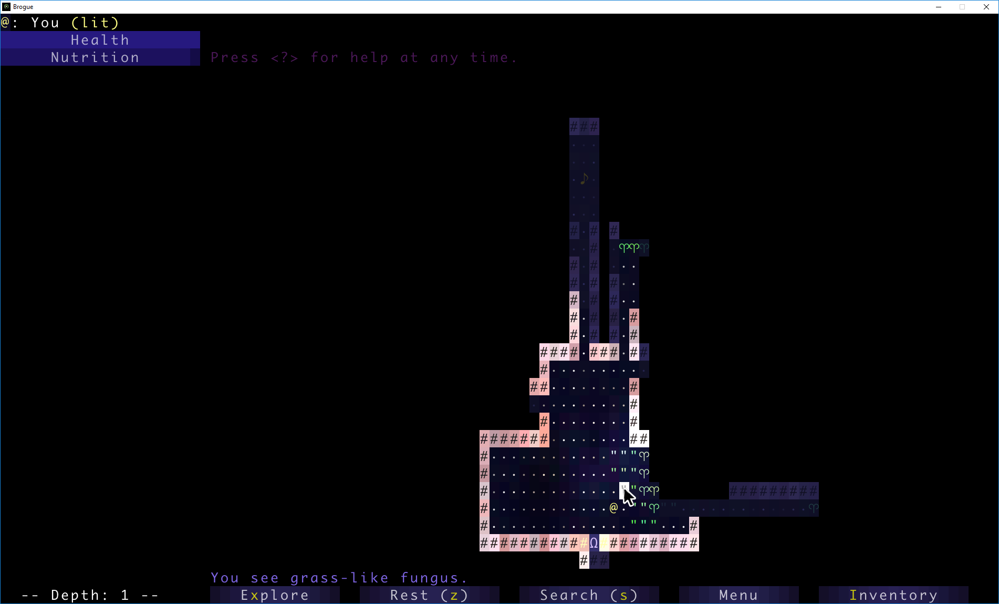

{: .warning}
Project 3: BYOW is not officially released. Until this warning disappears, the information in this spec is subject to change.

## [FAQ](faq.md)

Each assignment will have an FAQ linked at the top. You can also access it by adding "/faq" to the end of the URL. The
FAQ for Project 3 is located [here](faq.md).

## Introduction

In Project 3, you will create an engine for generating explorable worlds. This is a large design project that will
require you and one partner to work through every stage of development from ideation to presentation. The goal of this
project is to teach you how to handle a larger piece of code with little starter code in the hopes of emulating
something like a product development cycle. In accordance with this, the grading of this project will be different from
other projects. Since there is no notion of "the correct answer" when it comes to world design and implementation, you
will be assessed much like a performance review you might receive at an internship or job in addition to a very general
autograder. While this means you will be graded slightly subjectively, we promise to be pretty nice bosses and will
respect you as any boss should respect their hardworking employees. Please talk to us if you feel the grading scheme
feels unfair.

This project will require you a great deal of exploration and experimentation. Searching the web for answers (not
solutions from past semesters) should be a regular activity throughout this process. Please know that there are no right
and wrong answers, as this is a very open-ended project. However, there are some implementations and ideas that are
better than others. It is ok and expected that you will go through several iterations before settling on something that
you deem good. That is, this project is about **software engineering**.

You're not required to use any of the fancy data structures or concepts from class (A\*, MSTs, Disjoint Sets, etc.). This
project is about software engineering, not about data structures or algorithms. The data structures and algorithms we've
learned about in class will make your code significantly simpler and more efficient, but please don't use things just
because we learned about them in class. Only use these tools if you feel comfortable using them in your implementation.

A video playlist (from Spring 2018) discussing tips for working on this project can be
found [at this link](https://www.youtube.com/playlist?list=PL8FaHk7qbOD6REWjsJd5jz9fpXO5_3ebY&disable_polymer=true).
A walkthrough of the new skeleton code is also available [here](https://youtu.be/A8NlkICBWL8).

Please also note that since the structure of the project has been changed, Phase 1 will refer to part 3A of the project.

## Deliverables

Project 3 is worth 125 points. There are several key deadlines for this assignment:

- **Team formation (2 pts): Due 4/3 at 11:59 PM**
  - You must submit the [Project 3 Partnerships Form](https://forms.gle/CUV2iZN1NcPvNo8dA). You will **not** be able to change your partner later. Read and understand
    the [partnership guidelines](https://sp24.datastructur.es/resources/guides/partnerships/) before starting the assignment.
- **Project 3A (19 pts): Due 4/15 at 11:59 PM**
  - World Generation Autograder (3 pts): Due on Gradescope
  - Manual Review (6 pts): Due at [3A Checkoff Form](https://forms.gle/LRBWHnrW7dwr4mV89)
  - 3A Partner Reflection (10 pts): Due at [3A Reflection Form](https://forms.gle/q5UmLgKHrnRUhD8m8)
- **Project 3B (9 pts): Due 4/22 at 11:59 PM**
  - Interactivity Autograder (9 pts): Due on Gradescope
- **Project 3C (95 pts): Due 4/22 at 11:59 PM**
  - Ambition & Demos Checkoff (85 pts): Due at [Ambition Checkoff Form](https://forms.gle/oj8sFgt28aGce41u5)
  - 3BC Partner Reflection (10 pts): Due at [3BC Reflection Form](https://forms.gle/Tdq2V8UP11fCEbpN8)

{: .danger}
> Ambition Demos will be held in person during lab sections the week that Project 3BC is due. 
> All group members must arrive on time, otherwise a 20% late penalty will be applied to the group.


Notice that Project 3B & 3C are due on the same day. However, since you need to be manually checked off for the "Ambition" 
part, we made a division between "Interactivity" and "Ambition & Demos". In your Gradescope submission for 3B, your code 
should also have "Ambition" features because we will be asking for your Gradescope submission ID from 3B in the 3C Form.

You cannot submit Project 3B & 3C late, as it will be graded during a lab checkoff with a TA. While in theory you could submit 3A and the supporting labs (Lab 9 and Lab 10) late,
Project 3B & 3C builds upon these assignments, so it is unlikely that you will be able to submit these
assignments late and still complete Project 3B on time.

Now on to the assignment spec!

## Overview

Your task for the next few weeks is to design and implement a 2D tile-based world exploration engine. By "tile-based",
we mean the worlds you generate will consist of a 2D grid of tiles. By "world exploration engine" we mean that your
software will build a world, which the user will be able to explore by walking around and interacting with objects in
that world. Your world will have an overhead perspective. As an example of a much more sophisticated system than you
will build, the NES game "Zelda II" is (sometimes) a tile based world exploration engine that happens to be a video
game:


The system you build can either use graphical tiles (as shown above), or it can use text based tiles, like
the [game shown below](https://sites.google.com/site/broguegame/):



We will provide a tile renderer, a small set of starter tiles, and the headers for a few required methods that must be
implemented for your world engine and that will be used by the autograder. The project will have two major deadlines. By
the first deadline, you should be able to generate random worlds that meet the criteria below. By the second deadline, a
user should be able to explore and interact with the world.

The major goal of this project is to give you a chance to attempt to manage the complexity that comes with building a
large system. Be warned: The system you build probably isn't going to be that fun for users! Three weeks is simply not
enough time, particularly for novice programmers. However, we do hope you will find it to be a fulfilling project, and
the worlds you generate might even be beautiful.

## Project Setup

{: .warning}
THE SETUP FOR THIS PROJECT IS DIFFERENT THAN THE OTHER LABS / PROJECTS. PLEASE DO NOT SKIP THIS STEP!

### Group Repository Setup

You'll be working exclusively in a group repository for this portion of the project. To set this group repo up on your local computer, follow the instructions below (these are also in the spec):

- Go to your email and accept the GitHub repo invite that you should have received.
- Log in to Beacon, and click on the "Groups" tab. You should have a group listed here.
- Click the "View Repository on GitHub" link.
- You'll now be taken to your new repository on GitHub. You will have an empty repository. Copy the clone link shown in the text bar (blacked out in the screenshot).


- Open a new Terminal window, and navigate to the directory that you store your CS 61B files in (usually, students have a directory called `cs61b`).

{: .warning}
**IMPORTANT:** Do not cd into your `sp24-s****` repo! You should not be cloning the group repo inside of your personal 61b one.

- Type the following commands into your terminal, and hit Enter after each one:

```sh
git clone <paste your link from GitHub here>
cd sp24-proj3-g***  // Replace the *** here with your group repo number
git remote add skeleton https://github.com/Berkeley-CS61B/proj3-skeleton-sp24.git
git pull skeleton main --allow-unrelated-histories
```

Once you've completed the above steps, you should see your new group repo called `sp24-proj3-g***` in your local files, and if you open this repo, you'll see the `proj3` skeleton folder. From here, you and your partner can proceed as normal, by adding, committing, pushing, and pulling from this repo as you would otherwise. 

## Skeleton Code

Use `git pull skeleton main` in your group repo to pull the skeleton code. The skeleton code
contains two key packages that you'll be using: `TileEngine`, `Core` and `Utils`. `TileEngine` provides some basic methods for rendering, as well
as basic code structure for tiles, and contains:

- `TERenderer.java` - contains rendering-related methods.
- `TETile.java` - the type used for representing tiles in the world.
- `Tileset.java` - a library of provided tiles.

**IMPORTANT NOTE: Do NOT change TETile.java's `character` field or `character()` method as it may lead to bad autograder
results.**

The other package `Core` contains everything unrelated to tiles. We recommend that you put all of your code for
this project in the `Core` package, though this not required. The `Core` package comes with the following
classes:

- `AutograderBuddy.java` - Provides two method for interacting with your system. `TETile[][] getWorldFromInput(String input)` simulates the game without rendering by returning the world that would result if the input string had been typed on the keyboard. You should fill this out for autograder.
- `Main.java` - How the user starts the entire system. Reads command line arguments and calls the appropriate function
  in `World.java`.
- `World.java` - YOUR WORLD!

This is a open-ended project. As you can see, we gave you just one file called `World.java` where you can do necessary things to create your world! The aim of this project to give you freedom to create your own world with different desing choices. You can create any other classes if you want. Primarly, you can use `World.java` for the logic behind your world creation.

The last package `Utils` contains everything that you might need to implement your `World.java` class.

- `RandomUtils.java` - Provides handful of functions that might be useful.
- `FileUtils.java` - Library of simple file operations. You can find related APIs [here](https://docs.oracle.com/javase/8/docs/api/java/io/File.html) and [here](https://docs.oracle.com/javase/8/docs/api/java/nio/file/Files.html).

This project makes heavy use of `StdDraw`, which is a package that has basic graphics rendering capabilities.
Additionally, it supports user interaction with keyboard and mouse clicks. You will likely need to consult the API
specification for `StdDraw` at some points in the project, which can be
found [here](https://introcs.cs.princeton.edu/java/stdlib/javadoc/StdDraw.html).

Your project should only use standard java libraries (imported from java.\*) or any libraries we provided with your
repo. Your final submission for 3B and 3C should not use any external libraries other than the ones provided in the
skeleton.

**IMPORTANT NOTE: Do NOT use static variables unless they have the final keyword! In 2018, many students ran into major
debugging issues by trying to use static variables. Static non-final variables add a huge amount of complexity to a
system. Additionally, do not call `System.exit()` in `getWorldFromInput` as this will cause the autograder to exit
and fail.**

## 3A: World Generation

As mentioned above, the first goal of the project will be to write a world generator. Your world must be **valid** and 
**sufficiently random** The requirements for these criteria are listed below:

**Valid**
- The world must be a 2D grid, drawn using our tile engine. The tile engine is described in [lab 9](../../labs/lab09).
- The generated world must include distinct rooms and hallways, though it may also include outdoor spaces.
- At least some rooms should be rectangular, though you may support other shapes as well.
- Your world generator must be capable of generating hallways that include turns (or equivalently, straight hallways
  that intersect). Every world must include at least one turning hallway.
- Dead-end hallways are not allowed.
- Rooms and hallways must have walls that are visually distinct from floors. Walls and floors should be visually
  distinct from unused spaces. 
- Corner walls are optional.
- Rooms and hallways should be connected, i.e. there should not be gaps in the floor between adjacent rooms or hallways.
- All rooms should be reachable, i.e. there should be no rooms with no way to enter
- The world must not have excess unused space. While this criterion is inherently subjective, aim to populate above 
  50% of the world with rooms and hallways.

**Sufficiently Random**
- The world must be pseudo-randomly generated. Pseudo-randomness is discussed in lab 9.
- The world should contain a random number of rooms and hallways.
- The locations of the rooms and hallways should be random.
- The width and height of rooms should be random.
- Hallways should have a width of 1 tile and a random length.
- The world should be substantially different each time, i.e. you should **NOT** have the same basic layout with easily
  predictable features.

As an example of a world that meets all of these requirements (click for higher resolution), see the image below. In
this image, # represents a wall tile, a dot represents a floor tile, and there is also one golden colored wall segment
that represents a locked door. All unused spaces are left blank.

[](img/valid_world.png)

Once you've completed lab 9, you can start working on your world generation algorithm.

**It is very likely that you will end up throwing away your first world generation algorithm.** This is normal! In real
world systems, it is common to build several completely new versions before getting something you're happy with. The
room generation algorithm above was my 3rd one, and was ultimately much simpler than either of my first two.

You're welcome to search the web for cool world generation algorithms. You should not copy and paste code from existing
games or graphical demos online, but you're welcome to draw inspiration from code on the web. **Make sure to cite your
sources using @source tags.** For inspiration, you can try playing existing 2D tile based
games. [Brogue](https://sites.google.com/site/broguegame/) is an example of a particularly elegant, beautiful
game. [Dwarf Fortress](http://www.bay12games.com/dwarves/) is an example of an incredibly byzantine, absurdly complex
world generation engine.

### Tileset and Tile Rendering

The tile rendering engine we provide takes in a 2D array of `TETile` objects and draws it to the screen. Let's call
this `TETile[][] world` for now. `world[0][0]` corresponds to the bottom left tile of the world. The first coordinate is
the x coordinate, e.g. `world[9][0]` refers to the tile 9 spaces over to the right from the bottom left tile. The second
coordinate is the y coordinate, and the value increases as we move upwards, e.g. `world[0][5]` is 5 tiles up from the
bottom left tile. All values should be non-null, i.e. make sure to fill them all in before calling `renderFrame`. **Make
sure you understand the orientation of the world grid!** If you're unsure, write short sample programs that draw to the
grid to deepen your understanding. **If you mix up x vs. y or up vs. down, you're going to have an incredibly confusing
time debugging.**

We have provided a small set of default tiles in `Tileset.java` and these should serve as a good example of how to
create `TETile` objects. We strongly recommend adding your own tiles as well.

The tile engine also supports graphical tiles! To use graphical tiles, simply provide the filename of the tile as the
fifth argument to the `TETile` constructor. Images must be 16 x 16, and should ideally be in PNG format. There is a
large number of open source tile-sets available online for tile based games. Feel free to use these.

Any `TETile` object you create should be given a unique character that other tiles do not use. Even if you are using
your own images for rendering the tile, each `TETile` should still have its own character representation.

If you do not supply a filename, or the file cannot be opened, then the tile engine will use the unicode character
provided instead. This means that if someone else does not have the image file locally in the same location you
specified, your world will still be displayed, but using unicode characters instead of textures you chose.

The tile rendering engine relies on `StdDraw`. We recommend against using `StdDraw` commands like `setXScale`
or `setYScale` unless you really know what you're doing, as you may considerably alter or damage the _a e s t h e t i c_
of the system otherwise.

### Starting Your Program

Your program will be started by running the `main` method of the `Main` class. You will see that this method will render your program and will provide interactivity for you in the future. On top of that, in order to test your world, for 3A, your project must
support `getWorldFromInput`. Specifically, you should be able to handle an input of the format `"N#######S"`
where each # is a digit and there can be an arbitrary number of `#`s. This corresponds to requesting a new world (`N`),
providing a seed (`#`s), and then pressing `S` to indicate that the seed has been completely entered. The logic between your world generation in `Main` class and `getWorldFromInput` method should be similar. While you should render your program in `Main`, you should not do that in `getWorldFromInput` since this will be used for Autograder.


<!-- 

If you haven't run the `main` method yet, right-click the green arrow next to your main method like shown below, and
click "Modify Run Configurations" to access the same window as above.

Not needed anymore
 -->

<!--  -->

Finally, we recommend that you make minimal modifications to the `core.Main` class. It is a much better idea to delegate
all the work of the program to other classes you will create.

When your `core.Main.main()` method is run, your program must display a Main Menu that provides at
LEAST the options to start a new world, load a previously saved world, and quit. The Main Menu should be fully navigable
via the keyboard, using N for "new world", L for "load world", and Q for quit. You may include additional options or
methods of navigation if you so choose.



After pressing N on the keyboard for "new world", the user should be prompted to enter a "random seed", which is a long
value of their choosing. This long data type will be used to generate the world randomly (as described later and in lab
12). The UI should show the seed value that the user has entered so far. After the user has pressed the final number in
their seed, they should press S to tell the system that they've entered the entire seed that they want. Your world
generator should be able to handle any positive seed up to 9,223,372,036,854,775,807. There is no defined behavior for
seeds larger than this.

The behavior of the "Load" command is described later in this specification.

If the system is being called with `core.AutograderBuddy.getWorldFromInput`, no menu should be displayed and nothing
should be drawn to the screen. The system should process the given String as if a human user was pressing the
given keys using the `main()` method. For example, if we
call `getWorldFromInput("N3412S")`, your program should generate a world with seed 3412 and return the
generated 2D tile array. **Note that letters in the input string can be upper or lower case and your engine should be
able to accept either keypress (i.e. "N" and "n" should both initiate the process of world generation).** You should **
NOT** render any tiles or play any sound when using `getWorldFromInput`.

If you want to allow the user to have additional options, e.g. the ability to pick attributes of their character,
specify world generation parameters, etc., you should create additional options. For example, you might add a fourth
option "S" to the main menu for "select creature and create new world" if you want the user to be able to pick what sort
of creature to play as. These additional options may have arbitrary behavior of your choosing, however, the behavior of
N, L, and Q must be exactly as described in the spec!


### Requirements

For 3A, you should be able to run `Main.main` by providing an input String, and have your program create a world,
that adhere to the requirements mentioned above along with our randomness requirements mentioned in the **Submission and
Grading section** below. Note that you should render the world to check your code by writing your own `main` method, but
for the autograder, `getWorldFromInput` should not render the world, only returning the world as a `TETile` array.
Worlds should be visibly different for different seeds provided to the program.

## Design Document

Since we did not provide you with any significant skeleton code for Project 3, and since the project is very open-ended,
we expect that BYOW implementations will vary a fair amount between students. We recommend that you have a design
document that reflects the current state of your project.

Before you begin writing any code, use the guidelines listed here to create a plan for every feature of your BYOW
program, and convince yourself that your design is correct. Writing a design document is an iterative process. After
coming up with your initial design, you may find some flaws in it, requiring you to revisit your design and update its
description according to your new findings.

**Note:** Your design document will NOT be graded.

### Design Document Guidelines

You may use the following format for your BYOW design document.

#### Design Document Sections

##### 1. Classes and Data Structures

Include here any class definitions. For each class, list the instance variables (if any). Include a brief description of
each variable and its purpose in the class.

##### 2. Algorithms

This is where you describe how your code works. For each class, include a high-level description of the methods in that
class. That is, do not include a line-by-line breakdown of your code, but something you would write in a javadoc comment
above a method, including any edge cases you are accounting for.

##### 3. Persistence

You should only tackle this section after you are done with 3A. This section should describe how you are going to
save the state of a world, and load it again, following the requirements in the spec. Again, try to keep your
explanations clear and short. Include all the components your program interacts with - classes, specific methods, and
files you may create. You can check out [lab 9](../../labs/lab09).

## 3B: Interactivity

In the second part of the project, you'll add the ability for the user to actually interact with the world, and will
also add user interface (UI) elements to your world to make it feel more immersive and informative.

The requirements for interactivity are as follows:

- The user must be able to control some sort of "avatar" that can moved around using the W, A, S, and D keys. By "avatar", we just mean some sort of on-screen representation controlled by the
  user. For example, in my project, I used an "@" that could be moved around.
- The avatar must be able to interact with the world in some way.
- Your system must be deterministic in that the same sequence of key-presses from the same seed must result in exactly
  the same behavior every time. Note that a `Random` object is guaranteed to output the same random numbers every time.
- In order to support saving and loading, your program will need to create some files in your `proj3` directory (more
  details later in the spec and in the skeleton code). The only files you may create must have the suffix ".txt" (for
  example "save-file.txt"). You will get autograder issues if you do not do this.

Optionally, you may also include game mechanics that allow the user to win or lose.
Aside from these feature requirements, there will be a few technical requirements for your system, described in more
detail below.

### UI (User Interface) Appearance

After the user has entered a seed and pressed S, the world should be displayed with a user interface. The user interface
of your project must include:

- A 2D grid of tiles showing the current state of the world.
- A "Heads Up Display" (HUD) that provides additional information that maybe useful to the user. At the bare minimum,
  this should include Text that describes the tile currently under the mouse pointer. **This should not be flickering, if it flickers you won't be able to receive credit.**

As an example of the bare minimum, the simple interface below displays a grid of tiles and a HUD that displays the
description of the tile under the mouse pointer (click image for higher resolution):

[](img/valid_UI.png)

You may include additional features if you choose. In the example below (click image for higher resolution), as with the
previous example, the mouse cursor is currently over a wall, so the HUD displays the text "wall" in the top right.
However, this HUD also provides the user with 5 hearts representing the avatar's "health". Note that this world does not
meet the requirements of the spec above, as it is a large erratic cavernous space, as opposed to rooms connected by
hallways.

[](img/UI_example1.png)

As an example, the game below (click image for higher resolution) uses the GUI to list additional valid key presses, and
provides more verbose information when the user mouses-over a tile ("You see grass-like fungus."). The image shown below
is a professional game, so we do not expect your project to have this level of detail (but we encourage you to try for
some interesting visuals).

[](img/UI_example2.png)

For information about how to specify the location of the HUD, see
the `initialize(int width, int height, int xOffset, int yOffset)` method of `TERenderer` or see lab 11.

### UI Behavior

After the world has been generated, the user must be in control of some sort of avatar that is displayed in the world.
The user must be able to move up, left, down, and right using the `W`, `A`, `S`, and `D` keys, respectively. These keys may also
do additional things, e.g. pushing objects. You may include additional keys in your engine. The avatar should not move
when attempting to move into a wall and the program should not error.

The system must behave pseudo-randomly. That is, given a certain seed, the same set of key presses must yield the exact
same results!

In addition to movement keys, if the user enters `:Q` (note the colon), the program should quit and save. The
description of the saving (and loading) function is described in the next section. **This command must immediately quit
and save**, and should require no further key-presses to complete, e.g. do not ask them if they are sure before quitting.
We will call this single action of quitting and saving at the same time "quit/saving". This command is not case-sensitive,
so `:q` should work as well. Additionally, `:` followed by any other letter should not do anything.

This project uses `StdDraw` to handle user input. This results in a couple of important limitations:

- `StdDraw` does not support key combinations. When we say `:Q`, we mean `:` followed by `Q`.
- It can only register key presses that result in a char. This means any unicode character will be fine but keys such as
  the arrow keys and escape will not work.
- On some computers, it may not support holding down of keys without some significant modifications; i.e. you can't hold
  down the e key and keep moving east. If you can figure out how to support holding down of keys in a way that is
  compatible with `getWorldFromInput`, you're welcome to do so.

Because of the requirement that your system must handle String input (via `getWorldFromInput`), your engine cannot
make use of real time, i.e. your system cannot have any mechanic which depends on a certain amount of time passing in
real life, since that would not be captured in an input string and would not lead to deterministic behavior when using
that string vs. providing input with the keyboard. Keeping track of the number of turns that have elapsed is a perfectly
reasonable mechanic, and might be an interesting thing to include in your world, e.g. maybe the world grows steadily
darker with each step. You're welcome to include other key presses like allowing the user to press space bar in
order to wait one turn.


### Saving and Loading

Sometimes, you'll be exploring your world, and you suddenly notice that it's time to go to watch a CS 61B lecture. For
times like these, being able to save your progress and load it later, is very handy. Your system must have the ability
to save the state of the world while exploring, as well as to subsequently load the world into the exact state it was in
when last saved.

Within a running Java program, we use variables to store and load values. Keep in mind that when your program ends, all
the variables will go out of scope. Thus, you will need to persist the state of your program on some files that your
program should create.

When the user restarts `core.Main` and presses `L`, the world should be in **exactly the same state as it was before
the project was terminated**. This state includes the state of the random number generator! More on this in the next
section. In the case that a user attempts to load but there is no previous save, your system should simply quit and the
UI interface should close with no errors produced.

In the base requirements, the command `:Q` should save and completely terminate the program. This means an input string
that contains `:Q` should not have any more characters after it and loading a world would require the program to be run
again with an input string starting with `L`.

### Interacting With Input Strings

Your `getWorldFromInput(String input)` must be able to handle input strings that include movement.

For example, the string `N543SWWWWAA` corresponds to the user creating a world with the seed 543, then moving up four
times, then left twice. If we called `getWorldFromInput("N543SWWWWAA")`, your system would return
a `TETile[][]` representing the world EXACTLY as it would be if we'd used `main` and typed these keys in
manually. Since the system must be deterministic given a seed and a string of inputs, this will allow users to replay
exactly what happened for a given sequence of inputs. This will also be handy for testing out your code, as well as for
our autograder.

`getWorldFromInput(String s)` must also be able to handle saving and loading in a replay string,
e.g. `N25SDDWD:Q` would correspond to starting a new world with seed 25, then moving right, right, up, right, then
quit/saving. The method would then return the 2D `TETile[][]` array at the time of save. If we then started the engine
with the replay string `LDDDD`, we'd reload the world we just saved, move right four times, then return the
2D `TETile[][]` array after the fourth move.

**Your world should not change in any way between saves**, i.e. the same exact `TETile[][]` should be returned by the
last call to `getWorldFromInput` for all the following scenarios:

- `getWorldFromInput(N999SDDDWWWDDD)`
- `getWorldFromInput(N999SDDD:Q)`, then `getWorldFromInput(LWWWDDD)`
- `getWorldFromInput(N999SDDD:Q)`, then `getWorldFromInput(LWWW:Q)`, then `getWorldFromInput(LDDD:Q)`
- `getWorldFromInput(N999SDDD:Q)`, then `getWorldFromInput(L:Q)`, then `getWorldFromInput(L:Q)`
  then `getWorldFromInput(LWWWDDD)`

we then called `getWorldFromInput` with input `L:Q`, we'd expect the exact same world state to be saved and
returned as `TETile[][]` as with the previous call where we provided `LDDDD`.

You do not need to worry about replay strings that contain multiple saves, i.e. `N5SDD:QD:QDD:Q` is not considered a
valid replay string, since the program should have terminated before the second `:Q`. You do not need to worry about
invalid replay strings, i.e. you can assume that every replay string provided by the autograder starts with either `N#S`
or `L`, where `#` represents the user entered seed.

The return value of the `getWorldFromInput` method should not depend on whether the input string ends with `:Q` or
not. The only difference is whether the world state is saved or not as a side effect of the method.

## 3C: Ambition & Demos

28 points of your project score will be based on features of your choosing, which we call your "ambition score". The
big idea is that beyond the base requirements of this project, we want you to try to polish your product a bit more and
add some cool features. Below is a list of features worth either 21 points (primary feature) or 7 points (secondary
feature). From these two categories, you are required to implement at least one primary feature in order to get full
credit (not implementing a secondary feature is okay). This "ambition" category is only worth 28 points.
If you do, e.g., 35 points worth, you do not get extra credit.
However, feel free to add as many features as you'd like if you have the time and inclination.

**Your project must still meet the basic requirements described above!** For example, if you allow the user to use mouse
clicks, the project should still allow keyboard based movement!

Under the description of some primary features, we've provided some GIFS that would score full points on their
respective ambition point items to help clear any confusions. Yours do not need to look exactly like the examples given.

### 21 Points Primary Features

- Create a system so that the tile renderer only displays tiles on the screen that are within the line of sight of the avatar. The line of sight must be able to be toggled on and off with a keypress.

[](img/line-of-sight.gif)

- Add the ability for light sources to affect how the world is rendered, with at least one light source that can be turned on and off with a keypress. The intensity of the light must diminish in a gradient as the distance from the source increases. Light should also not pass through walls.

[](img/toggle-lights.gif)

- Add entities which chase the avatar/other entities by use of a search algorithm from class, with a toggle to display their projected path.

[](img/enemy.gif)

- Create a system for “encounters”, where a new interface appears when the avatar interacts with entities in the world,
  returning the avatar to the original interface when the encounter ends (e.g. Pokémon).

[](img/encounter.gif)

- Add the ability for the user to change the perspective of their view (first-person, isometric 2.5D, 3D, etc.) (We've never seen
  anyone do isometric 2.5D or full 3D before! The Nintendo 64
  game '[Kirby 64 - The Crystal Shards](https://www.youtube.com/watch?v=5uu2TWli-_M)' is an example of what an isometric 2.5D world
  looks like). One particularly interesting example is [Dorottya Urmossy and David Yang's Fall 2022 submission](https://www.youtube.com/watch?v=XJBQYucuAKc&t=94s), which is a 2.5D first-person view, i.e. the world is 3D but the entities are 2D.

- Implement a battle system that allows players to interact with moving enemies and obstacles. Assign the player a health value, place collectibles that restore health around the map, and create randomly-moving enemies/objects that inflict damage on and receive damage from the player.


### 7 Points Secondary Features

- Add the ability for the user to "replay" their most recent save, visually displaying all the actions taken since
  the last time a new world was created. This must result in the same final state as would occur if the user had loaded
  the most recent save. This means that the game should be playable once the replay is complete.
- Add multiple save slots that can be accessed with a new menu option, and a new keyboard shortcut to save to a slot
  other than slot 1. You should be careful to still support the default behavior of saving and loading in order to be
  consistent with the replay string requirements.
- Add the ability to create a new world without closing and reopening the project, either as a special option you can
  press while exploring, or when you reach a "game over" state if you've turned your world into a game.
- Add a menu option to change your avatar's appearance to a custom image.
- Add a menu option or randomly determine what the environment/theme of the world will be.
- Add a menu option to change all text in the interface to a different language. English should be the default and there
  should be a way to switch it back to English.
- Add support for mouse clicks on the main menu for anything that can be done with a keypress on the main menu.
- Make your engine render images instead of unicode characters.
- Add cool music to your menu and/or exploration interface. Also add sound effects for interactions the avatar makes
  with the world.
- Add a minimap somewhere which shows the entire map and the current avatar location. This feature is a lot more
  interesting if you also implement a map which is larger than the screen so that you are unable to see the entire map
  normally.
- Add ability to rotate the world, i.e. turn the board 90 degrees and adjust movement keys accordingly.
- Add support for movement with mouse clicks on any visible square. You'll need to implement some sort of algorithm for
  pathfinding.
- Add support for 2 users to interact at the same time. This will require that you have two avatars on screen which can
  move around, and they should have separate control schemes.
- Add support for undoing a movement (even moves that occurred in a previous save before the current one was loaded).
  Undoing a movement should reset the world back to before the most recent keypress but should add to the replay string
  instead of removing a character (i.e. undo command should be logged in the replay string).

## Requirements Summary

Here is a list of the requirements and restrictions on your project. Please note that this section does not substitute
reading the entire spec since there are a lot of details which are not captured here.

- When using `main`, your program must have a menu screen that has New World (N), Load (L), and Quit (Q)
  options, navigable by the keyboard, which are all not case-sensitive.
- When entering New World, the user should enter an integer seed followed by the S key. Upon pressing S, the world
  should be generated and displayed.
- The UI should show the numbers entered so far when the user is giving the seed.
- Must have pseudo-randomly generated worlds/variety in worlds, i.e. the world should be different for every seed.
- All generated worlds must include all the visual features described in 3A above.
- Users must be able to move around in the world using W, A, S, and D keys.
- Users must be able to press ":Q" to quit, and after starting the program up again, the L option on the main menu
  should load the world state **exactly as it was before**.
- All random events should be pseudorandom. That is, your program gives deterministic behavior given a seed.
- Users must be able to interact using `getWorldFromInput`, and behavior other than accepting input and drawing to
  the screen should be identical to `main`.
- `getWorldFromInput` must return a `TETile[][]` array of the world at the time after the last character in the
  string is processed.
- `getWorldFromInput` must be able to handle saving and loading, just like `main`.
- Your program must use our `TileEngine` and `StdDraw` for displaying graphics.
- Your program must have a HUD, which displays relevant information somewhere outside the area displaying the
  world/tiles.
- HUD must display a description of tile upon hovering over the tile.
- Your program must not use real time. Nothing should be moving if no input is being received. This requirement is only 
  necessary for the autograders; feel free to have real-time dependent features for 3C.
- Your program must include features that make up 28 points from the Ambition categories, **with at least one primary
  feature**.

## Submission and Grading

As usual, we'll have a grader for this project on Gradescope. **Remember to add your partner as a group member to your
Gradescope submission.** In addition, you'll also submit [this form](https://forms.gle/etpB2gqrX4ji2ryX7) when you've
completed the project. More details in the next section about checkoffs. **If you do not submit this form then you will
receive a 0 on the checkoff portion of the project.** Only one of your partners needs to submit this, but you should
write the responses together.

### Partnership Preferences Form: 2 points

Filling out the [Project 3 Partnership Preferences Form](https://forms.gle/sjpi47tAviigtTeKA) is worth 2 points for
this project. You must fill out the form by **Wednesday, April 3 at 11:59pm** to get these points.

### Autograders: 12 points

See [this section](#autograder-details) for autograder details.

- 3A: 3 points
- 3B: 9 points

### 3A Manual Review: 6 points

A TA will pull your code, and run your game 5 separate times with 5 separate
seeds. **They will then check that your 5 different worlds meet our randomness criteria defined below**:

- Locations of rooms should be in different places each time.
- Sizes of rooms should be different each time.
- The number of rooms and hallways should be different each time. You must have at least two hallways, one of which is turning.
- The world should be substantially different each time, i.e. you should not have the same basic layout with easily
  predictable features.

If you have questions or concerns about whether your world matches these criteria, you may ask a TA in Office Hours to confirm.

**In order to get credit for the 3A Checkoff, you must fill out [this form](https://forms.gle/262W6vsNAd2dKwt1A) by Monday, April 15th at 11:59PM.**

### Partner Reflection: 20 points

- [3A Reflection Form](https://forms.gle/Bj2no1aaT5YDWKaG7): 10 points (due April 15th at 11:59PM)
- [3B & 3C Reflection Form](https://forms.gle/YF7CwmeL2m1y1Si19): 10 points (due April 22nd at 11:59PM)

### 3C Checkoff Demo: 85 points

To get credit for the checkoff demo, you **must** submit [this form](https://forms.gle/idHdLNoqanTsU9Gs5).

- 57 points: Obeying base spec for 3A and 3B.
- 28 points: Ambition points.

**You'll also need identify a commit** so we can grade it. You should:

1. Identify the SHA of the commit that you'd like us to grade for the demo.
   **This SHA must be from the same as the commit you submitted to Gradescope**. It's OK if they're not exactly the
   same, though we recommend using the same commit so that you're sure that it compiles and runs the way you expect it
   to. But if you need to comment some lines out to pass the autograder and then uncomment them for the checkoff, that's
   OK. You can use
   `git log` to help you here. Copy this SHA and save it somewhere.
2. Ensure that this commit is before the deadline, and run your code from this commit to double-check that it is indeed
   the commit you'd like graded. If your commit was from after the deadline, you'll receive a 50% penalty.
3. Paste it carefully into the form submission.
4. **Do not ignore step 3**. If you paste the incorrect SHA, we'll grade an incorrect version of your code, and if you
   paste an invalid SHA we'll by default grade the `origin/HEAD` commit (which is likely to incur lateness penalties).

## Checkoff Script and Form

In the hopes of keeping this process as transparent as possible, click
[here](proj3checkoff) for the exact script the instructor will use when checking your project. Though checkoffs are
synchronous, we want to have a record of everyone's project on file in case there are technical difficulties during the
checkoff, or if we need to look at your project for whatever reason. Please be clear and concise so the grader knows exactly
how to use your feature. If you find that explaining how to use your feature is too complicated, then consider
simplifying the work the user must do to use it. If there are any known quirks in using the ambition feature, let us
know that here: e.g. “After you turn the lights on, you need to press T to change the brightness”.

It's also extremely important you read over the specifications again and ensure your project fits them exactly. It's
easy to miss a specification since there are so many of them, and so we ask that you read through them again right
before you submit what ambition points they've attempted as well as how to use those features. Please be clear and
concise so the grader knows exactly how to use your feature. If you find that explaining how to use your feature is too
complicated, then consider simplifying the work the user must do to use it.

Once you've ensured that you have:

1. Completed the project
2. Read through all the specifications again to ensure you didn't miss any
3. Identified the commit you want graded (see previous section)
4. **Ensure you only use libraries in `library-sp24` or `java.*`**

**then you are ready to submit the [Project 3C Checkoff Form](https://forms.gle/idHdLNoqanTsU9Gs5).**

## Autograder Details

We have two autograders for BYOW: the 3A grader and the 3B grader. We don't have token restrictions for these Autograders.

### 3A Grader

3A is due on **April 15th at 11:59 PM** for 3 points. It will test:

- `getWorldFromInput` returns a world
- `getWorldFromInput` recreates the same world given the same seed multiple times
- `getWorldFromInput` creates different worlds given different seeds

There will be **no** movement in these tests.

### 3B Grader

3B is due on **April 22nd at 11:59 PM** for 9 points. It will test:

- `getWorldFromInput` recreates the same world given the same seed and same movements multiple times
- `getWorldFromInput` creates different worlds given different seeds and different movement
- `getWorldFromInput` creates the same world even with saving and loading throughout the input string

**Remember to add your partner as a group member when submitting to the autograder.**

## Large Language Models (LLMs)

Recall that in the collaboration policy, we say:

"Use of GitHub Copilot / GPT3 / etc. \[is permitted with extreme caution\] if you're just generating some amount of boilerplate code, that's ok. However, you should not use such tools to generate non-trivial methods. We are trying to build your fundamental skills, and leaning on an AI is going to cause you trouble in circumstances where you don't have an AI to help, such as exams. Any AI generated code must be cited and explicitly commented as such."

For project 3B & 3C, we're relaxing this rule and it's OK to use large language models (LLMs) like ChatGPT, Bard, Bing, CoPilot, etc. For project 3B & 3C however you want, with the important note that any code generated must be explicitly cited as being AI generated.

If you want LLMs to be useful for project 3B & 3C, you're going to want to give them small tasks. You should think of LLMs as assistant programmers you've hired to help you out on your project — they're very fast and sloppy programmers who have little common sense, and they often need very specific directions to be useful.

If you give high level prompts like write a "write a lighting engine for my game with the code below", it's going to do badly. Prompts like "write a function that takes a Color and a brightness level and returns a new color with the given brightness" are really great use cases for LLMs.

**Important:** LLMs are notorious for confidently stating things that are not true. They don't have any actual understanding, and the code they generate may be buggy or even totally garbage.

Another possible use for LLMs is for debugging! I've occasionally given an LLM some code, described my issue, and it's been able to figure out what was wrong.

