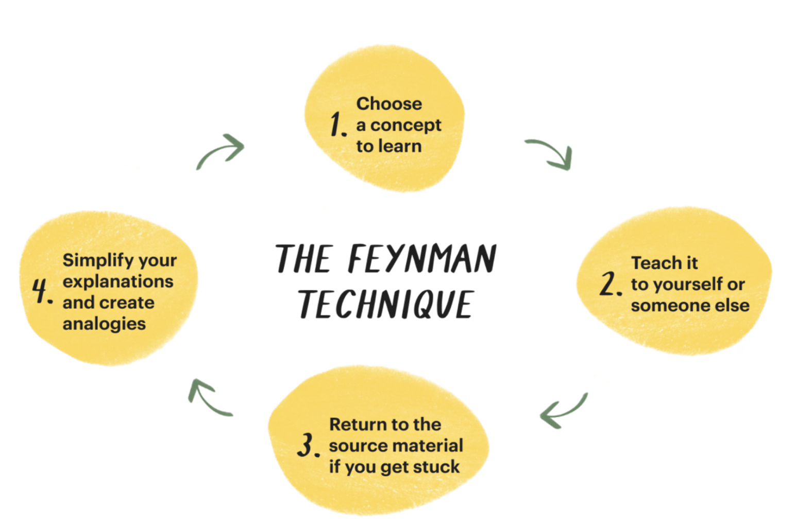
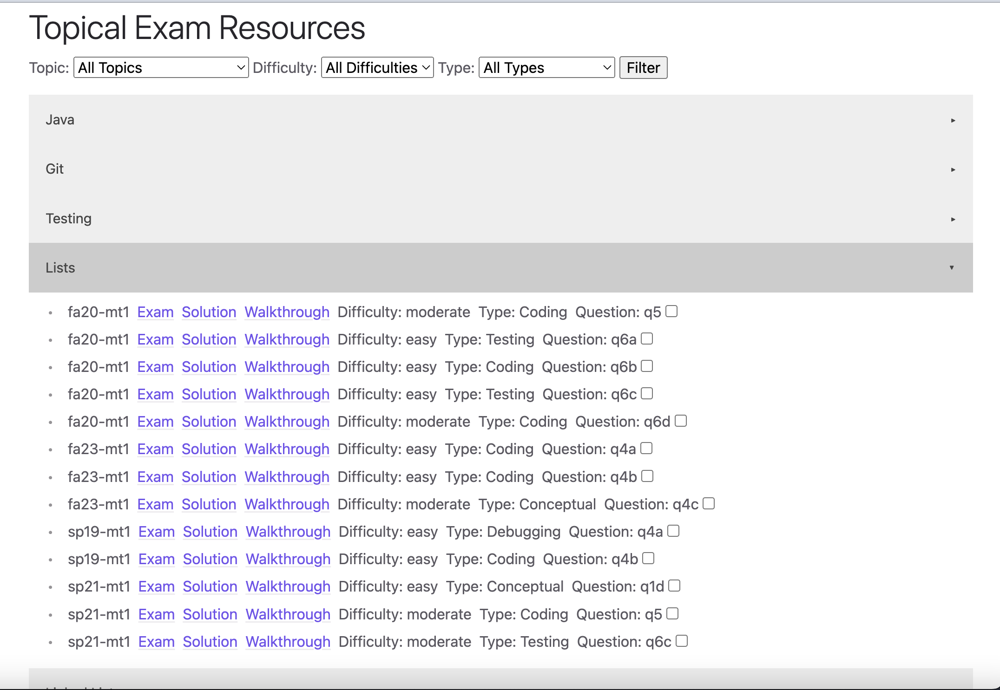

Preparing for exams in this class can be a stressful and challenging experience, especially when trying to balance everything else that is going on in life. In this guide, the student support team compiled some practical advice to help you approach studying more strategically and effectively, so you can perform your best on the day of the exam.

{: .warning}
> **Disclaimer: The exam tips provided are based on personal experiences and should be considered as advice rather than rigid rules. We encourage you to assess your own unique situation and adapt the suggestions accordingly.**

## Reviewing concepts

### Utilize course resources

Throughout the semester, we have resources for you to enhance the materials learned in class.

Bridge discussion sections 

Bridge sections are 2-hour long discussion sections that let us spend more time on reviewing the concepts in addition to going over worksheet problems. Because it is a longer section and we have two TAs per section, you’ll be able to get more 1:1 assistance during bridge and **ask more questions** to build a stronger conceptual foundation. 

Exam-level sections

Exam-level sections are faster paced sections that focus more on solving harder, exam-level problems. These sections are extremely helpful to **learn about problem-solving approaches** that can come in handy during exams. 

Tutor review sessions

Our amazing tutors hold exam review sessions during the weeks leading up to the exams. The sessions usually cover **conceptual reviews** on topics in scope for the exams, and a **review worksheet** to practice applying the concepts. 

Asynchronous resources

If for certain weeks you are unable to attend the discussion sections, there are also **walkthrough videos** for the discussion worksheets recorded by our incredibly awesome TAs from previous semesters. 

Utilizing these resources on a regular basis can put you in a better place when the exams roll around. Doing the work consistently will build more trust in your ability to review the concepts efficiently and not feeling the need to “relearn” everything for the exam. 

### Write cheat sheets

The process of writing the cheat sheets themselves is a great way to organize and review the concepts. We suggest creating it early so that you can use it while doing past exams.  

Here are some useful cheat sheet materials (credit: past 61B TAs)

* [Owen’s cheatsheet](https://docs.google.com/document/d/1PMoL1xJ9xa6ywQQ8HCc1oxLf2TUCiCaKaatlKYv6RZw/edit#heading=h.s3vq6kg31rbb) (Note: KD-Tree, Game trees, alpha-beta pruning, and bitwise operations are out of scope)
* [Crystal’s DMS flowchart](https://docs.google.com/presentation/d/1l9kslV4XB46fOOyD-hiXxi4sK-lmtFg9rMHRmS7_S5k/edit#slide=id.p)

### Go to OH leading up to an exam

A heavily underutilized resource is OH leading up to an exam. It is a great place to go through a problem with TAs and ask any questions or general test taking tips. Ask _good_ questions such as:

* **How to break up the problem into smaller chunks?**
* **How to make educated guesses based on hints from the instruction/skeleton, such as variable names?**
* **What is a good place to start for a problem?**

### Textbook

On the main page, most lectures have an associated textbook chapter. The textbook was written during the Spring 2023 semester and should contain the same concepts as the lectures. Corresponding lecture videos are embedded throughout the textbook. It’s a great way to review concepts efficiently or find the relevant lecture video to rewatch!

### Study Groups

Finding other students in CS 61B to study with is one of the best ways to keep yourself accountable, clear up misconceptions, and discuss difficult topics. You can meet potential study partners through sections, Ed, student organizations, and more.

## Applying concepts

### Teach someone

This tip is based on the [Feynman technique](https://golden.com/wiki/Feynman_Technique). The “someone” can be your classmate, your friend, your grandma, yourself, or an empty classroom. The key is to **teach the concept in _simple terms_, and if you notice any conceptual gaps through the process, go back and review.** You can also do this on a more regular basis to ensure that you have a solid understanding of any new concepts learned. 

This is a very effective way to truly test if you understand a topic conceptually. A great bonus is to improve some teaching and communication skills along the way. (future course staff alert?)

### Do AND review practice exams 

“Do practice exams” is probably the most common tip for successful exam prep. We suggest you take a practice exam when you first start studying, and use the results of this practice exam to guide the rest of your studying. 

In order to truly maximize its effectiveness to help you prepare for the exams, reviewing the exams is also crucial. 

The general approach is for each question that was wrong, ask yourself: **Was the problem testing on WHAT the concept is, or HOW the concept is applied?**

* If it’s asking about the _what_, then simply going back to relevant resources to review this concept is sufficient. 
* If it’s asking the _how_, then it’s best to dive deeper into the question to figure out the reasoning and logic behind using the concept this way in the specific problem scope.

Some other general advice relating to this topic are:

* Prioritize **doing past exams from the same instructor** to get a better gauge of the difficulty.
* If you’re in a time crunch, don’t do too many exams. But rather do one exam, look at the solution, and **REDO the exam** the next day. 
* If feasible, **do the exams under a simulated testing environment**. Print out the past exam and do the exam _on paper_ while timing yourself. Go down to granularity of time for individual questions so you can gauge where you’re at in comparison to the actual exam.
* We’ve released walkthrough videos for each past exam question. These are great resources to learn not only **what** the solution is but **how** someone might approach thinking about the problem and coming up with an answer.
* If you are stuck on a past exam question, that’s totally okay! Rather than looking at the solution, you can try watching part of the walkthrough video as a hint and see if you can finish the rest of the question afterwards. After completing the question, **reflect** on which steps you’re having the most difficulty with and any concepts you’re shaky on.

If you need additional guidance on understanding a concept or approach, feel free to ask questions on Ed or during OH! 

### Problem Bank

If you want to practice more problems based on specific topics, the  [problem bank](https://not.datastructur.es/resources/exams/topical_exam_resources/) is a great resource. (Shoutout to our amazing TAs who put this together!)

You can filter and choose specific past exam problems based on topic, difficulty, and type. The solution and walkthrough video are also linked in the problem bank, so it is an amazing asynchronous exam prep resource. 

## Final Preparations

### Visualization 

The power of visualization has long been utilized by professional athletes and performers. Studies have shown that when people _visualize_ performing a task, the same set of neurons are stimulated and fired as when they are _actually_ doing the task. Even though taking an exam might not be as daunting as competing at the Olympics (although some may argue that they are about the same), visualizing yourself taking the exam and doing well can be a helpful way to prepare yourself mentally for the upcoming exam. Of course, you still have to do the work, but by visualizing this task as detail as possible, you can train your brain to better manage stress during the exam. 

### Sleep, eat, repeat

It’s scientifically proven that [our brains reinforces learning during sleep](https://medium.com/intuitionmachine/the-link-between-sleep-and-deep-learning-5f7d347cc789), so getting enough sleep the night before the exam will be a lot more effective than cramming in a few more practice exams. Getting enough food will also supply your brain enough energy to tackle the exam. So please eat and sleep well!

### Positive reinforcement

During the exam, it’s important to first focus on problems that you DO know how to do. Ensure correctness for the ones that you do know or have some ideas about first, then attempt the questions that you skipped. 

Focusing on what you already know instead of worrying too much on what you don’t know can help maintain confidence throughout the exam, which is crucial for staying calm and reducing the chance of panic. Taking the exam with a collected mentality is more likely to lead to better performances. 

## During the Exam

### Scan first, skip if necessary

When the exam starts, take a minute to scan through all of the questions so you get an idea of what to expect. After the exam starts, if you’re looking at a problem for 10 minutes without making much progress, skip it and come back when you have more time.

### Draw diagrams, try small examples

If you aren’t sure how to start a problem, work through a small example and draw visualizations of the problem. As you solve the example, analyze how your brain is approaching it. What steps are you taking to break down the problem? Can you translate your logic into code?  

