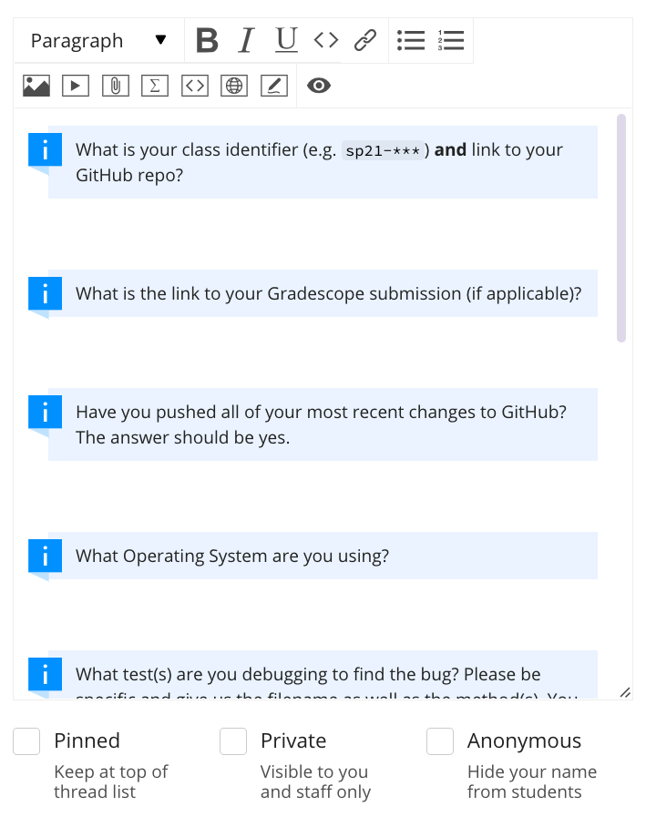
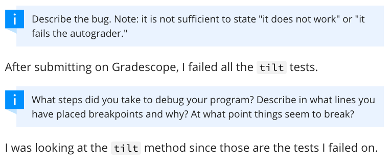
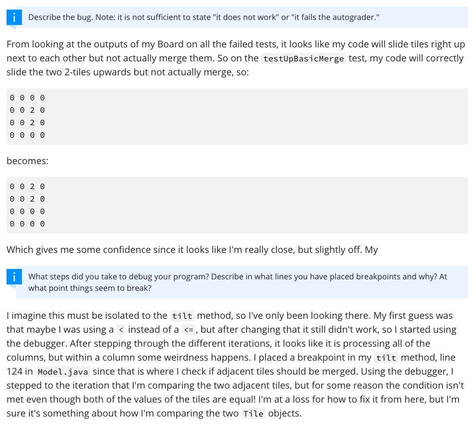

Gitbugs are your way to get debugging help on your assignments (labs, homeworks,
projects). Submitting a Gitbug is as simple as you creating a private Ed post,
following a particular template, and then waiting to get a response. After you
submit your Gitbug, all staff members will see it and we can clone your GitHub
repository on our own computers, look for the bug, and then give you a
hint/explain where you should be looking. We try to get a 24 hour turnaround,
but please be patient with us the day before or the day of a deadline as we get
a huge influx during those times.

## When to make a Gitbug

A Gitbug should be the last resort for you. The
assumption is that you’ve tried to debug your code and even after this you
couldn’t find the bug. For example, if you’re completing a method in a project
and failing the provided/graded test for it, do not immediately submit a Gitbug!
Developing debugging skills is an official part of the course, so we do expect
you to run into bugs and solve them on your own. On the other side of things, we
don’t want you to be stuck on a bug for 10 hours, so we have Gitbugs to help you
get unstuck. We trust that you can make the decision for yourself as to whether
you’ve put in honest effort looking for the bug, but be warned that if it is
obvious you haven’t tried debugging your own code, we will reject the Gitbug.

## Making a Gitbug

When making a Gitbug, please follow **these exact** steps to
keep everything organized for us and make sure we don’t reject your Gitbug:

1. Select the big blue ‘New Thread’ button in the top left corner
2. Select ‘Question’ as your type of post
3. Give a useful title to your Gitbug post, for example: “Project 1: Array
upsizing works, but downsizing throws ArrayIndexOutOfBoundException errors”
4. Select the Category as Gitbug and the Subcategory as whichever assignment
this is
5. Choosing the Gitbug category on Ed should show you a template for the
question asking you important questions to help us debug your code. If you don’t
see it, you didn’t do step 2. It should look like the below screenshot.
6. Fill out the questions in **full sentences** and if the questions tell you to
do something then make sure you do it (i.e. ensuring you’ve pushed your code to
GitHub). We will automatically reject Gitbugs without thorough explanations.
7. Make sure you’ve made your post **private**
8. Post your Gitbug!

It’s important that you fill out the Gitbug template exactly and put in
reasonable effort here, otherwise we won’t have all the important information to
help you solve the problem. **We will not be helping with low effort Gitbugs and
will reject them.** You should be spending anywhere from 5-10 minutes creating
your Gitbug to ensure it is of high quality. The better your Gitbug is, the
faster we can solve it and we can reciprocate with a high quality answer too
since we have all the details neccessary to see tell what errors you
made/misconceptions you have.

**It’s highly unlikely that a screenshot will make your Gitbug better, so please
don’t add any screenshots unless you truly think it’s useful.** Remember that
we’ll be able to see your code when we pull your GitHub repository, so no need
to screenshot IntelliJ or something like that. If you had an error message that
you think is important to the bug, please copy and paste that error message into
the post so that it’s easily searchable.

It's really important that you have a good description of what the bug is and
what you've done to try and solve it so far. Here is an example of Omar doing a
bad job:

Notice how Omar doesn't even address the question. He should add to his response
the specific test that failed (i.e. number) and maybe even what the error
message is. Also, it's clear that Omar didn't try to debug since he said he just
looked at the code. Maybe he did try and debug but just didn't include it: even
if he thinks his debugging was useless, he should still include it as it can
give really good insight/hints into what is going on, and it'll save the TA a
ton of time. Sorry for Omar, but this Gitbug gets rejected.

Now let's look at what a good Gitbug looks like:

Omar did a great job here! There is a clear test that he is failing and he has
even provided the error message for us. There is also ample evidence that he has
tried to debug the code and even some hypothesis that he has plus things he
already tried. Omar has also provided specific lines he has placed breakpoints
at as well as what they saw when they debugged. This saves the TA time and Omar
will get a very clear response on what the bug is since his question is so
specific. Great job Omar!

After submitting your Gitbug you just sit tight and continue working on
something else in the meanwhile.

Additionally, if you submit a Gitbug and were able to resolve it before we
responded, update the post by leaving a comment that the bug is resolved. We
will not process any of your future Gitbugs if we clone you code and see that
you have already resolved a bug without updating your Gitbug post.

Once your Gitbug has been answered, do not reply. We won’t be doing any back and
forth on Gitbugs. If you still have another bug, you should instead make a new
Gitbug. The one exception is if you want to say “thank you” or something like
that :)
