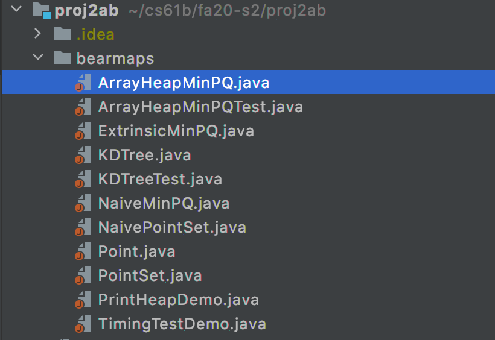
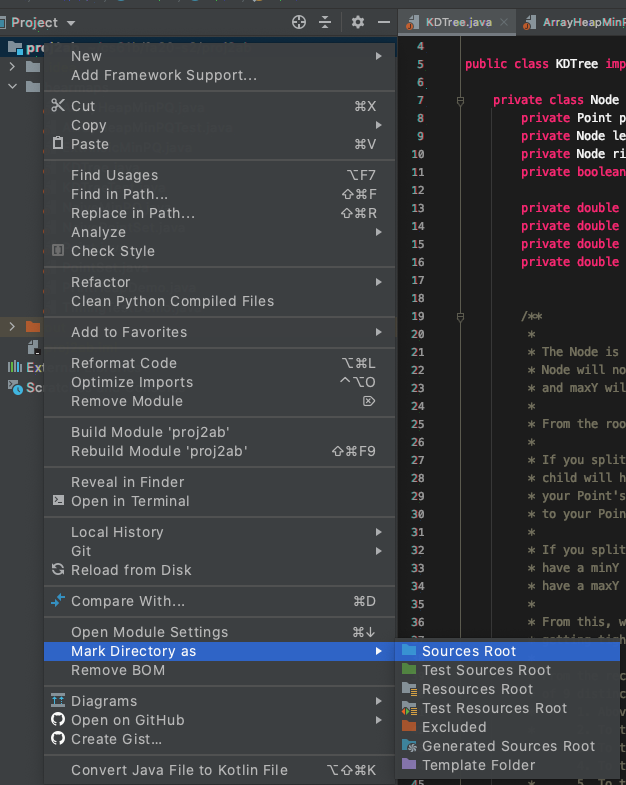
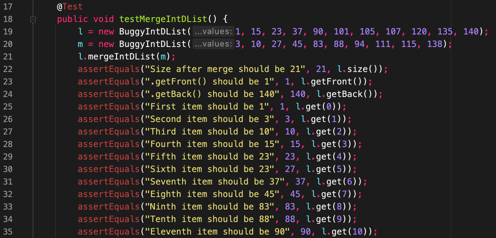
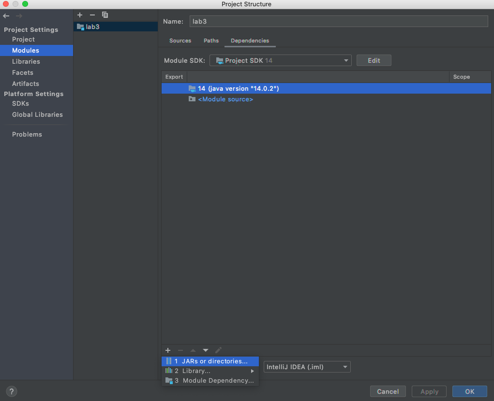
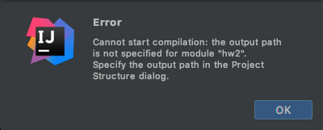
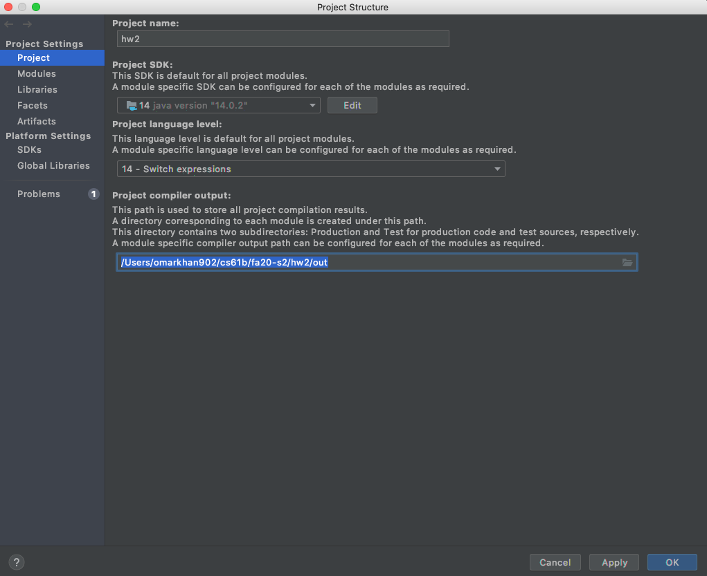

This document is intended to help you through frequently encountered weird
technical failure scenarios (WTFS) in IntelliJ. It will be populated as questions
arise.

## I can't run my Java file/Files don't show up as java files

If your files look like this then you haven't properly imported the project.
To fix this, you must simply right-click the outer-most folder which will be your
assignment folder, in this case, `proj2ab`, and scroll down to "Mark directory as ..."
and hit "Sources Root". It'll look like this:

You may need to do this with the `src` folder for most assignments, and mark the
`tests` folder as a **Test Sources Root**. Your `src` folder should be blue and
your `tests` folder should be green.

See [Assignment Workflow](../assignment-workflow/index.md) for additional
instructions on importing a new project.

## JUnit things show up as red in IntelliJ

This means that you forgot to add the CS 61B `javalib` as a library for this project!
IntelliJ cannot find the JUnit specific things like `@Test` or `assertEquals`
since you forgot to import them.

Every time you start a new assignment (unfortunately, EVERY TIME) you must readd
the `javalib`. To do this, simply go to "File" -> "Project Structure" -> "Libraries"
and add the javalib inside your repo. See [Lab 2 Setup](../lab/lab2setup/lab2setup.html#getting-java-libraries)
for additional instructions on adding Java libraries.

## package org.junit does not exist

This sometimes happens with IntelliJ where you've added the correct libraries,
but cannot run the code. To fix this, you need to add the libraries as a direct
dependency to the module. To do that, go to "File" -> "Project Structure" ->
"Modules" -> "Dependencies" and hit the "+" icon in the bottom left and select
"JARs or directories". Now, highlight every `.jar` file in your `javalib` folder
and add them. This is what the setting should look like right before you add
the JARs:

## Output path is not specified

IntelliJ puts all the compiled Java `.class` files in a special folder called
`out`. You may have seen it before. Usually, IntelliJ will be able to determine
where to put the `out` folder, but sometimes it cannot and needs your help. To
specify where to put the out foler, go to:

"File" > "Project Structure" > "Project" > "Project compiler output" and simply
add the output path. The output path should be of the form `path/to/assignment/out`
where the prefix is dependent on the path to your assignment (hw, lab, proj, etc)
and the suffix must be `/out`. Example for homework 2:

## Everything looks right but it still doesn't work!

Sometimes the easiest thing is to simply do it all over again. Even if you know you
just did everything correctly, starting over very often just fixes the problem.
First close the project ("File" -> "Close Project"), quit the IntelliJ application,
and then reimport the project from the beginning.

## Everything looks wrong and nothing works!

Sometimes, the easiest thing is to simply do it ALL over again. Specifically, we need to purge Intellij's memory and
make it forget that our project ever existed.

Intellij stores project information as `.idea` folders and `.iml` files. To make it forget our project, we'll be
deleting those:

1.  Close the project ("File" -> "Close Project")
2.  Quit Intellij
3.  In File Explorer / Finder, go to the project folder
4.  Now, you'll need to show hidden files, so that `.idea` and `.iml` show up:
    - Windows 10 and below:
      [guide](https://support.microsoft.com/en-us/windows/show-hidden-files-0320fe58-0117-fd59-6851-9b7f9840fdb2)
    - Windows 11: [guide](https://pureinfotech.com/show-hidden-files-windows-11-file-explorer/)
    - Mac: Press Command + Shift + . (period)
      [guide](https://www.pcmag.com/how-to/how-to-access-your-macs-hidden-files)
5.  Delete any `.idea` folders and `.iml` files you see
6.  Re-open the project in Intellij

At this point, the project should look normal, as if you're opening it for the first time (you'll need to import libraries again, if applicable). However, if things still look wrong, you may need to do the following: 

{:start="7"}

7.  Open up Project Structure ("File" -> "Project Structure")
8.  In the "Project" tab:
    - Set SDK and Language Level
    - Choose Compiler Output folder to be `<path>/<to>/<project>/out`. You may have to create this folder yourself
9.  In the "Modules" tab: Delete all modules, if any. Then, create a new module with the default settings
10. In the "Libraries" tab: Re-import libraries for the project.
    - At this point, go back and make sure that all settings were properly applied. Once you verified that everything
      looks correct, close Project Structure
11. In the Project sidebar on the left, right click on the root folder and mark as source (Right click ->
    "Mark Directory as" -> "Sources Root")
